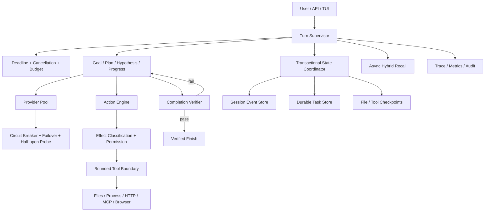

# Holmes Agent 生产可靠性整改方案

> 状态：Done（2026-08-13，全部 20 条台账缺陷关闭）
> 创建日期：2026-08-11
> 适用范围：当前工作区中的 Holmes Agent 实现
> 目标形态：可长时间运行、可恢复、有人机边界、具备明确完成判定的单机自治 Agent
> 负责人：待指定
> 评审人：待指定

## 1. 目标

本方案不以历史设计文档为验收依据，只针对当前 Agent 的真实行为和生产运行风险进行整改。

完成本方案后，Holmes 应满足：

1. 任一 LLM Provider、工具、浏览器、MCP 或 Hook 故障不会无限阻塞整个 Agent。
2. 所有外部副作用在权限不明确时默认拒绝，并且文件修改可以恢复。
3. 进程异常退出后，可以从最后一个已提交状态恢复会话和后台任务。
4. Agent 不仅能调用工具，还能检测停滞、切换策略、验证目标是否真正完成。
5. 子 Agent 有结构化结果、预算、隔离和持久化状态。
6. 关键可靠性指标可观测，并通过故障注入、长稳测试和 CI 持续验证。

### 1.1 本方案对“高可用”的定义

本阶段采用“单机进程级高可靠”口径：

- 支持模型、工具、浏览器等依赖故障的自动降级和恢复；
- 支持进程重启后的任务恢复；
- 不因单个外部调用永久挂起；
- 已确认的状态不丢失、不重复产生副作用；
- 可以连续无人值守运行。

以下内容暂不包含在本阶段：

- 多机主备；
- SQLite 跨节点复制；
- 分布式任务调度；
- 跨地域灾备。

如果最终目标是服务级 99.9% 或更高 SLA，需要在本方案完成后另立分布式部署方案。

## 2. 当前基线

### 2.1 已具备的基础

- 统一的运行循环和工具注册机制；
- 会话事件、语义回放和上下文压缩；
- 多 Provider 配置基础；
- 文件、命令、HTTP、MCP 和浏览器工具；
- 前台及后台子 Agent；
- 权限模式和审批接口；
- Harness 和场景测试基础。

### 2.2 当前验证结果

- `cargo test --workspace --all-targets`：549 passed，0 failed，11 ignored；
- 真实 Chromium/网络测试未进入默认测试路径；
- `cargo fmt --all -- --check` 未通过；
- `cargo clippy --workspace --all-targets -- -D warnings` 未通过；
- 当前未发现强制 CI；
- 当前工作区存在大量未提交改动，不是可复现发布快照。

## 3. 缺陷台账

状态取值：`Open`、`In Progress`、`Blocked`、`Done`、`Accepted Risk`。

| ID | 优先级 | 缺陷 | 影响 | 当前状态 | 负责人 |
|---|---|---|---|---|---|
| AGT-001 | P0 | LLM Provider 切换与恢复不可靠 | 模型异常时任务中断或永久不可用 | Done（2026-08-11，`crates/holmes-llm/`：`provider.rs` 重写为 Healthy/CoolingDown/HalfOpen/Disabled 显式状态机（冷却基数 5s 指数翻倍封顶 5min ±20% jitter，Retry-After 优先，半开探测成功复位/失败窗口翻倍）；`client.rs` 单次调用维护 attempted_provider_ids 绝不重选，受 `call_deadline_ms` 约束，全部冷却时等待最近 half-open 点、超时确定性失败；普通与流式路径共用 `error_classifier` 四类分类（Transient→冷却切换 / ProviderConfig→Disabled / RequestContent→直接上抛不计健康 / 调用方取消=drop 不计）；SSE 截断（无 stop_reason）与 error 事件帧纳入分类；切换/冷却/半开/恢复/禁用均产生结构化 tracing 事件；新增 `tests/provider_failover.rs` + `tests/provider_recovery.rs` 共 11 个 axum mock server 集成测试） | 待指定 |
| AGT-002 | P0 | MCP、Hook、子进程缺少统一 deadline/cancel | 单个调用可拖死整个 turn | Done（2026-08-12，`crates/holmes-core/src/execution_context.rs` 新增 `ExecutionContext`（turn_deadline / default tool deadline / CancellationToken / task_id / ResourceBudget），`run_bounded` 竞速 deadline 与取消并发出 `ToolDeadlineExceeded`/`CancellationCompleted` 结构化事件；`config.execution`（turn_deadline_ms / tool_deadline_ms / mcp_request_timeout_ms）入 `config.default.yaml`；传播链：Runtime `run_turn` 每 turn 续期 ctx + AtomicBool→token 桥接 → `RuntimeContext.exec` → ActionEngine 串/并行两条路径的取消门（取消后不再启动新工具）+ `ToolRegistry::execute_bounded`（+3s grace 外层竞速）→ 工具 `execute_with_context`（execute_command / execute_python / McpTool / SpawnSubagentTool 覆写）→ MCP stdio 读写带 deadline、超时后 kill 进程组并标记 transport 终止、后续调用 fail-fast（不再阻塞），MCP HTTP 显式 connect/read/total 超时，握手同样限时 → Hook（`hooks.timeout_ms` 超时杀进程组，`hooks.on_failure` deny/warn/skip，before_tool 默认 deny，修复原 spawn_blocking panic 被当成功的 fail-open）→ Browser 经 registry 外层竞速覆盖 → 子 agent：`SubagentRunner::run_subagent` 增加 ctx 参数，CliSubagentRunner `set_parent_execution` 派生子 token 并以上级 turn deadline 封顶，后台任务以 `ctx.child()` 竞速取消并记为 cancelled） | 待指定 |
| AGT-003 | P0 | 子进程超时后不保证退出 | 孤儿进程、资源泄漏和重复副作用 | Done（2026-08-12，`crates/holmes-tools/src/process.rs` 新增 `run_command`/`run_shell`：`kill_on_drop(true)` + Unix `process_group(0)`，超时或取消时对整组 `killpg(SIGKILL)` 并 await 收割直接子进程；execute_command / execute_python / UserHookMiddleware / MCP stdio 全部改用该路径；测试验证 fork 孙进程后超时整组无残留、取消杀组、stdin 投递与 spawn 失败语义） | 待指定 |
| AGT-004 | P0 | Checkpoint 参数不匹配且未覆盖 edit_file | 文件修改无法可靠回滚 | Done（2026-08-11，`crates/holmes-runtime/src/hooks/checkpoint.rs`：改按 `path` 参数取文件并覆盖 write_file/edit_file，`TargetFile` 保留为兼容回退；新增 checkpoint 创建/恢复/跳过测试） | 待指定 |
| AGT-005 | P0 | Ask 模式在 approver 缺失时 fail-open | 未经批准执行副作用 | Done（2026-08-11，`crates/holmes-runtime/src/action.rs`：串行与并行两条路径在无 approver 时一律 deny，reason 为 "approval required but no approval surface is available (fail-closed)"；新增回归测试） | 待指定 |
| AGT-006 | P0 | HTTP 工具副作用分类错误 | ReadOnly 模式可执行 POST/DELETE | Done（2026-08-11，`crates/holmes-tools/src/registry.rs` 新增 `Effect`/`effect_of`（参数感知，默认映射 is_read_only）；`http_request.rs` 按 method 分类 GET/HEAD/OPTIONS=ReadOnly 其余=Mutating；`permissions.rs`、`action.rs`、`can_parallelize` 改用 effect_of） | 待指定 |
| AGT-007 | P0 | 后台任务状态仅在内存中 | 进程重启后任务状态和归属丢失 | Done（2026-08-12，`crates/holmes-session/src/task_store.rs` 新增 tasks 表（migration）与 `TaskStore`：task_id/parent/child_session/state/lease/attempt/idempotency_key/checkpoint/result/last_error/safe_to_retry 全字段；状态机 Queued→Running→Succeeded/Retrying/Failed/Cancelled + Recovering/ManualRecoveryRequired；`holmes-core/src/background.rs` 新增 `DurableTaskSink`/`DurableTaskBinding`，`SpawnSubagentTool.with_durable_binding` 启动前 fail-closed 持久化、60s heartbeat 续租、完成/取消写回；`crates/holmes-runtime/src/recovery.rs` 启动恢复：过期 Running 中 safe_to_retry 的 Recovering→Retrying 重排队，有外部副作用的标 manual_recovery_required 不再自动执行；`chat.rs` 启动时调用并提示） | 待指定 |
| AGT-008 | P0 | 会话初始化及 DB/JSONL 写入非原子 | 崩溃后出现半初始化或数据分叉 | Done（2026-08-12，`db.rs` create_session_with_events/append_event/fork_session 全部单事务（序列化前置到事务外，失败不落盘）；`transcript_projection.rs` 把 transcript.jsonl 改为事务提交后的异步投影（单 worker 保序、失败进重建队列、tmp+rename 原子 `rebuild_transcript` 从 events 表全量重建）；`write_contention.rs` 重试仅限 SQLITE_BUSY/LOCKED 且 15 次封顶带 jitter，约束/IO 等永久错误首次即抛出） | 待指定 |
| AGT-009 | P1 | 缺少统一的任务监督器 | 无法稳定检测停滞、重复和策略失效 | Done | 2026-08-12 |
| AGT-010 | P1 | Finish 缺少独立完成验证 | Agent 可在目标未完成时提前结束 | Done | 2026-08-12 |
| AGT-011 | P1 | 记忆主要依赖同步词法召回 | 召回弱、延迟进入主链路、缺少冲突处理 | Done（2026-08-12，`holmes-core/src/types.rs` Memory 增加来源/置信度/时效/范围/冲突/替代/敏感性/版本字段与新类目（Fact/UserPreference/ProjectConvention/Skill）+ MemorySource/MemoryScope/MemoryStatus 枚举；`holmes-session/src/schema.rs` migration v3 加列；`holmes-session/src/embedding.rs` 本地哈希 embedding（unigram+字符 trigram，CJK 可用）+ 安全领域同义词扩展；`holmes-session/src/memory_store.rs` 重写：FTS/LIKE 词法候选与 embedding 余弦融合（0.6/0.4），按置信度/时效/范围重排，`hybrid_recall=false` 或无 embedding 时纯 FTS 降级，仅召回 active 且未过期条目，冲突/替代对不同时注入（保留高分者并返回 suppressed 列表），召回写 access_count/accessed_at usage telemetry；`holmes-runtime/src/memory.rs` 召回包进 `recall_timeout_ms` 预算（tokio timeout，超时 tracing `MemoryRecallTimeout` 后继续 turn，0=跳过），注入前去重 + `recall_max_chars` 字符预算裁剪 + `MemoryConflictDetected` 审计事件；`holmes-core/src/sensitive.rs` 统一敏感筛查，写边界拒绝并产生 `MemoryRejected` 审计事件（flush note 等案件状态显式 opt-in 并标 sensitive）） | 待指定 |
| AGT-012 | P1 | 学习仅覆盖有限偏好/纠正 | 无法把成功任务转化为可验证能力 | Done（2026-08-12，`holmes-runtime/src/learning.rs`：候选带 source；verified goal（`GoalEvaluated` 附 `[verified; ...]`）产出 Skill 候选；Agent 推断与技能一律只进 staged（持久化 staged 行 + `MemoryWriteStaged` 事件），仅 `promote` 门可激活——技能须 validation_status=passed 且 approved_by 非空，否则 `StoreError::Blocked`；`memory_store` 提供 record_validation/promote/disable（低质量先停用）/archive（仅允许从 disabled）/new_version（parent_version_id 链 + supersedes）/rollback（回滚到上一版本）/record_usage（成功率/失败率/最后使用时间）；`holmes-runtime/src/memory.rs` 对应 lifecycle 方法全部落 `MemoryStatusChanged` 事件；敏感候选统一走 `holmes_core::screen_sensitive`，拒写产生审计事件） | 待指定 |
| AGT-013 | P1 | 子 Agent 结果与统计不完整 | 父 Agent 难以验证和复用结果 | Done（2026-08-12，`holmes-core/src/subagent.rs` 新增结构化结果协议 `AgentTaskResult`（task_id/status(completed/partial/failed/cancelled)/summary/findings/evidence/changed_files/validations/remaining_work/usage/checkpoint），`SubagentRunner` 改返回该类型并删除旧的 `SubAgentResult`；`build_agent_task_result` 从子会话事件日志确定性收集 findings（FindingRecorded）、validations（GoalEvaluated）、changed_files（write_file/edit_file ToolCall）与 usage（工具数/turn/tokens/wall-clock），不再依赖模型自报；父侧 `verify_agent_task_result` 确定性校验（占位 summary、completed 携带失败验证或非空 remaining_work、有 findings 无 evidence、悬空 evidence 引用、partial/failed 无 remaining_work），`wrap_for_parent` 把有缺陷的 completed 降级 partial 并把缺陷写入 remaining_work；`CliSubagentRunner` 真实填充全部字段并向父会话事件流写 `SubAgentSpawned`/`SubAgentCompleted`；sync 与 background 两条路径均写回 durable task store（`DurableTaskSink::task_attached_session` 记录 child_session_id，重启后 `list_by_parent` 可重新关联）；结构化事件 SubagentStarted/SubagentCompleted/SubagentResultVerified/SubagentResultRejected/SubagentPanicked） | 待指定 |
| AGT-014 | P1 | 并行任务资源隔离不足 | 临时文件碰撞、预算失控、相互影响 | Done（2026-08-12，`config.subagent` 新增 max_depth=2/max_concurrent=4/max_tool_calls/max_wall_clock_ms 并入 `config.default.yaml`；`ExecutionContext` 增加 depth 与 temp_dir（child() 继承 depth 不继承 temp_dir），`RuntimeContext` 续期 ctx 时子 agent depth+1、应用工具预算与 wall-clock 上限（与父 turn deadline 取 min）、携带隔离临时目录；`SpawnSubagentTool` 准入控制（深度/并发超限时同步拒绝），并发由进程级共享 `Arc<Semaphore>`（ChatContext 持有，嵌套 registry 共用同一池）；runner 每次运行建独立 `tempfile::TempDir`，execute_python 经 `ctx.temp_dir()` 写入隔离目录；`constraints.max_turns` 接入子 agent 迭代预算，超预算/超轮次经 TurnOutcome::MaxIterationsReached 产出 Partial+remaining_work；sync 路径 tokio::spawn 隔离 + background 路径 JoinHandle 监督任务，子 agent panic 记为失败结果且不影响兄弟任务） | 待指定 |
| AGT-015 | P1 | 缺少生产级运行指标和告警 | 运行但无进展时无法及时发现 | Done（2026-08-13，`holmes-core/src/metrics.rs` 零依赖进程内 registry：计数器 + 每指标有界时延样本（4096 FIFO），nearest-rank p50/p95/p99/max，`snapshot()` 产出 JSON 快照；事件清单逐条核对并补齐缺口——Provider 侧统一为 `ProviderHealthChanged`（from/to 字段，取代原 snake_case 的 recovered/disabled/cooling_down/half_open_probe 四个事件），新增 `ProviderFailoverStarted/Completed/Failed` 三元组、`ProcessKilled`、`ApprovalUnavailable`、`CheckpointCreated/Restored/Failed`、`TaskRecovered`/`ManualRecoveryRequired`（原仅无 event 字段的日志）；命名规范统一为 tracing 事件 CamelCase + 维度 snake_case + 整型毫秒 `_ms` 后缀，全部插桩点同步落指标；方案指标清单逐项映射（turn 成功率与 `turn.duration_ms` 分位、`llm.call.first_try_success`/failover 三计数/`provider.downtime_ms`、`tool.deadline_exceeded`+`process.killed`、`supervisor.iterations_without_progress`/strategy_changed/stop_for_user、`task.recovered`/manual_recovery_required、completion.verification_passed/failed、memory.recall hit/total/timeout 与 learning.user_correction、subagent.completed/failed/... 与 tokens/wall_clock/tool_calls 样本、sqlite.busy_retry）；`docs/observability.md` 为事件/指标/检索口径单一参考；告警以 warn/error 级结构化事件作日志告警挂钩） | 待指定 |
| AGT-016 | P1 | 关键故障路径缺少自动化测试 | 回归风险高，无法证明恢复能力 | Done（2026-08-13，harness 机制扩展：`HarnessTool.delay_ms` 挂起工具注入 + 场景级 `config.execution`（deadline）与 `config.permissions`（mode）覆盖；新增 4 个故障注入场景全绿——`repeated-failure-stop.yaml`（重复失败→策略切换提示→停转交还 operator）、`stagnation-stop.yaml`（停滞→反思→停转保留部分结果）、`tool-deadline.yaml`（10s 挂起工具被 150ms deadline 确定性截断、turn 有界恢复）、`approval-fail-closed.yaml`（Ask 无审批面 mutating 调用被拒且工具体从未执行）；`holmes-session/tests/concurrency_tests.rs` 2 个并发测试；既有 provider failover/recovery 11 个集成测试、MCP/进程组/UTF-8/崩溃恢复测试均在默认测试路径进 CI；24 小时长稳与 kill -9 演练做不到实机级别，以故障注入/场景测试覆盖（nightly reliability-soak ×10 循环）） | 待指定 |
| AGT-019 | P2 | SQLite 单连接全局锁限制并发 | 多子 Agent 下吞吐和尾延迟恶化 | Done（2026-08-13，按 §11.2 决策本阶段不迁移存储：WAL 已有，`busy_timeout` 1000→5000ms 降低尾延迟落入错误路径的概率，有界 BUSY/LOCKED 重试（15 次封顶带 jitter，永久错误首次即抛）已有并新增 `sqlite.busy_retry`/`sqlite.busy_retry_exhausted` 指标；新增 `concurrency_tests.rs`：8 并发写共享句柄 200 事件零丢失、event_index 无重复，双句柄同文件（跨进程替身）串行写互相可见且锁错误不上浮；吞吐上限与连接池/外部库评估口径写入 `docs/runbooks/agent-recovery.md` §7） | 待指定 |
| AGT-020 | P2 | 质量门禁未建立 | 格式、Lint 和集成回归可进入主分支 | Done（2026-08-13，`ci.yml`：fmt / clippy -D warnings / `cargo test --workspace --all-targets` / `git diff --check` 四个 job（Phase 0 已有）+ 新增 `audit` job（rustsec/audit-check 依赖漏洞检查；配套修复 crossbeam-epoch 0.9.18→0.9.20 / RUSTSEC-2026-0204，仅 Cargo.lock，本地 `cargo audit` 复跑 0 漏洞、6 条 unmaintained/unsound 警告列为后续清理）；Provider/MCP 故障注入、SQLite 崩溃恢复、harness 可靠性场景全部在默认测试路径，回归即阻塞合并；项目未使用 Loom，并发覆盖为确定性集成测试（进程组、并行 Python、写竞争、并发写）并在 ci.yml 注释中注明；`nightly-reliability.yml` 新增 `reliability-soak` job（harness + holmes-llm + holmes-session ×10 循环），真实浏览器 smoke（local/network 两 job）已在 nightly；许可证检查未落地（cargo-deny 需额外基线配置，列为后续项）） | 待指定 |
| AGT-017 | P1 | 默认 TLS/HTTP 安全策略过宽 | 中间人风险及外部调用结果不可信 | Done（2026-08-11，`crates/holmes-tools/src/builtin/http_request.rs`：默认 client 不再 `danger_accept_invalid_certs(true)`（编译期断言 `ACCEPT_INVALID_CERTS_BY_DEFAULT == false`）；跳过校验需显式 `insecure: true` 参数并产生 warn 日志；`holmes-llm` client 核实无 danger 配置，默认即安全） | 待指定 |
| AGT-018 | P1 | 按字节截断 UTF-8 输出可能 panic | 大量中文或多字节输出导致 turn 崩溃 | Done（2026-08-11，`holmes-core/src/tool_types.rs` 新增 `truncate_with_note`；替换 `execute_command.rs`/`execute_python.rs` 的不安全字节截断与 `inline_ui.rs` 的 `String::truncate`，`http_request.rs`/`dialogue.rs`/`client.rs`/`setup.rs`/`chat.rs` 统一复用 `truncate_str`；含多字节属性式回归测试） | 待指定 |
| AGT-019 | P2 | SQLite 单连接全局锁限制并发 | 多子 Agent 下吞吐和尾延迟恶化 | Open | 待指定 |
| AGT-020 | P2 | 质量门禁未建立 | 格式、Lint 和集成回归可进入主分支 | Open | 待指定 |

## 4. 关键缺陷证据

### AGT-001：LLM Provider 高可用

涉及文件：

- `crates/holmes-llm/src/client.rs`
- `crates/holmes-llm/src/provider.rs`

当前问题：

- 某些非重试错误只记录一次失败，随后可能再次选择当前 Provider；
- 流式读取和解析错误没有在所有路径中更新 Provider 健康状态；
- `last_failure` 被记录但没有形成冷却、半开探测和自动恢复；
- 全部 Provider unhealthy 后缺少恢复路径；
- 缺少客户端级 failover 集成测试。

### AGT-002/003/014/018：执行边界

涉及文件：

- `crates/holmes-tools/src/mcp/transport.rs`
- `crates/holmes-tools/src/builtin/execute_command.rs`
- `crates/holmes-tools/src/builtin/execute_python.rs`
- `crates/holmes-runtime/src/middleware.rs`

当前问题：

- MCP stdio 读写没有调用级超时；
- MCP HTTP Client 没有统一 deadline；
- 用户 Hook 的 `wait_with_output` 没有超时；
- 命令 Future 超时后不保证杀死子进程；
- Python 临时文件仅使用 PID 命名，并行任务可能覆盖；
- 输出截断使用字节下标，可能切到 UTF-8 字符中间并 panic。

### AGT-004/005/006/017：副作用安全

涉及文件：

- `crates/holmes-runtime/src/action.rs`
- `crates/holmes-runtime/src/hooks/checkpoint.rs`
- `crates/holmes-tools/src/builtin/file_ops.rs`
- `crates/holmes-tools/src/builtin/http_request.rs`
- `config.default.yaml`

当前问题：

- Ask 模式缺少 approver 时没有默认拒绝；
- Checkpoint Hook 查找 `TargetFile`，而工具参数为 `path`；
- Checkpoint 没有完整覆盖 `edit_file`；
- 文件写入不是原子替换；
- HTTP 工具把所有方法都视为只读；
- HTTP/TLS 默认允许无效证书，降低结果可信度。

### AGT-007/008：持久化与恢复

涉及文件：

- `crates/holmes-core/src/background.rs`
- `crates/holmes-session/src/db.rs`
- `crates/holmes-cli/src/chat.rs`
- `crates/holmes-cli/src/subagent.rs`

当前问题：

- 后台任务注册表为进程内 `HashMap`；
- 新会话和启动元数据分多次提交；
- transcript JSONL 在数据库写入前独立写入，并忽略部分失败；
- 缺少任务 lease、heartbeat、幂等键和重启恢复策略。

### AGT-009/010：任务监督与完成验证

涉及文件：

- `crates/holmes-runtime/src/decision.rs`
- `crates/holmes-runtime/src/reflection.rs`
- `crates/holmes-runtime/src/runtime.rs`

当前问题：

- Reflection 主要处理迭代预算和错误映射；
- 没有结构化维护目标、子计划、活跃假设和证据；
- 没有重复动作、无进展和策略失效检测；
- 模型可以直接选择 Finish，系统没有独立验证目标完成度。

### AGT-011/012：记忆与学习

涉及文件：

- `crates/holmes-runtime/src/memory.rs`
- `crates/holmes-runtime/src/learning.rs`
- `crates/holmes-mind-palace/src/lib.rs`

当前问题：

- 当前召回以 FTS/LIKE 为主；
- 缺少语义召回、来源、置信度、时效和冲突处理；
- 召回同步占用 turn 主链路；
- 学习候选主要是 Memory，尚未形成技能生成、验证、使用统计和淘汰闭环。

## 5. 目标架构



### 5.1 设计原则

1. **Fail closed**：权限、分类或审批状态不明确时拒绝副作用。
2. **Bounded execution**：所有外部调用都必须有 deadline、取消和回收。
3. **Durability before acknowledgement**：只有持久化成功后才向上层确认状态完成。
4. **Idempotency**：可恢复任务的副作用必须可识别、可去重或可补偿。
5. **Evidence before finish**：Finish 是验证结果，不只是模型意图。
6. **One source of truth**：SQLite 事件库作为权威状态，JSONL 作为可重建投影。
7. **Observable degradation**：降级、重试、切换和恢复必须产生结构化事件。

## 6. 实施方案

## 工作流 A：LLM Provider 可靠性内核

目标：任何单 Provider 故障均不会中断任务，并能自动恢复使用。

建议改动：

- 在 `crates/holmes-llm/src/provider.rs` 引入显式状态机：
  - `Healthy`
  - `CoolingDown { until }`
  - `HalfOpen`
  - `Disabled`
- 区分错误类型：
  - 请求级临时错误：timeout、连接失败、429、5xx；
  - Provider 配置错误：无效模型、Provider 专属认证失败；
  - 请求内容错误：上下文过长、无效参数；
  - 全局不可恢复错误：调用方主动取消。
- 在一次模型调用中维护 `attempted_provider_ids`，禁止无意义地立即选择同一失败 Provider。
- 所有流建立、流读取、事件解析、结束原因解析路径统一记录成功或失败。
- 支持 `Retry-After`、指数退避和 jitter。
- 当所有 Provider 都在冷却时，等待最近的 half-open 时间，但不得超过 turn deadline。
- 成功的 half-open 请求恢复 Provider 健康状态；失败则扩大冷却窗口。
- 为普通调用和流式调用共用同一故障分类及切换逻辑。

建议新增测试：

- `crates/holmes-llm/tests/provider_failover.rs`
- `crates/holmes-llm/tests/provider_recovery.rs`

验收标准：

- [ ] 第一个 Provider 连接失败时，同一调用自动切到第二个 Provider；
- [ ] 流建立后中断时能切换或返回明确、可恢复的错误；
- [ ] unhealthy Provider 在冷却后自动 half-open 探测；
- [ ] 所有 Provider 不可用时，在总 deadline 内确定性失败；
- [ ] 每次切换、冷却和恢复都有结构化事件和指标；
- [ ] 不会在一次调用中无限循环选择同一 Provider。

## 工作流 B：统一 Deadline、取消和进程回收

目标：任何工具都不能无限占用一个 turn。

建议改动：

- 在 `holmes-core` 新增统一的执行上下文，例如 `ExecutionContext`：
  - `turn_deadline`
  - `tool_deadline`
  - `CancellationToken`
  - `task_id`
  - `resource_budget`
- 将执行上下文从 Runtime 传播到 ActionEngine、Tool、MCP、Hook、Browser 和子 Agent。
- 每个 Tool 支持默认超时和配置覆盖，但不得超过 turn 剩余时间。
- MCP stdio 使用带 deadline 的读写，并在超时后终止 transport。
- MCP HTTP 使用显式 connect/read/total timeout。
- Hook 增加 timeout；失败策略可配置为 deny、warn 或 skip，副作用前 Hook 默认 deny。
- 命令执行启用 `kill_on_drop`；Unix 下终止整个进程组并等待 reap。
- Python 使用 `tempfile::NamedTempFile` 或唯一任务目录，不再按 PID 共用文件名。
- 将字符串截断改为 UTF-8 边界安全函数，并统一复用。
- 取消后停止新的工具调用，并等待受控清理阶段。

建议新增文件：

- `crates/holmes-core/src/execution_context.rs`
- `crates/holmes-tools/src/output.rs`

验收标准：

- [ ] MCP 永久不返回时，Agent 在配置时间内恢复控制；
- [ ] 命令超时后不存在残留子进程；
- [ ] 取消 turn 后不会启动新工具；
- [ ] 并行运行 100 个 Python 工具无临时文件冲突；
- [ ] 大量中文输出截断不 panic；
- [ ] 所有超时包含 tool、task、elapsed 和 deadline 信息。

## 工作流 C：副作用分类、审批和文件事务

目标：副作用默认安全，文件变更可验证、可恢复。

建议改动：

- 用明确枚举替代单一 `is_read_only()`：
  - `ReadOnly`
  - `WorkspaceWrite`
  - `ProcessExecution`
  - `NetworkRead`
  - `ExternalWrite`
  - `CredentialAccess`
- 权限决策使用工具定义和本次参数共同计算 effect。
- HTTP GET/HEAD 归类为 NetworkRead；POST/PUT/PATCH/DELETE 默认 ExternalWrite。
- Ask 模式没有 approver 时返回 `ApprovalUnavailable`，绝不执行。
- 修复 Checkpoint Hook 参数名并覆盖 write/edit/delete 等文件操作。
- 文件修改流程调整为：
  1. 规范化并校验目标路径；
  2. 创建 checkpoint；
  3. 在同目录写临时文件；
  4. fsync；
  5. 原子 rename；
  6. 校验结果并记录哈希；
  7. 失败时恢复 checkpoint。
- 默认拒绝无效 TLS 证书；仅在显式配置和明显告警下允许跳过校验。
- 对外部写操作增加 idempotency key 或明确的“不可重试”标记。

建议新增文件：

- `crates/holmes-core/src/effect.rs`
- `crates/holmes-runtime/src/file_transaction.rs`

验收标准：

- [ ] Ask 模式无 approver 时所有副作用均失败；
- [ ] ReadOnly 模式拒绝 POST、DELETE 和进程执行；
- [ ] write_file/edit_file 都会创建有效 checkpoint；
- [ ] 文件写入中断不会留下半文件；
- [ ] checkpoint 恢复经过集成测试；
- [ ] 默认 HTTP/TLS 配置不接受无效证书。

## 工作流 D：持久化状态与崩溃恢复

目标：进程重启后可以确定性恢复会话和后台任务。

建议方案：

- 明确 SQLite 为状态权威源；JSONL transcript 改为事务提交后的异步投影。
- 把新会话、启动元数据、初始工具快照放在单个数据库事务中。
- 为后台任务建立持久化表：
  - `task_id`
  - `parent_session_id`
  - `child_session_id`
  - `state`
  - `lease_owner`
  - `lease_expires_at`
  - `attempt`
  - `idempotency_key`
  - `checkpoint`
  - `result`
  - `last_error`
- 任务状态采用受控迁移：
  - `Queued -> Running -> Succeeded`
  - `Running -> Retrying/Failed/Cancelled`
  - 重启后过期的 Running 任务进入 Recovering；
- 对不可安全重试的外部副作用任务标记 `manual_recovery_required`。
- 在关键状态提交后再发出成功事件。
- transcript 投影失败进入重建队列，不影响数据库事实。
- 为 SQLite 锁冲突只重试明确的 BUSY/LOCKED，不重试所有数据库错误。

建议新增文件：

- `crates/holmes-session/src/task_store.rs`
- `crates/holmes-runtime/src/recovery.rs`
- `crates/holmes-session/src/transcript_projection.rs`

验收标准：

- [x] 在会话创建各步骤注入崩溃，不会出现半初始化可用会话（2026-08-12，`durability_tests.rs::failed_session_create_leaves_no_partial_state`：冲突插入整事务回滚，无半会话/野事件/计数器漂移）；
- [x] 进程重启后能发现并恢复或明确挂起后台任务（2026-08-12，`crash_recovery_dispositions_orphaned_running_tasks`（跨进程重开同一 DB 文件）+ `recovery.rs` 四个重启测试）；
- [x] 已提交事件不会丢失（2026-08-12，`projection_failure_does_not_affect_committed_events`：投影被破坏后 commit 仍成功、事件可读）；
- [x] transcript 可以完全从事件库重建（2026-08-12，`rebuilt_transcript_matches_live_projection`：重建与实时投影字节一致）；
- [x] 重启不会重复执行已确认的外部副作用（2026-08-12，`recovery_ignores_live_and_terminal_tasks` + `completion_after_cancel_does_not_resurrect_task`：终态不可被迟到完成复活、manual_recovery_required 不可再租）；
- [x] 数据库永久错误不会被误判为写竞争反复重试（2026-08-12，`write_contention.rs` 单测：约束错误首次即抛出、BUSY 重试有界）。

## 工作流 E：任务监督器与完成验证

目标：从“工具调用循环”升级为“可判断进展和完成度的 Agent”。

建议在 Runtime 中维护结构化 `TaskControlState`：

- 用户目标和约束；
- 子任务及依赖；
- 活跃假设；
- 已获得证据；
- 未解决问题；
- 最近动作签名；
- 进展分数；
- 剩余时间、token 和工具预算；
- 当前策略及切换次数。

新增 `TurnSupervisor`：

- 检测连续相同或等价工具调用；
- 检测若干轮后证据和任务状态无变化；
- 将错误分为可重试、需换策略、需用户输入和不可恢复；
- 触发反思、缩小目标、替换工具或请求用户；
- 达到预算时生成带未完成项的可恢复结果，而不是假装完成。

新增 `CompletionVerifier`：

- 确定性检查：工具是否成功、测试是否通过、预期文件是否存在、任务清单是否清空；
- 证据检查：最终声明必须关联事件或工具结果；
- 模型检查：只用于语义目标，不替代确定性规则；
- 验证失败时返回缺口并继续执行；
- 验证通过后才能提交 Verified Finish。

建议新增文件：

- `crates/holmes-runtime/src/supervisor.rs`
- `crates/holmes-runtime/src/task_control.rs`
- `crates/holmes-runtime/src/completion.rs`

验收标准：

- [x] 重复调用同一失败工具时自动停止并换策略（2026-08-12，`TurnSupervisor`：同签名失败调用达阈值先注入换策略提示，仍重复则停转并交还操作者）；
- [x] 连续无进展达到阈值后触发反思或请求用户（2026-08-12，`StagnationDetected` 事件 + 反思提示注入，第二个窗口仍无进展则以可恢复部分结果停转）；
- [x] 编码任务在测试失败时不能报告完成（2026-08-12，`CompletionVerifier` 确定性门禁：存在未消解的失败调用时拒绝 Finish）；
- [x] 部分完成必须明确列出未完成项（2026-08-12，`budget_exhausted_message` 列出 goal/subtask/open question；验证重试耗尽后产出部分结果而非裸失败）；
- [x] Finish 事件包含验证结果和证据引用（2026-08-12，`GoalEvaluated` reason 附 `[verified; evidence: ...]`，拒绝时记录 satisfied=false + 缺口；tracing 事件 `CompletionVerificationPassed/Failed`）；
- [x] 恢复会话后任务控制状态保持一致（2026-08-12，`TaskControlState::rebuild` 从事件日志重建目标/子任务/假设/证据/动作签名）。

## 工作流 F：记忆与受控学习

目标：提高跨会话有效性，同时避免错误记忆污染。

建议的数据模型：

- 类型：事实、用户偏好、项目约定、任务经验、技能；
- 来源：用户明确输入、工具证据、Agent 推断；
- 置信度；
- 创建时间、最后验证时间、过期时间；
- 适用范围：session/project/user/global；
- 冲突关系和替代关系；
- 敏感性标记。

召回方案：

- FTS 词法召回和 embedding 语义召回并行；
- 结合相关度、时效、置信度和范围重排；
- 召回放到异步预算中，超时后继续 turn；
- 注入前进行去重、冲突处理和 token 预算裁剪；
- 所有被使用的记忆记录 usage telemetry。

学习方案：

- 用户明确纠正可以生成高优先级候选；
- Agent 推断只能进入 staged 状态；
- 从成功任务提取技能前，必须经过脱敏、确定性测试和人工或策略审批；
- 技能记录版本、成功率、失败率、最后使用时间和适用范围；
- 低质量技能先停用再归档，不直接删除；
- 禁止把 token、密码、私钥和提示注入内容写入长期记忆。

验收标准：

- [x] 同义查询能够召回相关项目记忆（2026-08-12，`embedding.rs` 同义词扩展（sqli→sql injection 等）+ 哈希 embedding 余弦通道，测试 `hybrid_recall_finds_paraphrase_and_degrades_to_lexical` 验证 "sqli bypass" 召回不含该词的记忆）；
- [x] 召回超时不会阻塞 turn（2026-08-12，`MemoryEngine::recall_for_turn` 以 `tokio::time::timeout(recall_timeout_ms)` 包裹，超时 tracing 告警后空投影继续 turn；`zero_recall_budget_skips_recall_without_blocking_turn` 测试）；
- [x] 冲突记忆不会同时作为确定事实注入（2026-08-12，写入时同类目同规范化内容且 verdict 相反自动互链 `conflicts_with`；召回时只保留高分/较新的一端并产生 `MemoryConflictDetected` 审计事件；store 与 runtime 双层测试）；
- [x] 敏感信息写入被拒绝并产生审计事件（2026-08-12，`holmes-core/src/sensitive.rs` 统一筛查凭据/私钥/提示注入；`MemoryStore::store` 边界拒绝（`StoreError::Rejected`），runtime 落 `MemoryRejected` 事件（只存摘要不存内容）；显式 opt-in 的案件状态标 `sensitive` 存放）；
- [x] 未验证的学习候选不会自动成为生产技能（2026-08-12，技能强制 staged；`promote` 要求 validation_status=passed + 非空 approved_by，否则 Blocked；`agent_inferred_candidate_is_staged_even_without_approval_config` 等测试）；
- [x] 技能可以回滚到上一版本（2026-08-12，`new_version`（version+1、parent_version_id 链、旧版 disable）+ `rollback`（当前版 disable、父版 reactivate）；`skill_versions_can_be_rolled_back` 测试）。

## 工作流 G：子 Agent 协议与资源隔离

目标：让父 Agent 能可靠调度、验证和恢复子 Agent。

定义结构化结果：

```rust
struct AgentTaskResult {
    task_id: String,
    status: TaskStatus,
    summary: String,
    findings: Vec<Finding>,
    evidence: Vec<EvidenceRef>,
    changed_files: Vec<PathBuf>,
    validations: Vec<ValidationResult>,
    remaining_work: Vec<String>,
    usage: ResourceUsage,
    checkpoint: Option<CheckpointRef>,
}
```

建议改动：

- 子 Agent 必须返回结构化结果，最终文本只作为展示字段；
- 每个任务使用独立临时目录、取消令牌和资源预算；
- 配置最大并发、递归深度、总 token、总工具次数和 wall-clock deadline；
- 父任务取消时向所有子任务传播取消；
- 子任务结果写入持久化任务表；
- 父 Agent 对结果执行证据和完成验证，不盲信 summary。

验收标准：

- [x] 子 Agent 返回真实 findings、usage 和验证结果（2026-08-12，`build_agent_task_result` 从子会话事件日志确定性收集：FindingRecorded→findings+evidence、GoalEvaluated→validations+tokens/turns、write_file/edit_file ToolCall→changed_files、ToolCall 计数→tool_calls、runner 计时→wall_clock_ms；`wrap_accepts_clean_result` 等测试）；
- [x] 任一子 Agent 崩溃不会影响其他子 Agent（2026-08-12，sync 路径 tokio::spawn 隔离 JoinError、background 路径 JoinHandle 监督任务把 panic 记为失败结果并写回 durable store；`panicking_subagent_does_not_affect_siblings` 测试）；
- [x] 父任务取消后子任务和子进程全部退出（2026-08-12，沿用 PR3 的 child token 派生 + 进程组杀收；新增 `parent_cancellation_propagates_into_sync_subagent` 验证 sync 路径取消传播产出 Cancelled 结构化结果，background 路径已有取消回归）；
- [x] 重启后父 Agent 能重新关联子任务（2026-08-12，`DurableTaskSink::task_attached_session` 把子会话 id 写入 tasks.child_session_id，runner 同时向父会话事件流写 `SubAgentSpawned`/`SubAgentCompleted`；`subagent_result_and_child_session_survive_restart` 测试：重启后 result JSON 可解析、child_session_id 关联、list_by_parent 可发现）；
- [x] 超预算任务确定性停止并保留部分结果（2026-08-12，`config.subagent.max_tool_calls` 经 action 预算门确定性拒启新工具、`constraints.max_turns` 接入迭代预算，TurnOutcome::MaxIterationsReached → Partial + remaining_work；`budget_exhausted_partial_result_carries_remaining_work` 与 `build_collects_*` 测试）。

## 工作流 H：可观测性、评估与发布门禁

目标：能够证明 Agent 正在正确运行，并在退化时快速定位。

新增结构化事件：

- `ProviderFailoverStarted/Completed/Failed`
- `ProviderHealthChanged`
- `ToolDeadlineExceeded`
- `CancellationRequested/Completed`
- `ProcessKilled`
- `ApprovalUnavailable`
- `CheckpointCreated/Restored/Failed`
- `TaskRecovered/ManualRecoveryRequired`
- `StagnationDetected`
- `StrategyChanged`
- `CompletionVerificationFailed/Passed`
- `MemoryRecalled/Rejected/ConflictDetected`

核心指标：

- turn 成功率和 P50/P95/P99 延迟；
- Provider 首次成功率、切换率、恢复时间；
- 工具超时率和孤儿进程数；
- 无进展轮数和策略切换成功率；
- 任务重启恢复率；
- Verified Finish 比例；
- 完成声明的证据覆盖率；
- 记忆召回命中率和用户纠正率；
- 子 Agent 成功率、成本和资源峰值。

CI 门禁：

- `cargo fmt --all -- --check`
- `cargo clippy --workspace --all-targets -- -D warnings`
- `cargo test --workspace --all-targets`
- 关键 Loom/并发测试；
- Provider/MCP 故障注入测试；
- SQLite 崩溃恢复测试；
- 浏览器 smoke test；
- 依赖漏洞和许可证检查；
- `git diff --check`。

建议新增：

- `.github/workflows/ci.yml`
- `.github/workflows/nightly-reliability.yml`
- `crates/holmes-harness/scenarios/reliability/`
- `docs/runbooks/agent-recovery.md`

验收标准：

- [x] 所有 PR 必须通过格式、Lint 和单元/集成测试（2026-08-13，`ci.yml` 的 fmt / clippy -D warnings / `cargo test --workspace --all-targets` / `git diff --check` 四个 job 对 push 与 PR 全量触发）；
- [x] Nightly 执行真实浏览器和长稳测试（2026-08-13，浏览器 smoke local/network 两 job 每日运行；24 小时长稳做不到实机级别——以 `reliability-soak` job 的故障注入/场景/恢复套件 ×10 循环覆盖，如实标注）；
- [x] 任一 P0 事件能够通过 task/session/provider 维度检索（2026-08-13，tracing 事件统一携带 task_id/session_id/provider/tool 维度字段，持久化会话事件按 session/turn/type 索引；检索口径与示例见 `docs/observability.md`）；
- [x] 可靠性退化能够阻止发布（2026-08-13，Provider/MCP 故障注入、SQLite 崩溃恢复、harness 可靠性场景全部位于默认 `cargo test --workspace` 路径，CI test job 失败即阻塞合并；nightly soak 失败须先 triage 再发布）；
- [x] 有可执行的人工恢复 Runbook（2026-08-13，`docs/runbooks/agent-recovery.md`；全部 SQL 已按真实 schema 在 scratch DB 逐条演练通过；端到端实机故障演练未做，以恢复集成测试覆盖）。

## 7. 分阶段交付计划

时间仅表示建议顺序和相对工作量，最终由团队按人力确认。

### Phase 0：建立可复现基线（2–3 个工作日）

- [ ] 冻结并提交当前目标快照（用户决定全程不碰 git，快照未提交）；
- [x] 修复 fmt、clippy 和 `git diff --check`（2026-08-11 完成：`cargo fmt --all -- --check`、`cargo clippy --workspace --all-targets -- -D warnings`、`git diff --check` 全部通过）；
- [x] 建立基础 CI（2026-08-11 完成：新增 `.github/workflows/ci.yml`，含 fmt / clippy -D warnings / `cargo test --workspace --all-targets` / `git diff --check` 四个 job）；
- [x] 将现有 11 个 ignored test 分类为 nightly、环境依赖或待修复（2026-08-11 完成：全部位于 `crates/holmes-browser/tests/manager.rs`，分类标注为 `[nightly]`（6 个）、`[nightly:network]`（3 个）、`[env-dependent]`（2 个，不进 CI）；nightly 由 `.github/workflows/nightly-reliability.yml` 每日运行）；
- [ ] 建立本缺陷台账的负责人和状态更新规则。

退出条件：主分支在干净环境中可重复构建和测试。

### Phase 1：阻塞与副作用安全（1–2 周）

- [x] 完成工作流 A：Provider failover/failback（2026-08-11，见 §13 PR 2）；
- [ ] 完成工作流 B：deadline/cancel/process reap；
- [ ] 完成工作流 C：effect/approval/checkpoint/atomic write；
- [ ] 修复 UTF-8 截断和 Python 临时文件竞争；
- [ ] 补齐对应故障注入测试。

退出条件：单个依赖故障不会拖死 Agent，未经批准不会产生副作用。

### Phase 2：持久化与恢复（1–2 周）

- [ ] 完成会话创建事务；
- [ ] 建立 durable task store；
- [ ] 实现后台任务 lease/heartbeat/recovery；
- [ ] 将 transcript 改为可重建投影；
- [ ] 完成崩溃点注入测试。

退出条件：强制终止进程后，重启可以恢复到最后已提交状态且不重复副作用。

### Phase 3：任务监督与完成验证（1–2 周）

- [x] 引入 TaskControlState（2026-08-12，见 §13 PR 5）；
- [x] 引入 TurnSupervisor（2026-08-12，见 §13 PR 5）；
- [x] 实现停滞、重复动作和策略切换（2026-08-12，见 §13 PR 5）；
- [x] 引入 CompletionVerifier（2026-08-12，见 §13 PR 5）；
- [x] 在现有 Harness 场景中加入未完成、假完成和错误证据案例（2026-08-12，`scenarios/premature-finish.yaml`、`unverifiable-finish.yaml`、`false-evidence-finish.yaml`）。

退出条件：复杂任务不会仅因模型输出 Finish 而被视为完成。

### Phase 4：记忆、学习和子 Agent（2–3 周）

- [ ] 实现异步混合召回；
- [ ] 引入来源、置信度、冲突和过期模型；
- [ ] 建立 staged learning 和技能版本管理；
- [x] 完成 AgentTaskResult 协议（2026-08-12，见 §13 PR 7）；
- [x] 完成子 Agent 预算、隔离和恢复（2026-08-12，见 §13 PR 7）。

退出条件：跨会话经验可受控复用，子 Agent 结果可验证、可恢复。

### Phase 5：长稳与发布（至少 1 周）

- [ ] 连续运行可靠性场景；
- [ ] 真实浏览器、MCP、Provider 切换组合测试；
- [ ] 人为 kill -9 后恢复测试；
- [ ] 资源泄漏测试；
- [ ] 安全审批回归；
- [ ] 完成 Runbook 和发布回滚演练。

退出条件：达到第 9 节定义的发布准入标准。

## 8. 测试矩阵

| 故障场景 | 预期行为 | 测试层级 |
|---|---|---|
| 首选 Provider 连接拒绝 | 自动切换下一个 Provider | 集成 |
| 流式响应中途断开 | 在策略允许时切换，否则产生可恢复错误 | 集成 |
| 所有 Provider 429 | 遵守 Retry-After，并在总 deadline 内结束 | 集成 |
| MCP stdio 永不返回 | 超时、关闭 transport、释放 turn | 集成 |
| Hook 永不返回 | 按策略拒绝或跳过，不永久挂起 | 集成 |
| Shell 派生孙进程后超时 | 整个进程组被终止并回收 | 平台集成 |
| 大量中文输出 | 安全截断，无 panic | 单元/属性测试 |
| 并行 Python 调用 | 临时文件互不影响 | 并发集成 |
| Ask 模式无 approver | 副作用工具返回拒绝 | 单元/集成 |
| ReadOnly 下 HTTP POST | 调用被拒绝 | 单元 |
| 文件 rename 前崩溃 | 原文件保持完整 | 故障注入 |
| 文件写入后验证失败 | 自动恢复 checkpoint | 故障注入 |
| 会话初始化中 kill -9 | 不产生可恢复为正常状态的半会话 | 进程集成 |
| 后台任务运行中重启 | 任务进入 Recovering 并按策略处理 | 进程集成 |
| 同一工具重复失败 | Supervisor 触发策略切换 | Harness |
| 测试失败但模型要求 Finish | CompletionVerifier 拒绝完成 | Harness |
| 记忆召回超时 | 不阻塞 turn，记录降级事件 | 集成 |
| 冲突记忆同时命中 | 不注入为单一确定事实 | 单元/集成 |
| 子 Agent 超预算 | 停止并返回结构化部分结果 | 集成 |
| 浏览器断开 CDP | 重连或重启浏览器并保持明确状态 | 真实浏览器 |

## 9. 发布准入标准

只有全部满足以下条件，才可以对外称为“可无人值守运行的生产 Agent”：

### 正确性

- [ ] 所有 P0 缺陷关闭；
- [ ] 所有 Finish 都经过 CompletionVerifier；
- [ ] 核心 Harness 场景连续三次全通过；
- [ ] 没有已知会导致文件损坏或越权副作用的缺陷。

### 恢复能力

- [ ] 100 个任务随机故障注入后，已提交状态零丢失；
- [ ] 后台任务重启恢复结果确定；
- [ ] 不重复执行已确认的外部写操作；
- [ ] transcript 可以从数据库重建。

### 有界执行

- [ ] 每个 LLM、Tool、MCP、Hook、Browser 调用都有 deadline；
- [ ] 取消后所有子进程和子任务在约定时间内退出；
- [ ] 24 小时长稳测试无永久挂起和孤儿进程增长。

### 质量门禁

- [ ] fmt、clippy、test、diff-check 全通过；
- [ ] P0 故障路径进入 CI；
- [ ] 真实浏览器和长稳测试进入 Nightly；
- [ ] 完成依赖漏洞检查；
- [ ] 发布快照来自干净、已提交的工作树。

### 可观测性

- [ ] Provider 切换、工具超时、任务恢复和验证失败均可检索；
- [ ] 能按 session/task/tool/provider 定位一次失败；
- [ ] 有资源泄漏、任务停滞和连续失败告警；
- [ ] Runbook 已经过一次实际演练。

## 10. 推进方式

建议每个缺陷使用以下模板拆分 Issue：

```markdown
## 问题
关联缺陷 ID：AGT-XXX

## 行为变化
描述修复前后可观察行为。

## 实现范围
- 修改文件：
- 新增类型/事件：
- 数据迁移：

## 故障模型
列出 timeout、cancel、crash、retry、duplicate 和 partial write 行为。

## 验收测试
- [ ] 单元测试
- [ ] 集成测试
- [ ] 故障注入
- [ ] 回归测试

## 回滚方案
说明 feature flag、数据兼容和回滚步骤。
```

每个 PR 必须：

1. 只解决一个可独立验收的故障域；
2. 同时提交故障复现测试和修复；
3. 说明取消、超时、重试、幂等和恢复语义；
4. 更新本台账状态和验收勾选项；
5. 不把“记录日志”视为故障恢复。

## 11. 风险与取舍

### 11.1 状态模型复杂度

持久化任务、Provider 状态机和文件事务会增加实现复杂度，但这是无人值守运行的必要成本。应优先保持状态迁移显式，避免把恢复逻辑散落在 CLI 和工具中。

### 11.2 SQLite 的边界

SQLite 足以支撑当前单机 Agent，但全局连接锁会限制高并发。第一阶段先保证正确性；当并行任务规模明确后，再评估连接池、读写分离或外部数据库，不建议现在过早迁移。

### 11.3 CompletionVerifier 的成本

验证会增加 token 和延迟。确定性检查应优先，只有语义完成条件才调用模型；低风险问答可以配置轻量验证，高风险写操作必须完整验证。

### 11.4 语义记忆的依赖

Embedding 会引入模型依赖、成本和隐私问题。应保留纯本地 FTS 降级路径，并支持项目级关闭语义索引。

### 11.5 自动恢复与重复副作用

并非所有工具都可安全重试。恢复框架必须允许 `manual_recovery_required`，不能为了自动化而重复发送消息、支付、删除或外部写入。

## 12. 待团队确认的决策

- [ ] “高可用”是否只要求单机进程恢复，还是要求多节点服务 SLA？
- [ ] SQLite 是否继续作为唯一权威存储？本方案默认是。
- [ ] JSONL 是否接受降级为可重建投影？本方案建议接受。
- [ ] 哪些工具属于不可自动重试的 ExternalWrite？
- [ ] Ask 模式在无 UI/approver 时是否统一拒绝？本方案建议统一拒绝。
- [ ] CompletionVerifier 哪些任务必须启用模型验证？
- [ ] 语义记忆使用本地 embedding 还是远程 Provider？
- [ ] Nightly 测试可使用哪些真实 Provider、浏览器和 MCP 环境？

## 13. 建议的首批三个 PR

### PR 1：执行安全快速修复

- [x] 修复 Ask 无 approver 的 fail-open（2026-08-11，AGT-005）；
- [x] 修复 HTTP effect 分类（2026-08-11，AGT-006，采用 `effect_of` 参数感知方案）；
- [x] 修复 Checkpoint 参数和 edit_file 覆盖（2026-08-11，AGT-004）；
- [x] 修复 UTF-8 安全截断（2026-08-11，AGT-018）；
- [x] Python 使用唯一临时文件（2026-08-11，AGT-014 部分）；
- [x] 添加对应回归测试（2026-08-11：Ask 无 approver 串行/并行拒绝、ReadOnly 下 POST 拒绝/GET 放行、checkpoint 创建与恢复、中文输出截断不 panic、32 路并行 Python 无冲突；`cargo fmt --all -- --check`、`cargo clippy --workspace --all-targets -- -D warnings`、`cargo test --workspace --all-targets` 及 harness 场景全绿）。

### PR 2：Provider 状态机与故障切换

- [x] 实现失败分类、attempted provider 排除（2026-08-11，`error_classifier.rs` FailureClass 四类 + `client.rs` 单次调用 attempted_provider_ids）；
- [x] 实现 cooldown/half-open（2026-08-11，`provider.rs` 状态机：基数 5s 翻倍封顶 5min ±20% jitter、Retry-After、半开探测成功复位/失败翻倍、Disabled 不再自动选中，配置项 `provider_cooldown_base_ms`/`provider_cooldown_max_ms`/`call_deadline_ms` 并入 `config.default.yaml` 文档）；
- [x] 统一普通和流式调用健康记录（2026-08-11，流建立失败/读取中断/SSE 截断与 error 事件帧与 buffered 路径共用同一分类与选择逻辑）；
- [x] 使用 mock server 完成切换与恢复测试（2026-08-11，`tests/provider_failover.rs` 7 个 + `tests/provider_recovery.rs` 4 个，axum mock Anthropic 协议；`cargo fmt --all -- --check`、`cargo clippy --workspace --all-targets -- -D warnings`、`cargo test --workspace --all-targets` 全绿）。

### PR 3：统一 Deadline 和取消

- [x] 引入 ExecutionContext（2026-08-12，`holmes-core/src/execution_context.rs`：turn/tool deadline + CancellationToken + task_id + ResourceBudget，`run_bounded` 统一竞速并产出 ToolDeadlineExceeded/CancellationRequested/CancellationCompleted 结构化事件，超时信息含 tool/task/elapsed/deadline 字段）；
- [x] 打通 Runtime、ActionEngine 和 Tool（2026-08-12，`runtime.rs` run_turn 包装层每 turn 续期 ctx + cancel-flag 桥接 + turn deadline 循环退出；`action.rs` 串/并行取消门与预算门，取消后不再启动新工具；`registry.rs` `execute_bounded` + `Tool::execute_with_context` 默认透传）；
- [x] 首先覆盖 MCP、Hook、Shell、Python（2026-08-12，MCP stdio 读写 deadline + 超时终止 transport + fail-fast、MCP HTTP connect/read/total 显式超时；Hook `timeout_ms` + `on_failure` 默认 deny；execute_command/execute_python 走 process.rs 进程组路径；100 并行 execute_python 回归通过）；
- [x] 增加进程回收和永久挂起测试（2026-08-12，进程组 reap（fork 孙进程超时后无残留）、MCP stdio 永不返回超时/终止/后续 fail-fast、MCP HTTP 静默服务器总超时、hook 超时默认 deny、取消后不再启动新工具（含 batch 中途取消）、后台子 agent 取消记为 cancelled；`cargo fmt --all -- --check`、`cargo clippy --workspace --all-targets -- -D warnings`、`cargo test --workspace --all-targets` 全绿）。

这三个 PR 完成后，再进入持久化任务和认知控制层，能够以较低迁移风险先消除最危险的生产故障。

### PR 4：持久化权威源与可恢复任务（工作流 D，AGT-007/008）

- [x] SQLite 为权威源，会话创建/事件追加/fork 单事务提交（2026-08-12，`holmes-session/src/db.rs`：create_session_with_events、append_event、fork_session 全部单事务，事件序列化前置到事务外）；
- [x] durable task store 与状态机（2026-08-12，`holmes-session/src/task_store.rs` + tasks 表 migration：全字段、lease/attempt/idempotency_key UNIQUE、Queued→Running→Succeeded/Retrying/Failed/Cancelled、Recovering/ManualRecoveryRequired；终态写入仅允许从 Running 落地）；
- [x] transcript JSONL 降级为提交后异步投影（2026-08-12，`transcript_projection.rs`：单 worker 保序追加、失败进重建队列、`rebuild_transcript` tmp+rename 原子重建，与实时投影字节一致）；
- [x] SQLite 重试仅限 BUSY/LOCKED 且有界（2026-08-12，`write_contention.rs`：15 次封顶 + jitter，永久错误首次即抛出）；
- [x] 重启恢复流程与子 agent 后台任务打通（2026-08-12，`holmes-runtime/src/recovery.rs` 启动时过期 Running 按 safe_to_retry 分流 Recovering→Retrying / manual_recovery_required，`chat.rs` 启动调用并提示；`holmes-core/src/background.rs` `DurableTaskSink`，`SpawnSubagentTool` 启动 fail-closed 持久化 + 60s heartbeat + 完成/取消写回）；
- [x] 崩溃恢复/幂等/投影/重试测试（2026-08-12，`holmes-session/tests/durability_tests.rs` 6 个集成测试 + recovery/transcript_projection/write_contention 单测；`cargo fmt --all -- --check`、`cargo clippy --workspace --all-targets -- -D warnings`、`cargo test --workspace --all-targets` 及 harness 全绿）。

### PR 5：任务监督器与完成验证（工作流 E，AGT-009/010）

- [x] 引入 TaskControlState（2026-08-12，`holmes-runtime/src/task_control.rs`：目标/子任务/活跃假设/证据引用/未解决问题/动作签名（工具名+规范化参数 JSON，键序与空白无关）/进展分/迭代与 token 预算/策略切换计数；`rebuild` 从事件日志重建，恢复会话后保持一致）；
- [x] 引入 TurnSupervisor（2026-08-12，`holmes-runtime/src/supervisor.rs`：同签名失败调用达 `max_repeat_action` 先注入换策略提示（`StrategyChanged` 事件），仍重复则停转交还操作者；`stagnation_limit` 轮无进展注入反思提示（`StagnationDetected` 事件），第二个窗口仍无进展则以可恢复部分结果停转；错误四分类 Retryable/StrategyChange/NeedsUser/Unrecoverable 与 PR2 `FailureClass` 语义对齐；`budget_exhausted_message` 使 max-iterations/turn-deadline/停滞停转均产出含 remaining_work 的可恢复结果）；
- [x] 引入 CompletionVerifier（2026-08-12，`holmes-runtime/src/completion.rs`：确定性检查优先——未消解失败调用/未完成子任务/有目标但零证据直接拒绝；模型检查仅用于语义目标且 fail-closed；验证失败记录 `GoalEvaluated satisfied=false` 并把缺口注入循环继续执行，重试耗尽（`max_verification_retries`）后产出列明未完成项的部分结果；通过时 `GoalEvaluated` 附 `[verified; evidence: ...]` 并发 `CompletionVerificationPassed` 事件）；
- [x] Runtime 接线与配置（2026-08-12，`runtime.rs` UseTools 批次记录动作/证据/进展信号并逐轮 `assess`，Finish 分支接入验证门；`holmes-core/src/config.rs` 新增 `supervisor` 段（max_repeat_action=3、stagnation_limit=4、max_verification_retries=2、model_verification=true）并写入 `config.default.yaml`）；
- [x] Harness 场景与测试（2026-08-12，`scenarios/premature-finish.yaml`（未完成即宣称完成）、`unverifiable-finish.yaml`（假完成，重试耗尽产出部分结果）、`false-evidence-finish.yaml`（错误证据被采信；`HarnessTool.fail_times` 支持限次失败后成功）；单元测试覆盖签名规范化、重复检测与升级、N 轮无进展停滞、预算耗尽 remaining_work、确定性拒绝、语义目标模型检查；`cargo fmt --all -- --check`、`cargo clippy --workspace --all-targets -- -D warnings`、`cargo test --workspace --all-targets`（658 passed / 0 failed）及 `cargo test -p holmes-harness`（14 个场景测试）全绿）。

### PR 6：记忆数据模型、混合召回与受控学习（工作流 F，AGT-011/012）

- [x] 记忆数据模型扩展（2026-08-12，`holmes-core/src/types.rs`：MemoryCategory 增加 Fact/UserPreference/ProjectConvention/Skill，新增 MemorySource（user/tool_evidence/agent_inferred）、MemoryScope（session/project/user/global）、MemoryStatus（active/staged/disabled/archived）；Memory 增加 source/confidence/scope/status/last_verified_at/expires_at/conflicts_with/supersedes/sensitive/version/parent_version_id；`holmes-session/src/schema.rs` migration v3 同步加列含 validation_status/approved_by/use_count/success_count/failure_count/last_used_at/embedding）；
- [x] 异步混合召回（2026-08-12，`holmes-session/src/embedding.rs` 本地哈希 embedding（词 unigram + 字符 trigram，L2 归一化，CJK 友好）+ 安全领域同义词扩展；`memory_store.recall` 融合 FTS/LIKE 词法候选（BM25 rank 归一化）与 embedding 余弦（0.6/0.4），按置信度、时效（30/90 天分桶）、范围（本会话 session 范围加权）重排；无 embedding 或 `hybrid_recall=false` 时纯 FTS 降级；仅召回 active 且未过期条目；命中写 access_count/accessed_at usage telemetry；`MemoryEngine::recall_for_turn` 以 `recall_timeout_ms` 预算包裹，超时不阻塞 turn，注入前去重 + `recall_max_chars` 裁剪）；
- [x] 冲突处理（2026-08-12，写入时同类目同规范化内容且 success verdict 相反自动互链 conflicts_with；召回时冲突/supersedes 对只保留高分（并列取较新）一端，其余进 suppressed 列表并由 runtime 落 `MemoryConflictDetected` 审计事件）；
- [x] 敏感信息拒写与审计（2026-08-12，`holmes-core/src/sensitive.rs` 统一筛查凭据/私钥/token/提示注入；`MemoryStore::store`/`new_version` 写边界拒绝（`StoreError::Rejected`），runtime 落 `MemoryRejected` 事件（仅摘要，不落内容）；pre-compaction flush note 等案件状态显式 `allow_sensitive` opt-in 并标 sensitive 列）；
- [x] Staged learning 闭环（2026-08-12，`learning.rs`：候选带 source，verified goal 产出 Skill 候选；Agent 推断与技能一律 staged 持久化（`MemoryWriteStaged` 事件）；`memory_store` 提供 record_validation / promote（技能须 validation passed + 非空 approved_by，否则 Blocked）/ disable（先停用）/ archive（仅允许从 disabled，从不硬删）/ new_version（parent_version_id 链 + supersedes）/ rollback（回滚上一版本）/ record_usage（成功率/失败率/最后使用）；runtime lifecycle 方法全部落 `MemoryStatusChanged` 事件；`holmes-core/src/config.rs` learning 段增加 skill_write_approval/rule_write_approval/skill_extraction，memory 段增加 hybrid_recall/recall_timeout_ms/recall_max_chars，均入 `config.default.yaml`）；
- [x] 测试与门禁（2026-08-12，新增/更新约 20 个测试：敏感拒写+审计事件、staged→promoted 门控（无验证/无审批人均被拒）、版本回滚、冲突检测与召回抑制、同义/释意混合召回、embedding 缺失纯 FTS 降级、过期不可召回、usage telemetry、召回超时不拖住 turn、Agent 观察只进 staged、verified goal 技能候选；`cargo fmt --all -- --check`、`cargo clippy --workspace --all-targets -- -D warnings`、`cargo test --workspace --all-targets`（678 passed / 0 failed）及 `cargo test -p holmes-harness`（14 个场景测试）全绿）。

### PR 7：子 Agent 结构化结果协议与资源隔离（工作流 G，AGT-013/014）

- [x] 结构化结果协议（2026-08-12，`holmes-core/src/subagent.rs`：`AgentTaskResult`（task_id/status/summary/findings/evidence/changed_files/validations/remaining_work/usage/checkpoint）+ `Finding`/`EvidenceRef`/`ValidationResult`/`ResourceUsage`；`SubagentRunner::run_subagent` 改返回 `AgentTaskResult`，旧的空壳 `SubAgentResult` 删除，`Event::SubAgentCompleted.result` 同步换型；`build_agent_task_result` 从子会话事件日志确定性构建（FindingRecorded→findings+evidence、GoalEvaluated→validations/tokens/turns、write_file/edit_file→changed_files、ToolCall 计数→tool_calls），finish 携带失败验证时直接落 Partial；最终文本仅为 summary 展示字段）；
- [x] 父侧确定性验证不盲信 summary（2026-08-12，`verify_agent_task_result`：占位/空 summary、completed 携带失败验证或非空 remaining_work、有 findings 无 evidence、悬空 evidence 引用、partial/failed 缺 remaining_work 均为缺陷；`wrap_for_parent` 附 `verification`  verdict 并把有缺陷的 completed 降级 Partial、缺陷写入 remaining_work；`SpawnSubagentTool` sync/background 两路径统一经此包装后才返回/注入父会话，并落 `SubagentResultVerified`/`SubagentResultRejected` 事件）；
- [x] 结果写回持久任务表与重启关联（2026-08-12，sync 路径也注册 durable 任务（best-effort，结果直接回父无需 fail-closed）、完成后写回 result 字段；`DurableTaskSink::task_attached_session`（默认 no-op，`TaskStore` 覆写为 set_child_session）在完成前记录子会话 id；runner 额外向父会话事件流持久 `SubAgentSpawned`/`SubAgentCompleted`；`subagent_result_and_child_session_survive_restart` 验证重启后 result 可解析、child_session_id 关联、list_by_parent 可发现）；
- [x] 资源隔离（2026-08-12，`config.subagent`（max_depth=2/max_concurrent=4/max_tool_calls/max_wall_clock_ms）入 `config.default.yaml`；`ExecutionContext` 增加 depth/temp_dir（child() 继承 depth 不继承临时目录）；`RuntimeContext` 续期时子 agent depth+1、应用工具预算与 wall-clock 上限（与父 deadline 取 min）、携带隔离目录；`SpawnSubagentTool` 准入控制深度/并发超限同步拒绝（`SubagentSpawnRejected`），并发为进程级共享 `Arc<Semaphore>`（ChatContext 持有、嵌套 registry 共用）；runner 每跑建独立 `tempfile::TempDir`，execute_python 经 `ctx.temp_dir()` 写隔离目录；`constraints.max_turns` 接入子 agent 迭代预算；取消沿用 child token 派生传播）；
- [x] 崩溃隔离（2026-08-12，sync 路径 tokio::spawn 捕获 JoinError、background 路径 JoinHandle 监督任务把 panic 记为失败结果并写回 durable store（修复原 fire-and-forget 下 panic 静默、任务永远 Running 的漏洞）；`SubagentPanicked` 结构化事件）；
- [x] 测试与门禁（2026-08-12，新增约 18 个测试：协议序列化往返、事件构建（findings/validations/changed_files/usage/remaining_work）、假完成/空证据/占位 summary/悬空引用拒绝与降级、sync 取消传播、panic 不影响兄弟任务、深度/并发拒绝、sync durable 写回（RecordingSink）、重启后结果与子会话关联可读、子 agent 执行边界（depth/budget/wall-clock/temp_dir）；`cargo fmt --all -- --check`、`cargo clippy --workspace --all-targets -- -D warnings`、`cargo test --workspace --all-targets`（696 passed / 0 failed）及 `cargo test -p holmes-harness`（14 个场景测试）全绿）。

### PR 8：可观测性、故障注入与发布门禁（工作流 H，AGT-015/016/019/020）

- [x] 结构化事件清单核对与缺口补齐（2026-08-13，方案事件清单逐条对照代码：已落地 ToolDeadlineExceeded / CancellationRequested/Completed / StagnationDetected / StrategyChanged / CompletionVerificationPassed/Failed / MemoryRecalled/Rejected/ConflictDetected / Subagent\* 等；补齐缺口——`ProviderFailoverStarted/Completed/Failed`（原仅单一 `provider_failover`）、`ProviderHealthChanged`（统一原 `provider_recovered`/`provider_disabled`/`provider_cooling_down`/`provider_half_open_probe` 四个 snake_case 事件，from/to 字段承载迁移）、`ProcessKilled`（原为 debug 日志）、`ApprovalUnavailable`（Ask 无审批面 fail-closed 拒绝处，串/并行两路径）、`CheckpointCreated/Failed` + `CheckpointRestored`（新增 `restore_latest_checkpoint` operator 程序入口）、`TaskRecovered`/`ManualRecoveryRequired`（原仅无 event 字段的 warn 日志）；`llm_call_deadline_exceeded`/`llm_awaiting_half_open`/`provider_attempt_failed` 同步改为 CamelCase；命名规范统一：tracing 事件 CamelCase `event=` 字段 + 维度 snake_case + 整型毫秒 `_ms` 后缀，会话持久化事件保持 snake_case `event_type`）；
- [x] 核心指标（2026-08-13，`holmes-core/src/metrics.rs`：零依赖进程内 registry（计数器 + 每指标 4096 有界 FIFO 时延样本，nearest-rank p50/p95/p99/max，`snapshot()` JSON 可序列化），按方案指标清单逐项插桩——turn 五类结局计数 + `turn.duration_ms`、llm.call.success/failed/first_try_success、failover started/completed/failed、provider 四状态计数 + `provider.downtime_ms`（首次失败→恢复）、tool.deadline_exceeded、process.killed、approval.unavailable、checkpoint.created/restored/failed、task.recovered/manual_recovery_required、supervisor.strategy_changed/stop_for_user/stagnation_detected/stagnation_stop + `supervisor.iterations_without_progress`、completion.verification_passed/failed、memory.recall.total/hit/timeout、memory.rejected/conflict_detected、memory.learning.staged/applied/user_correction、subagent.started/completed/partial/failed/cancelled/panicked/spawn_rejected/result_verified/result_rejected + tokens/wall_clock/tool_calls 样本、sqlite.busy_retry/exhausted；映射表与检索示例见 `docs/observability.md`；告警形态 = warn/error 级结构化事件接日志告警）；
- [x] 故障注入场景（2026-08-13，沿用根目录 `scenarios/*.yaml` + `crates/holmes-harness/tests/scenario.rs` 现有机制（未另建 `crates/holmes-harness/scenarios/reliability/` 目录，与方案建议路径不同，以既有机制为准）；harness 扩展 `HarnessTool.delay_ms` + 场景级 `config.execution`/`config.permissions` 覆盖；新增 `repeated-failure-stop.yaml`、`stagnation-stop.yaml`、`tool-deadline.yaml`、`approval-fail-closed.yaml` 4 个场景及断言，覆盖测试矩阵的 Harness 层条目（重复失败换策略、停滞停转、挂起工具 deadline 截断、Ask 无审批面拒绝）；矩阵其余条目（Provider 切换/恢复、MCP 永不返回、Hook 超时、进程组收割、UTF-8 截断、并行 Python、崩溃恢复、checkpoint、子 agent 超预算等）已由工作流 A–G 的单元/集成测试覆盖并在默认测试路径）；
- [x] Runbook 与可观测性文档（2026-08-13，`docs/runbooks/agent-recovery.md`：状态位置速查、崩溃/kill -9 自动恢复流程、`manual_recovery_required` 四步处置（含重新排队的风险警告）、Provider Disabled/冷却处置、卡死 turn/后台任务处置、checkpoint 手工恢复、transcript 重建、SQLite 锁竞争、升级/回滚注意；全部 SQL 已按真实 schema 在 scratch DB 逐条演练通过；`docs/observability.md`：三层可观测面命名规范、全量事件清单（含级别与字段）、指标映射表、常用检索）；
- [x] AGT-019 SQLite 并发（2026-08-13，按 §11.2 不迁移存储；`busy_timeout` 1000→5000ms + WAL + 有界 BUSY/LOCKED 重试 + `sqlite.busy_retry*` 指标；`holmes-session/tests/concurrency_tests.rs`：8 并发写共享句柄 200 事件零丢失零重复索引、双句柄同文件串行写互相可见无锁错误上浮）；
- [x] CI 门禁补齐（2026-08-13，`ci.yml` 新增 `audit` job（rustsec/audit-check 依赖漏洞检查），并在注释中写明故障注入/崩溃恢复/可靠性场景进默认测试路径的门禁映射与「项目未使用 Loom」的替代口径；`nightly-reliability.yml` 新增 `reliability-soak` job（harness + holmes-llm + holmes-session ×10 循环）替代做不到实机级别的 24 小时长稳与 kill -9 演练；为使 audit 门禁首次即绿， transitive 依赖 crossbeam-epoch 0.9.18→0.9.20（RUSTSEC-2026-0204，经 rayon←lopdf←pdf-extract 引入，仅 Cargo.lock 变更），本地 `cargo audit` 复跑 0 漏洞（剩 6 条 unmaintained/unsound 警告，默认不fail门禁：bincode、yaml-rust、proc-macro-error2、ttf-parser、anyhow downcast_mut、lru pop，列为后续清理项）；许可证检查未落地（cargo-deny 需基线配置，列为后续项））；
- [x] 测试与门禁（2026-08-13，新增 12 个测试：metrics 5（计数/百分位/单样本/FIFO 有界/JSON 序列化）、checkpoint restore 1、并发 2、harness 场景 4；`cargo fmt --all -- --check`、`cargo clippy --workspace --all-targets -- -D warnings`、`cargo test --workspace --all-targets`（708 passed / 0 failed / 11 ignored）及 `cargo test -p holmes-harness`（18 个场景测试）全绿）。
