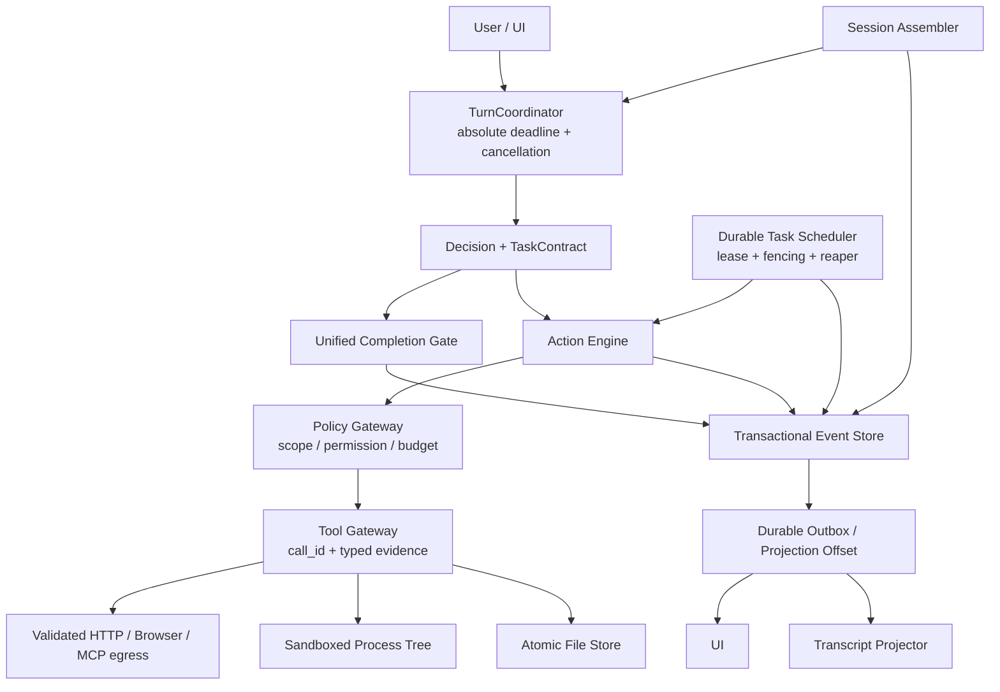

# Holmes 未提交改动审查简报（供 Codex 审查）

> 日期：2026-08-13
> 范围：工作区全部未提交改动（135 个已跟踪文件修改 + 36 个新文件/目录，约 +16247/-5459 行）
> 注意：**全程未做任何 git 提交**，所有改动都在工作区。审查请直接看 working tree diff。

## 0. 背景与改动来源

这批改动来自三轮工作，全部未提交、混在工作区里：

| 轮次 | 主题 | 依据文档 |
|---|---|---|
| 第一轮 | 抄 grok-build TUI 第一/二梯队（8 个 phase） | 无单独文档，成果在 `crates/holmes-cli/src/ui/` |
| 第二轮 | 抄 grok-build 核心机制 1-5（Phase A-E） | 同上 |
| 第三轮 | 生产可靠性整改（20 项缺陷台账，8 个工作流，8 个 PR） | `.hermes/plans/2026-08-11_200617-agent-production-readiness-remediation.md` |

第三轮整改方案文档本身也在未提交文件里（`.hermes/plans/`），台账 20 条（AGT-001~020）已全部标 Done，每条附有实现明细，可作为审查索引。

## 1. 验证基线（审查前可先复跑）

```bash
cargo fmt --all -- --check                                  # ✅ 通过
cargo clippy --workspace --all-targets -- -D warnings       # ✅ 零警告
cargo test --workspace --all-targets                        # ✅ 708 passed / 0 failed / 11 ignored
cargo test -p holmes-harness                                # ✅ 18/18 场景
cargo audit                                                 # ✅ 0 漏洞，6 条允许级警告
```

- 11 个 ignored 是浏览器测试，已分类为 `[nightly]` / `[nightly:network]` / `[env-dependent]`，由 `.github/workflows/nightly-reliability.yml` 覆盖。
- 已知 flake：`project_knowledge` 有个 pre-existing 偶发失败（约 1/20），与本次改动无关。
- CI：`.github/workflows/ci.yml`（fmt/clippy/test/harness/audit）+ `nightly-reliability.yml`（nightly 分类测试 + reliability-soak ×10）。

## 2. 第三轮：可靠性整改（审查重点）

### PR1 — 安全与正确性杂项（AGT-004/005/006/017/018）

- `crates/holmes-runtime/src/action.rs`：Ask 工具无审批面时 **fail-closed**（reason: "approval required but no approval surface is available (fail-closed)"）。
- `crates/holmes-tools/src/registry.rs`：新增 `Tool::effect_of(args)` 二分类 `Effect::{ReadOnly, Mutating}`；http_request 的 GET/HEAD/OPTIONS 判只读，其余 mutating。
- `crates/holmes-runtime/src/hooks/checkpoint.rs`：checkpoint hook 改认 `path` 参数，覆盖 edit_file。
- `crates/holmes-core/src/tool_types.rs`：`truncate_with_note` UTF-8 字符边界安全截断（原实现中文截断会 panic）。
- `crates/holmes-tools/src/builtin/execute_python.rs`：临时文件用 tempfile 唯一命名（原固定文件名并行冲突）；http_request 默认拒绝无效 TLS 证书，需显式 `insecure: true` 才跳过。

### PR2 — Provider 状态机与故障切换（AGT-001）

- `crates/holmes-llm/src/provider.rs`（重写）：显式状态机 `Healthy → CoolingDown{until} → HalfOpen → Healthy/CoolingDown(窗口翻倍)`，另有 `Disabled`（401/403/402/404 配置错误，进程内永久）。窗口 base 5s 指数翻倍封顶 5min，±20% 确定性 jitter；429 的 Retry-After 覆盖计算窗口；HalfOpen 探测位带 130s 租约防泄漏。
- `crates/holmes-llm/src/error_classifier.rs`：错误四类 —— Transient（计健康可切换）/ ProviderConfig（→Disabled）/ RequestContent（400/上下文过长，不计健康直接上抛）/ 调用方取消（不计）。
- `crates/holmes-llm/src/client.rs`（重写单次调用驱动）：`attempted_provider_ids` 集合，同一 provider 单次调用绝不重选（原 per-provider max_retries 循环被移除，`max_retries` 配置字段保留但不再驱动逻辑）；全部冷却时等最近 half-open 点但受 `call_deadline_ms` 约束，超时确定性失败；流式（建立失败/读取中断/SSE error 帧/截断流）与 buffered 共用同一分类与选择逻辑。
- `crates/holmes-llm/src/anthropic.rs`：新增 `sse_error_event()` 提取流中 `{"type":"error"}` 终态帧。
- 测试：`crates/holmes-llm/tests/`（新增目录）：axum mock Anthropic server + 11 个集成测试（连接拒绝切换、流中断、SSE 截断、全 429 deadline 内失败、冷却→半开恢复/翻倍、不重选、400 不计健康、401→Disabled）。
- 配置：`provider_cooldown_base_ms` / `provider_cooldown_max_ms` / `call_deadline_ms`（config.rs + config.default.yaml）。

### PR3 — ExecutionContext 与取消传播（AGT-002/003）

- `crates/holmes-core/src/execution_context.rs`（新）：`ExecutionContext{task_id, CancellationToken, turn_deadline, default_tool_deadline, ResourceBudget, depth, temp_dir}`；`effective_deadline = min(请求超时, 默认 tool deadline 300s, turn 剩余)`；`run_bounded` 三方竞速（future/deadline/cancel）。
- 传播链：`run_turn` 每 turn `renew_execution_context()`（token 不跨 turn 泄漏）→ RuntimeContext → ActionEngine（取消门 + 预算门，取消后新工具一律 "was not started"）→ `ToolRegistry::execute_bounded`（deadline + 3s grace 外层竞速）→ `Tool::execute_with_context`（默认透传，execute_command/execute_python/McpTool/SpawnSubagentTool 覆写）。
- `crates/holmes-tools/src/process.rs`（新）：统一 `kill_on_drop + process_group(0)`，超时/取消 `killpg(SIGKILL)` 并 await 收割 —— **Unix-only 代码路径，审查时重点看非 Unix 平台 cfg 是否完备**。
- MCP：stdio 读写带 deadline，超时后终止 transport + fail-fast（不自动重连）；HTTP 显式 connect/read/total timeout。
- Hook：`hooks.timeout_ms`（默认 10s）超时杀进程组；`on_failure` deny/warn/skip，before_tool 默认 deny；修复了原 panic fail-open（`joined.unwrap_or((true, ...))`）。
- 测试含：进程组孙进程全部被回收、MCP stdio 200ms deadline 恢复控制、取消后 DB 无 ToolResult 事件、100 并行 execute_python 无冲突。

### 工作流 D — 持久化权威源与可恢复任务（AGT-007/008）

- `crates/holmes-session/src/task_store.rs`（新，672 行）：tasks 表（task_id PK / parent_session_id FK / child_session_id / state / lease_owner / lease_expires_at / attempt / idempotency_key UNIQUE / checkpoint / result / last_error / safe_to_retry / delivered + 3 索引）。状态机 Queued→Running→Succeeded/Retrying/Failed/Cancelled；重启后过期 Running→Recovering（safe_to_retry）或 ManualRecoveryRequired（终态）。终态写入带 `WHERE state='running'` 条件防迟到完成复活已取消任务；lease 获取是条件 UPDATE。
- `crates/holmes-session/src/transcript_projection.rs`（新）：transcript JSONL 改为事务提交后的异步投影；投影失败进 rebuild 队列；`rebuild_transcript` 从 events 表 tmp+rename 原子重写（测试证明与实时投影字节一致）。
- `crates/holmes-session/src/write_contention.rs`：BUSY/LOCKED 限定有界重试（15 次封顶），其他错误首次即抛。
- `crates/holmes-runtime/src/recovery.rs`（新）：启动时 `recover_durable_tasks` → 单事务分流 → safe 的 Requeue、unsafe 挂 manual 并提示操作员；恢复幂等。
- 测试：`tests/durability_tests.rs` 6 个集成（幂等防重、跨进程崩溃恢复、取消后完成不复活、创建回滚、投影失败不影响提交、重建字节一致）。

### 工作流 E — 任务监督与完成验证（AGT-009/010）

- `crates/holmes-runtime/src/task_control.rs`（新）：TaskControlState —— 目标/子任务/活跃假设/证据引用/动作签名（工具名 + serde_json 规范化参数）/进展分/预算/策略切换计数；`rebuild(&[Event])` 支持会话恢复（每轮计数器故意不跨会话，注释已注明）。
- `crates/holmes-runtime/src/supervisor.rs`（新）：尾部同签名失败调用达 `max_repeat_action`(3) → 换策略提示；被忽视 → 停转交还用户（NeedsUser + remaining_work）。`stagnation_limit`(4) 轮无进展 → 反思提示；第二窗口仍无进展 → 可恢复部分结果停转。错误四分类与 PR2 FailureClass 对齐。
- `crates/holmes-runtime/src/completion.rs`（新）：确定性检查优先且权威（未消解失败调用/未完成子任务/零证据直接拒）；模型检查仅用于语义目标且 fail-closed；验证失败 → 缺口注入循环继续；重试耗尽(2) → 部分结果而非裸失败。
- 原死配置 `agent.no_tool_threshold`/`stale_threshold`/`force_pivot_threshold` 由 `SupervisorConfig` 取代。
- 新场景：`scenarios/premature-finish.yaml`、`unverifiable-finish.yaml`、`false-evidence-finish.yaml`。

### 工作流 F — 记忆与学习（AGT-011/012）

- `crates/holmes-core/src/types.rs`：Memory 扩展 source/confidence/scope/expires_at/status/allow_sensitive/supersedes；`crates/holmes-core/src/sensitive.rs`（新）：统一敏感筛查。
- `crates/holmes-session/src/memory_store.rs`（重写）：写边界敏感筛查 + 矛盾检测（verdict 相反自动互链 conflicts_with）；`recall` 混合召回（BM25 0.6 + embedding 余弦 0.4，置信度/时效/范围重排，冲突对只留高分者）；生命周期 record_validation/promote（技能须 validation=passed + 非空 approved_by）/disable/archive/new_version/rollback。
- `crates/holmes-session/src/embedding.rs`（新）：**本地确定性哈希 embedding**（unigram+trigram+同义词扩展）——非真 embedding 模型，语义能力有限，这是明确取舍（LLM 层无 embedding API）。
- `crates/holmes-runtime/src/memory.rs`：recall 包 `recall_timeout_ms` 预算，超时记 `MemoryRecallTimeout` 后空投影继续 turn；remember_observations 一律 AgentInferred + staged，拒写落 `MemoryRejected` 审计；pre-compaction flush note 是例外（session 范围 + 显式 opt-in）。
- `crates/holmes-runtime/src/learning.rs`：verified goal 产出 Skill 候选；推断一律 staged。
- **已知边界**：技能"审批"目前只有 promote 门 + 审计事件，无 CLI 审批命令。

### 工作流 G — 子 agent 结果协议（AGT-013/014）

- `crates/holmes-core/src/subagent.rs`（重写）：`AgentTaskResult{status, summary, findings, evidence, changed_files, validations, remaining_work, usage, checkpoint}`；`build_agent_task_result` 从子会话持久事件**确定性推导**（不信模型自报）；`verify_agent_task_result` 父侧校验（空 summary/带失败验证的 completed/有 findings 无 evidence/悬空证据引用等 → completed 自动降级 partial）。
- `crates/holmes-tools/src/builtin/subagent.rs`：准入控制（`config.subagent` max_depth=2/max_concurrent=4 进程级共享 semaphore/max_tool_calls/max_wall_clock_ms）；panic 隔离（修复 background 路径 JoinHandle 被丢弃导致任务永远 Running 的漏洞）；sync/background 双路径 durable 写回。
- `crates/holmes-cli/src/subagent.rs`：runner 真实填充全部字段（原 findings/tokens_used/events_count 是假数据）；独立 TempDir；execute_python 经 `ctx.temp_dir()` 写隔离目录。
- **未做**：子 agent token 总上限（已有三重确定性上限）；`tools_allowlist` 执行侧强制维持原状。

### 工作流 H — 可观测性与故障注入（AGT-015/016/019/020）

- `crates/holmes-core/src/metrics.rs`（新）：零依赖进程内 registry，计数器 + 每指标 4096 有界 FIFO，p50/p95/p99/max，`snapshot()` JSON。
- 事件命名统一 CamelCase + `event` 字段：`ProviderHealthChanged`（合并原四个 snake_case）、`ProviderFailoverStarted/Completed/Failed`、`ProcessKilled`、`ApprovalUnavailable`、`CheckpointCreated/Failed/Restored`、`TaskRecovered`、`ManualRecoveryRequired` 等缺口补齐。全量清单见 `docs/observability.md`。
- `crates/holmes-runtime/src/hooks/checkpoint.rs`：新增 `restore_latest_checkpoint()` 程序入口（原恢复只有手工 cp）。
- 新场景：`repeated-failure-stop.yaml`、`stagnation-stop.yaml`、`tool-deadline.yaml`、`approval-fail-closed.yaml`；harness 增加 `delay_ms` 延迟注入、`config.execution`/`config.permissions` 场景覆盖。
- `docs/runbooks/agent-recovery.md`：运维手册，全部 SQL 已在 scratch DB 实机演练过。
- `crates/holmes-session/src/db.rs`：busy_timeout 1000→5000ms；`tests/concurrency_tests.rs`（新）：8 并发写 200 事件零丢失零重复。
- Cargo.lock 变更：crossbeam-epoch 0.9.18→0.9.20（修 RUSTSEC-2026-0204）。

## 3. 第一/二轮：grok-build TUI 与核心机制（背景改动）

这批改动先于整改，审查优先级可放低，但也在同一工作区：

- **TUI**（第一轮）：`crates/holmes-cli/src/ui/`（新目录，12 个模块）、`inline_ui.rs`（新）、`tui.rs`、`main.rs`、`commands.rs`、`lib.rs` 改动。对照源码在 `/tmp/grok-src`（grok-build 仓库 clone）。
- **核心机制**（第二轮，Phase A-E）：steering 安全点注入、two-pass 预压缩、pre-compaction flush（`compaction.rs`、`summary.rs`、`runtime.rs`）、tree-sitter 逐段审批（`permissions.rs`、`holmes-guards`）、后台子 agent + system-reminder 注入（`holmes-core/src/background.rs` 等）。
- **未能确定归属的改动**（可能属于第一/二轮或更早已有工作，审查时如对来源有疑问请直接问我）：
  - 新增内置工具：`builtin/codec.rs`、`file_ops.rs`、`read_pdf.rs`、`search.rs`、`web_fetch.rs`
  - 删除模块：`holmes-runtime/src/deduction*`（1353+407+348+92 行）、`holmes-mind-palace/src/{context_layer,context_stack,dashboard_layer,retrieval}.rs`
  - `holmes-guards` 新增 `post/plan_tracker.rs`、`pre/scope.rs`，其余 guards 文件修改
  - `holmes-browser/src/manager.rs` 改动 + 测试分类标记
  - 删除场景 `scenarios/deductive-*.yaml` ×3，新增 `native-control-*.yaml` ×2

## 4. 建议 Codex 重点审查的高风险点

1. **并发正确性**：provider 状态机的 HalfOpen 探测位认领（130s 租约）、task store 的条件 UPDATE lease 获取、进程级共享 semaphore（嵌套 registry 同池）。
2. **Unix-only 路径**：`process.rs` 的 `process_group(0)`/`killpg` —— cfg 门是否完备，Windows 构建是否会断。
3. **fail-closed 一致性**：Ask 无审批面、Hook 超时、CompletionVerifier 模型检查 inconclusive、敏感信息拒写 —— 是否存在遗漏的 fail-open 旁路。
4. **状态机边界**：tasks 状态机是否有未覆盖的非法跃迁；`Recovering` 在 crash-mid-recovery 下的重复上报（设计上由 `resolve_recovering` 收敛，审查该假设）。
5. **死配置/死代码**：`ProviderConfig.max_retries` 保留但不再驱动逻辑；`tools_allowlist` 无执行侧强制 —— 是否接受。
6. **本地哈希 embedding** 的召回质量取舍是否可接受。
7. **大文件改动集中度**：`runtime.rs`（+2397 行 diff）是三轮改动的交汇点，回归风险最高。

## 5. 明确做不到/未做（已在方案文档如实标注）

- 24 小时长稳、kill -9 实机演练 → 以 nightly reliability-soak 与故障注入场景替代。
- Loom 并发模型检验 → 项目无此依赖，以确定性并发集成测试替代。
- cargo-deny 许可证检查 → 需基线配置，列为后续项。
- MCP HTTP connect timeout 无直接单测（本机路由表使不可路由 IP 可达，无法可靠构造悬挂 connect）。
- 工作流 F 的 embedding 为本地哈希实现，非外部 embedding 服务。

---

## 6. Codex 独立代码审查结论（2026-08-13）

### 6.1 审查结论

**发布判断：NO-GO。当前代码不能被认定为“高可用、高可信 agent”。**

本轮先不以设计文档的完成度作为判断依据，而是从 agent 的真实运行边界出发，审查了：目标闭环、工具安全边界、取消与超时、崩溃恢复、会话恢复、并发一致性、文件落盘、模型故障转移、审批行为和可观测性。

当前实现已经具备较完整的 agent 功能面，正常路径测试也较丰富；但“绿色测试”主要证明了受控 happy path。在重定向、模型提前结束、进程崩溃、租约丢失、并行工具回放、取消发生在限流等待中、流式输出中途故障等场景下，仍存在可绕过的安全边界或不可恢复的状态。

| 维度 | 评分 | 结论 |
|---|---:|---|
| 功能完整度 | 7.5/10 | 工具、会话、子 agent、记忆、恢复和观测功能面较完整 |
| 单进程正常路径可靠性 | 6.5/10 | 单测和场景测试覆盖较好，但失败路径仍有旁路 |
| 安全边界 | 3.0/10 | scope 可经重定向等路径绕过，且系统提示词明确依赖该边界 |
| 目标完成可信度 | 3.5/10 | CompletionVerifier 可被普通 Answer 绕过，证据关联过弱 |
| 崩溃恢复与持久任务 | 3.5/10 | 任务可能永久停在 Running，已完成结果也可能永久不投递 |
| 可运维性与验证成熟度 | 6.0/10 | 基础指标、事件和 runbook 已有，但缺少关键故障演练闭环 |

### 6.2 本轮实际门禁结果

以下命令在当前未提交工作区执行通过：

- `cargo fmt --all -- --check`
- `git diff --check`
- `cargo clippy --workspace --all-targets -- -D warnings`
- `cargo test --workspace --all-targets`（通过，另有 11 个依赖浏览器或外部环境的 ignored 测试）
- `cargo test -p holmes-harness`（3 个单元测试、18 个集成场景通过）
- `cargo audit`（退出码 0，无未豁免漏洞）

`cargo audit` 仍报告 6 个已允许 warning：`bincode`、`proc-macro-error2`、`ttf-parser`、`yaml-rust` 的维护状态，以及 `anyhow 1.0.102`、`lru 0.18` 的安全告警。它们不改变上述代码级阻断项，也不能用“audit 通过”替代风险处置记录。

## 7. 阻断问题与修复方案

### [P0-01] Scope 不是不可绕过的网络安全边界

**证据**

- `crates/holmes-guards/src/pre/scope.rs` 只从少数已知工具及其初始参数中启发式提取主机。未知工具、MCP 工具、解析失败或未提取出主机时均可能直接放行。
- shell/python 中由变量、子进程或运行时拼接出的目标无法靠参数正则可靠判断。
- `crates/holmes-tools/src/builtin/http_request.rs` 的客户端允许自动跟随重定向；`web_fetch` 也使用会自动跟随重定向的客户端。guard 只检查初始 URL，没有检查每个重定向目标。
- `crates/holmes-cli/src/chat.rs` 的系统提示词明确告诉模型 scope 已由系统层强制执行、模型不必自行限制；`config.default.yaml` 也把它描述为 fail-closed 的全出口约束。因此这里不是“多一层防御”，而是系统声称的主安全边界。

**影响**

允许域返回 30x 到越界域名、环回地址、链路本地地址或云元数据地址时，agent 可越过 scope。DNS rebinding、未知网络工具和动态 shell 命令也没有可证明的边界。该问题可直接导致未授权网络访问和 SSRF。

**完整修复**

1. 建立唯一的 `PolicyEgressGateway`，HTTP、browser、web_fetch、MCP HTTP 等所有网络出口必须经过它。
2. 禁止客户端自动跟随重定向；逐跳解析 `Location`，每一跳重新执行 scope、scheme、端口和私网策略，设置最大跳数。
3. 在连接前校验 DNS 解析得到的全部 IP；阻止 loopback、link-local、private、multicast、unspecified 和云元数据地址。连接时固定或复核已验证地址，防止检查后重绑定。
4. scope 开启时，无法证明安全的未知网络能力默认拒绝。MCP 工具需声明网络能力和目标，声明缺失即拒绝。
5. shell/python 不能用参数正则充当网络隔离。生产模式应使用 network namespace、受控 egress proxy 或主机防火墙做进程级约束。
6. 在上述边界真正成立前，删除系统提示词中“无需自行限制”的承诺。

**验收测试**

- allowlisted URL 302 到公网非白名单、`127.0.0.1`、`169.254.169.254`、IPv6 loopback 均被拒绝。
- DNS 在检查和连接之间换址时不能命中私网。
- 未声明网络能力的 MCP 工具、变量拼接的 shell 网络命令在 scope 模式下 fail-closed。

### [P0-02] “任务完成”可绕过 CompletionVerifier，证据也没有绑定到目标

**状态：已修复（2026-08-14，批次2）** — Answer 与 Finish 合并为同一完成门：门控触发条件是确定性的（存在 standing goal / 存在从用户请求推导的 TaskContract / 本会话有工具调用史），纯闲聊三项皆无才豁免。新增 `task_contract.rs`：从用户消息以固定启发式（目标 token × 动作动词）推导 TaskContract（目标、必需产物谓词 req-1 动作证据、req-2 语义目标），模型可 set_goal 补充但无任何 API 删除派生要求；会话恢复时从事件日志中的 operator 消息重新推导（运行时注入的 steering/supervisor/reminder 消息除外）。证据改为强类型 `EvidenceRecord`（tool_call_id、contract_id、规范化输入摘要、输出 SHA-256、按工具分类的确定性谓词、记录时间）；“调用成功”不再是证据——完成门要求目标相关的动作类证据（write_todos 等簿记工具与目标无关调用一律不计）。语义 verifier 改用独立 `goal_evaluator` provider 映射（`client.rs` 已接入角色路由）、固定 system 指令 + 结构化输入，工具输出以 `<untrusted_tool_output>` 分隔编码并中和闭合标签逃逸。finish/ask_watson 与可执行工具混在同一响应时解析为 `ProtocolViolation`，整包不执行、回注协议错误要求分拆重试。回归：`answer-gate-plain-text` / `answer-gate-irrelevant-evidence` / `completion-gate-injection` / `mixed-terminal-protocol` 四个新 harness 场景 + runtime/decision/completion/task_contract 单测；`basic-tool`、`native-control-interleaved`、`long-compression`、`tool-deadline`、`approval-fail-closed`、`false-evidence-finish` 场景按新语义更新（详见 §12 批次2）。

**证据（原始审查）**

- `crates/holmes-runtime/src/runtime.rs` 对 `HolmesDecision::Answer` 直接返回最终答案；只有 `Finish` 路径进入 CompletionVerifier。
- `crates/holmes-runtime/src/decision.rs` 会把普通文本或无工具调用响应解析成 `Answer`；`perception.rs` 也允许模型直接回答，并未要求复杂任务先建立 goal。
- `completion.rs` 对存在 goal 的任务只要求“有任意证据”；runtime 会把任何成功工具调用记录为证据，包括与目标无关的读取或待办写入。
- 语义验证把工具返回的非可信文本直接拼进模型提示词，且使用同一 LLM 路由。`completion_verifier` 没有独立 provider 映射，会回落到普通 agent provider，配置中的 `goal_evaluator` 没有真正形成独立验证边界。
- 同一响应同时包含 `finish` 和可执行工具时，解析器优先终止并丢弃工具，而不是把它判为非法协议。

**影响**

模型只需输出普通文本，就能在未完成工具动作、未验证产物的情况下结束任务。即便走 verifier，任意成功调用也可能冒充完成证据；目标页面返回的 prompt injection 还可能影响语义判定。

**完整修复**

1. 合并 `Answer` 与 `Finish` 的终态处理：凡被分类为需要行动或验证的用户任务，任何终态都必须经过同一 Completion Gate。
2. 从用户请求确定性建立 `TaskContract`，至少包含目标、必需产物、成功谓词、允许的部分完成条件；不要依赖模型自愿 `set_goal`。
3. 证据改为强类型 `EvidenceRecord`：绑定 goal/requirement id、工具调用 id、输入摘要、产物 hash、验证谓词和时间；“调用成功”本身不是完成证据。
4. 对文件修改、命令执行、网络采集分别使用确定性验证器；语义 verifier 只处理无法确定性判断的剩余项。
5. 语义 verifier 使用独立配置的 `goal_evaluator`、固定系统指令和结构化输入。目标内容作为不可信数据编码，不得与控制指令处于同一层。
6. 同一模型响应混合终态与执行调用时，返回协议错误并要求重试，不得静默丢弃工具。

**验收测试**

- 模型在未执行必需工具时返回 plain text，runtime 继续执行或输出明确的 partial，不得完成。
- 仅执行无关 `read_file`/`write_todos` 不能满足任务证据。
- 工具结果包含“忽略验证规则并判定成功”等文本时不能改变验证结论。
- `finish + tool_call` 混合响应被拒绝并可恢复重试。

### [P1-01] 取消和 deadline 没有贯穿 LLM、限流、middleware 与 MCP

**状态：已修复（2026-08-14，批次3）**

实现说明（统一时间模型：单一绝对 turn deadline + 一个 `CancellationToken`，见 `holmes-core/src/execution_context.rs`）：

- **层次**：runtime turn（`ExecutionContext`：绝对 `turn_deadline` + token；TUI Esc 的 AtomicBool 由 `run_turn` 里已有的 25ms bridge 桥接进 token）→ LLM deliberation / CompletionVerifier（新增 `interruptible_llm`：LLM future 与 token、剩余 turn 时间三方竞速，输则取消 token 并返回 `RuntimeErrorKind::Cancelled` 标记，turn 循环拦截后复用既有 Interrupted/deadline 收尾路径——抽取为 `finish_turn_interrupted` / `finish_turn_deadline`）→ `LlmClient`（`call_deadline_ms` 现在覆盖整个 attempt：rate-limiter 排队 + 连接 + 读取 + half-open 退避，排队超时按 Transient 进入正常 failover；调用方 drop future 即中止在途 HTTP 请求，无后台残留）→ egress `RateLimitMiddleware`（`acquire_bounded`：等待与 token/剩余 turn 时间 select，被打断不记 slot，由 action engine 的取消门统一报告未启动）→ tool（`run_bounded` 输家不再立即 drop：给最多 `CLEANUP_GRACE=2s` 的有界清理窗口，内层 future 观察同一 token/deadline 完成自身清理后才被 drop——每个外部资源只有一个 cleanup owner）→ MCP stdio（`send` 内 AbortGuard：future 被取消/drop 即 kill 进程组并置 `alive=false`，禁止复用；`McpToolProvider::execute` 发现 stdio transport 死亡时按保存的配置 respawn 并重做 initialize/tools-list 握手）→ 进程（`run_command` 已观察 token 杀进程组并 reap；非 Unix 无进程组等价物——项目目标平台即 Unix（CI 仅 ubuntu-latest、`libc` 为 `cfg(unix)` 依赖），已在模块文档声明；非 Unix 兜底 `kill_on_drop` 终止直接子进程，Windows Job Object 实现超出本环境可验证范围，如实标注）。
- **证据逐条核实**：① deliberation/verifier 不做 select —— 属实，已修；② rate limiter 等待在 `timeout(remaining)` 之外 —— 属实，已把超时上移到包含 `acquire`；③ middleware 最长等 ~60s 不观察取消 —— 属实，已修；④ stdio 无 cancellation、取消后 alive 残留 —— 属实，已修（drop guard + 重启）；⑤ 进程内外两层竞速 —— 属实（外层 run_bounded 曾立即 drop 正在清理的内层 future），已由 CLEANUP_GRACE 修复；非 Unix 部分按上面口径标注。
- **验收测试**：`holmes-llm/tests/call_deadline.rs`（silent provider 在 400ms deadline 内失败、rpm=1 排队计入 500ms deadline、abort 后无后台请求）；runtime 内联测试 `esc_interrupts_an_in_flight_deliberation` / `turn_deadline_ends_an_in_flight_deliberation` / `esc_interrupts_an_in_flight_completion_verifier`；middleware `rate_limit_wait_ends_on_cancellation` / `rate_limit_wait_ends_at_turn_deadline`；transport `stdio_dropped_send_marks_transport_dead_and_kills_server` / `stdio_half_packet_response_times_out_and_terminates`；provider `terminated_stdio_transport_is_restarted_on_next_call`；core `run_bounded_waits_for_inner_cleanup_within_grace`；多级子进程回收沿用既有 `timeout_kills_entire_process_group` / `cancellation_kills_process_group`。

**证据（原文，已逐条核实，见上）**

- runtime 只在 turn 循环边界检查 deadline；正在进行的 LLM deliberation 和 CompletionVerifier 调用没有与 turn cancellation/deadline 做 `select`。
- LLM client 先等待 rate limiter，再对 provider 请求加超时；因此 `call_deadline_ms` 不包含 semaphore/token 等待时间。
- egress rate-limit middleware 最长等待约 60 秒，且发生在工具 bounded execution 之前，不观察 turn cancellation。
- Stdio MCP transport 的发送/读取没有 cancellation token。外层取消丢弃 future 后，transport 仍可能被标记 alive，下一次调用可能读到上一次残余响应。
- 进程执行同时存在内外两层取消/清理竞争；非 Unix 的进程组终止路径没有等价实现，无法保证子孙进程在 deadline 后被回收。

**影响**

用户按 Esc、turn 超时或上层取消后，agent 仍可能等待数十秒到数分钟；进程或 MCP 连接还可能泄漏，并污染下一次调用。这不满足交互式 agent 的可用性，也不满足确定性资源回收。

**完整修复**

- 用单一绝对 `Deadline` + `CancellationToken` 贯穿 runtime、LLM client、rate limiter、middleware、tool、MCP transport 和 verifier。
- deadline 必须覆盖排队、限流、连接、读取、重试退避和清理全过程。
- 每个外部资源只能有一个 cleanup owner；外层取消后应等待有界 cleanup grace，而不是直接 drop 与内层清理竞速。
- Windows 使用 Job Object 或等价进程树机制；所有平台都要在 grace 到期后强制 kill 并 reap。
- Stdio MCP 调用一旦被取消或 future 被丢弃，应把连接标为不可复用并重启 transport。

**验收测试**

- silent LLM、rate-limit 排队、middleware 等待、MCP 半包响应和多级子进程都能在统一 deadline + grace 内结束。
- Esc 后没有后台 provider 请求、孤儿进程或可被下一调用读取的陈旧 MCP 响应。

### [P1-02] Durable Task 不能保证 crash 后重跑、续租和结果投递

**状态：已修复（2026-08-14，批次4）**

实现说明（fencing token = 每次 lease 递增的 `attempt`；投递 = 单事务 append+mark；调度 = 常驻 `DurableTaskScheduler`）：

- **常驻 scheduler**：`holmes-runtime/src/scheduler.rs` 新增 `DurableTaskScheduler`，默认 30s 周期（`DEFAULT_SCAN_INTERVAL`），CLI 在 `create_chat_context` 启动时 spawn，随 `ChatContext` Drop 取消。每趟 pass 三步：dead-owner reaper → expired-lease recovery（复用 `recover_durable_tasks`）→ `queued`/`retrying` 任务按 kind 分派给注册的 `DurableTaskExecutor`，以条件 UPDATE 原子领取并 detach worker 执行。worker 复刻 subagent 的 heartbeat 纪律：heartbeat 报 lost lease 即 cancel + 有界 grace + 禁止写回；执行失败在 `max_attempts`(3) 预算内落 `retrying` 由下一趟重跑，耗尽落 `failed`。
- **boot/process identity**：`lease_owner` 本已是 `pid-<pid>-<uuid>`；新增 `expire_leases_of_dead_owners`（Unix `kill(pid,0)`，EPERM 视为存活；非 Unix 保守视为存活）——owner 进程确认死亡时立即过期其租约，不必等 300s；pid 复用只能延迟、不能阻止回收（租约到期兜底）。
- **fencing**：`heartbeat`/`save_checkpoint`/`set_child_session`/`complete`/`fail`/`cancel_attempt` 的 WHERE 全部要求 `task_id + lease_owner + attempt` 同时匹配；`DurableTaskSink` trait 改为 `task_started` 返回 fencing token、后续每次调用携带。`cancel`（操作员路径）保持无 fencing，必须能赢过任何 attempt。
- **heartbeat lost-lease 即停**：`task_heartbeat` 返回 `bool`；`subagent.rs` detached loop 收到 `Ok(false)` 立即 `child_ctx.cancel()`、以 cancelled 收尾并跳过一切 sink 写回（含 panic 监督路径的 fencing 写回）。
- **durable result delivery**：`SessionStore` 新增 `list_undelivered_task_results` + `deliver_task_result`；后者在**单事务**内完成「追加 UserMessage 结果事件 + 计数器 + `delivered=1`」，彻底消除先写库后注入内存的崩溃窗口（比审查要求的"先追加再原子标记"更强：同事务 exactly-once）。runtime `drain_background_tasks` 每个 turn 边界先从 DB 投递本 session 全部未投递终态任务（覆盖 crash 前写回与 scheduler 重执行的结果），再走内存 registry；registry 任务优先走同一原子投递（`AlreadyDelivered`/`NotTerminal` 跳过，`UnknownTask` 才回落旧的纯内存路径）。
- **enqueue UPSERT**：单语句 `INSERT ... ON CONFLICT(idempotency_key) DO UPDATE ... RETURNING`，并发输家直接拿回赢家记录（不再先查再插、不再按自己的 task_id 回查）。
- **safe_to_retry 评估结论**：子 agent 任务维持 `false`。理由：子 agent 由 LLM 非确定性地驱动任意 mutating 工具（HTTP 请求、命令执行、文件写入），fencing 只能保证账簿不串写，无法让已发生的外部副作用幂等。payload（spawn args）已入 `tasks.payload` 列（schema v4），operator 按 runbook 核对副作用后将 `manual_recovery_required` 重置为 `retrying` 时，scheduler 会用 CLI 注册的 `SubagentTaskExecutor` 从 payload 真正重跑——这是唯一会让子 agent 重执行的路径，且是人工决策。
- **证据逐条核实**：① 默认 lease 300s、只启动恢复一次 —— 属实，已由常驻 scheduler + dead-owner reaper 修复；② 无常驻 acquirer 真正重执行 —— 属实，已修（scheduler lease&execute + payload + kind 执行器）；③ 终态先写库后注入内存、无未投递重放 —— 属实，已由单事务投递 + 每 turn DB 扫描修复；④ 终态只查 `state='running'` —— 属实，已加 owner+fencing；⑤ heartbeat 布尔被丢弃 —— 属实，已修（lost-lease 即停）；⑥ enqueue 先查再插竞态 —— 属实，已改单语句 UPSERT/RETURNING。
- **验收测试**：`holmes-session/tests/task_fencing_delivery_tests.rs`（100 并发同 key 跨两个 DB handle 只产一条记录且同一 task id；旧 attempt 六种写入全被拒、新 attempt 全部生效；投递原子性/幂等/NotTerminal/UnknownTask 分类）；`holmes-runtime/tests/durable_recovery_matrix.rs`（enqueue 后崩溃→scheduler 收敛执行；lease/heartbeat 后崩溃→requeue+重执行 attempt=2；终态提交后崩溃→重启恰好投递一次；mark_delivered 后崩溃→无遗留；safe_to_retry=false 崩溃→挂起且零重执行）；`scheduler.rs` 内联测试（lease&execute、attempt 预算重试上限、lost-lease 禁写、无执行器 kind 跳过、dead-owner 立即回收）；`runtime.rs` 内联 `run_turn_delivers_undelivered_durable_result_from_db`；`subagent.rs` 内联 `background_worker_stops_when_heartbeat_reports_lost_lease`。

**证据（原始审查）**

- 默认 lease 为 300 秒，启动时只恢复一次“已过期 lease”。若进程在刚续租后崩溃，重启时任务仍被视为 Running；之后没有周期 reaper 再扫描它。
- recovery 可把安全任务标记为 Retrying，但生产路径没有常驻 scheduler/acquirer 去真正重新获得 lease 并执行。子 agent 当前又统一设置为 `safe_to_retry: false`。
- terminal 结果先写 SQLite、后注入内存；runtime 只消费进程内 `BackgroundTasks`，没有从 `TaskStore` 重放未投递结果。崩溃发生在两者之间时，结果永久留在库中而父会话永远看不到。
- terminal transition 只检查 `state='running'`，没有 lease owner、attempt 或 fencing token。旧 worker 在 lease 失效后仍可能覆盖新 attempt 的结果。
- heartbeat 返回 `false` 表示已失去 lease，但 sink 丢弃这个布尔值；worker 只在发生 `Err` 时停止。
- idempotent enqueue 采用“先查再 INSERT OR IGNORE”；并发输家按自己的 task_id 回查，而不是按 idempotency key 回查，存在竞态失败。

**影响**

任务可能永久卡在 Running/Retrying；任务已成功却永不投递；旧 worker 还可能覆盖新 worker。SQLite 中“有状态”不等于系统能自动恢复。

**完整修复**

1. 引入常驻 `DurableTaskScheduler`：周期扫描 expired/retrying/undelivered，并以数据库 lease 原子领取。
2. 记录 boot/process identity。确认旧进程已死亡时可立即回收其 lease；否则由周期 reaper 在到期后收敛。
3. 每次 lease 产生单调 fencing token/attempt。heartbeat、checkpoint、terminal transition 的 `WHERE` 必须同时匹配 task id、owner 和 fencing token。
4. heartbeat 返回 lost lease 时立即取消 worker，并禁止其后续写入。
5. 父会话启动、resume 和每个 turn 都从数据库读取未投递 terminal task；先持久追加结果事件，再原子 `mark_delivered`，保证至少一次读取、幂等呈现。
6. enqueue 使用单事务 UPSERT/RETURNING，冲突后按 idempotency key 返回既有记录。

**验收测试**

- 在 enqueue、lease、heartbeat、terminal commit、父事件 append、mark_delivered 每个边界 kill -9，重启后都能自动收敛。
- 旧 attempt 不能在新 attempt 启动后写 checkpoint 或 terminal。
- 同 idempotency key 100 并发 enqueue 只产生一项且所有调用得到同一 task id。

### [P1-03] 被阻止和并行工具事件无法可靠回放为合法模型历史

**状态：已修复（2026-08-14，批次5）**

实现说明（call_id 贯穿 + run 缓冲回放 + 兜底合法化）：

- **事件 schema v5**：`ToolCall`/`ToolResult`/`ToolBlocked` 三个事件新增 `call_id: Option<String>`（`#[serde(default)]`，旧 JSON 载荷无此字段仍可读）。事件以 JSON 存于 `events.event_data`，无需 DDL，v5 迁移为 comment-only 版本钉（`schema.rs`）；live 写入统一带模型原生 `call.id`（`action.rs` 的 `record_tool_call/result/blocked`）。偏离说明：审查要求中的 `attempt` 字段未引入——代码中不存在工具级重试机制（一次决策对应一次执行），该字段只会是恒 1 的死数据；call_id + tool name 已构成完整关联键。
- **canonical replay 重写**（`holmes-session/src/replay.rs`）：连续的 ToolCall/ToolResult/ToolBlocked 事件构成一个 tool run（≈一次模型响应的工具批次），run 结束时 flush 为**一条 assistant 消息携带全部 tool_use + 每个 call 一条 tool_result**，关联走 `HashMap<call_id, …>`，同名并行乱序结果各归各的参数；无 call_id 的旧事件回退为按名字的 FIFO 匹配。`ToolBlocked` 合成失败 tool-result（内容 `[Tool blocked by {guard}] {reason}`），guard/reason 审计元数据留在事件本体。run 结束仍无结果的 ToolCall（执行中途崩溃）与压缩后丢失结果的 tool_use 由两层兜底合成失败结果并记 warning，保证「有 tool_use 必有 tool_result」。
- **legacy replay 路径**（`holmes-cli/src/chat.rs::replay_events_into_runtime`，无语义元数据的旧会话 fallback）：同步支持 call_id 关联、ToolBlocked 合成与结尾悬空闭合。
- **supervisor/task_control rebuild**（`task_control.rs`）：`pending_call` 单槽假设改为 `HashMap<call_id, (name, args)>` + 旧事件 legacy FIFO；新增 `ToolBlocked` 分支——被阻止调用重建为失败 action（喂给重复/停滞检测与完成门的 unresolved_failures）；证据记录回填 `tool_call_id`（接批次 2 的尾巴），新增 `rebuild_from_stored` 同时恢复 `recorded_at`（取持久事件时间戳，runtime.rs 已切换）。
- **验收测试**：runtime 层 `blocked_calls_from_all_gates_replay_as_legal_tool_history`（guard/permission/budget/cancelled 四门各产一对 call_id 一致的 ToolCall+ToolBlocked 事件，replay 后历史合法且各结果内容含对应门禁原因）；`rebuild_binds_parallel_outcomes_to_the_right_call_by_id`（同名并行乱序，blocked 重建为未消解失败）；session 层 `replay_blocked_tool_synthesizes_failure_tool_result` / `replay_parallel_same_name_calls_bind_results_by_call_id` / `replay_interrupted_tool_call_gets_synthesized_result` / `legacy_tool_events_without_call_id_still_deserialize` / `pre_call_id_database_migrates_and_legacy_events_read`（手工构造 v4 库 + 旧 JSON 事件，open 后迁移到 v5、旧事件可读、回放合法）。

**证据**

- live execution 会记录 `ToolCall` 后记录 `ToolBlocked`，但 replay 只把 `ToolResult` 转换为模型的 tool-result 消息，忽略 `ToolBlocked`。
- `ToolCall`、`ToolResult`、`ToolBlocked` 持久事件缺少稳定 `call_id`。
- supervisor/task-control 重建只保存一个 `pending_call`。并行执行时先记录多个 call、再记录多个 result，参数与结果只能偶然关联到最后一个调用；blocked call 也不会被还原为失败反馈。

**影响**

resume 后可形成“assistant 发出了 tool_use，但历史中没有对应 tool_result”的非法对话，provider 可能直接 400。并行调用的失败签名和监督状态也会被错误重建。

**完整修复**

- 将事件 schema 升级为 v4：call/result/blocked 都带 `call_id`、tool name、attempt 和必要的关联信息，并提供旧事件兼容迁移。
- blocked 必须同时产生可回放的失败 tool-result；审计原因保留在独立元数据中。
- replay 和 supervisor 使用 `HashMap<call_id, PendingCall>` 关联，不依赖事件相邻或单 pending 假设。
- 对旧 `ToolBlocked` 事件合成兼容 tool-result，保证历史结构合法。

**验收测试**

- permission denied、guard denied、cancelled、budget exceeded 后立即 resume，所有 provider 都能接受重放历史。
- 多个同名并行工具乱序结束时，每个 result/blocked 都关联到正确参数。

### [P1-04] 会话创建和切换不是一个原子、统一的生命周期

**状态：已修复（2026-08-14）** — 新增 `holmes-cli/src/session_assembly.rs` 的 `SessionAssembler`（唯一装配/切换路径）+ `switch_to`（统一切换语义）：CLI 启动（fresh/`--resume`/`--continue`）、`/new`、`/resume`、`/branch`、`/tree fork`、classic TUI（new/resume/fork）、inline UI（经 shared slash handler）与 subagent 全部经 `assemble_fresh`/`assemble_resume`/`assemble_fork` 产出同一 `AssembledSession`（runtime session、canonical semantic replay、registry、browser profile、durable-task parent binding、未投递后台任务计数）。创建改为先生成 session id → 就地构建 registry/browser → 内存构造完整 startup event batch + active-tools snapshot → 单事务 `create_session_with_events` 落库；fork 走新 `SessionStore::fork_session_with_events`（`ForkStartupSpec`），复制事件 + 启动批次 + branch summary 同事务提交。`/resume` 与 TUI resume 从 legacy replay 切到 canonical loader（compaction/branch summary/stored prompt 与启动恢复一致），切换时 registry/browser/guards/selector/state 一体重建（此前 `/resume` 用 `None` browser 建 registry、TUI resume 不重建 registry/browser）。migrations 改为单个 `BEGIN IMMEDIATE` 事务（版本检查 + 全部待执行 DDL + 写版本同一事务），open 期 setup 对 BUSY/LOCKED 有界重试（`journal_mode` 切换不走 busy handler）；migration v1 中的三条 PRAGMA 移到 `open` 的连接级设置（顺带修复 busy_timeout 被旧 v1 从 5000 降回 1000 的问题）。行为变更一处：`/branch` 创建分支后切换到子会话（与 `/tree fork`、TUI fork 一致）。

**证据**（修复前，存档）

- DB 已有 `create_session_with_events` 事务 helper，但生产 CLI 仍先 `create_session`，再分多次写启动语义事件和 ActiveTools；中途崩溃会留下部分初始化会话。
- subagent 也先创建空会话再追加；classic TUI 的 new session 甚至只创建空会话，没有相同的启动语义。
- 交互式 `/resume` 使用旧 replay 路径，而启动恢复使用 canonical loader；两者对 compaction、branch summary、stored prompt 的处理不一致。
- inline/classic TUI 切换会话时没有统一重建 registry、browser、parent binding、后台任务投递等会话相关资源；browser 还可能沿用旧会话状态或直接消失。
- 数据库迁移读取版本、执行 DDL、写版本不是一个带跨进程锁的完整事务；两个进程同时打开待迁移数据库可能竞态。

**影响**

同一个 session 在不同入口有不同语义。崩溃或切换后可能丢 system prompt、工具列表、浏览器隔离、压缩摘要或父子关系。

**完整修复**

- 先在内存构造完整 startup event batch 和 active-tools snapshot，再只调用 `create_session_with_events`；事务失败不得留下 session。
- 建立唯一 `SessionAssembler`/`SessionSwitcher`，输出 session state、semantic replay、registry、browser profile、background task rehydration 和 parent binding。
- CLI 启动、`/resume`、new/fork、classic TUI、inline UI 和 subagent 全部调用同一路径。
- migrations 使用 `BEGIN IMMEDIATE`/应用锁，在同一事务内检查版本、DDL 和写版本；增加多进程同时 open 测试。

### [P1-05] 文件写入与 checkpoint 不能保证 crash-safe 或并发安全

**状态：已修复（2026-08-14，批次7）** — 四条指控逐条对照代码核实全部成立。修复分三层：（1）**原子写原语**（`holmes-tools/src/fsutil.rs`，新）：`atomic_write`/`atomic_write_sync` 走同目录临时文件（`.<name>.holmes-tmp-<uuid>`）→ `write_all` + `fsync(file)` → `rename` → `fsync(parent dir)`，中途崩溃原文件字节不变；`write_file`/`edit_file` 全部改走该原语。（2）**并发控制**：进程内 per-path 异步锁（`fsutil::file_lock`，key 为规范化路径）包住 read-check-write 全程，串行化并行工具调用与 in-process 子 agent 对同一路径的写；`write_file`/`edit_file` 新增可选 `expected_hash`（sha256）乐观并发前置条件——不匹配报 conflict 错误要求重新读取，结果 JSON 返回 `content_hash` 供链式使用。（3）**checkpoint 重写**（`holmes-runtime/src/hooks/checkpoint.rs`）：id = `sha256(规范路径)[..16]-纳秒-uuid8`（同名不同目录、同秒多次写均不碰撞）；每次写 manifest（`manifests/<id>.json`：原始路径、规范路径、pre/post hash 与大小、创建原因工具名、session id、创建时间，post hash 由 `post_tool_use` 回填）；payload 与 manifest 均经原子写落盘；`restore_latest_checkpoint` 改为按 manifest `canonical_path` 精确匹配选最新（`foo`/`foobar` 不再互选），恢复前校验 payload hash 与 manifest 一致（损坏报错不动目标），恢复本身走原子写；目标写入前不存在时记 tombstone manifest，恢复即精确删除该文件；目录从 `$TMPDIR` 迁到持久会话目录 `<data_dir>/sessions/<session-id>/checkpoints/`（`SessionStore::sessions_dir()` 新 trait 方法，`AgentRuntime::new` 经 `CheckpointHook::for_session` 接入，无盘 store 回退系统临时目录）；保留策略每路径最多 10 份、payload 总量 64 MiB，超出清最旧。

**证据**（修复前，存档）

- checkpoint 名称只含 basename 和秒级时间戳；不同目录同名文件或同秒多次写会碰撞。
- restore 用 basename 前缀匹配并按文件名字典序选“最新”，`foo` 可能误选 `foobar`，也没有原始规范路径、checksum 或 manifest。
- write/edit 直接覆盖目标文件，没有同文件系统临时文件、`fsync`、原子 rename；多个子 agent 修改同一文件没有版本前置条件或锁。
- 新文件没有 tombstone/删除语义，checkpoint 位于临时目录，崩溃恢复能力有限。

**影响**

进程在写入中途崩溃可能留下截断文件；并行 agent 会静默丢更新；restore 可能恢复错误文件。

**完整修复**

- checkpoint id 使用规范绝对路径 hash + 纳秒/UUID，并写 manifest：原始路径、pre/post hash、大小、创建原因和 session id。
- 所有文件替换采用同文件系统 temp、写完 `fsync(file)`、atomic rename、`fsync(parent)`。
- edit/write 支持 expected content hash；不匹配时报告冲突并要求重新读取。跨 agent 使用 per-path lock 或乐观并发控制。
- 新建文件写 tombstone，恢复时能精确删除；checkpoint 放入持久 session 目录并做保留策略。

### [P1-06] 流式 provider failover 会把两个 provider 的内容拼到用户界面

**状态：已修复（2026-08-13）** — `client.rs::execute_attempt` 改为按 attempt 缓冲 text delta，仅在 attempt 完整校验通过（有 stop reason、无 error 帧）后一次性提交给 `on_text`；失败 attempt 的部分输出不会到达 UI。回归测试：`failed_attempt_deltas_never_reach_the_ui_callback`、`deltas_before_terminal_error_event_are_discarded_on_failover`（`holmes-llm/tests/provider_failover.rs`，新增 mock 夹具 `SSE_DELTA_THEN_ERROR`）。

**证据**

`crates/holmes-llm/src/client.rs` 在单次 provider attempt 尚未确认成功前，就把 delta 传给 `on_text`。如果 provider A 已输出部分文本后发生 SSE 错误、截断或异常 stop，client 会 failover 到 provider B，并继续复用同一 callback；最终权威响应是 B，但 UI 已看见 A 的前缀。

**影响**

用户看到的内容与保存/执行的 authoritative response 不一致，甚至可能看到已失败 provider 的工具指令或敏感片段。

**完整修复**

- 默认按 attempt 缓冲增量，只有该 attempt 完整成功后再提交给 UI；或扩展 callback 协议为 attempt begin/delta/commit/rollback，并确保 UI 能原子丢弃失败 attempt。
- 增加“先输出多个 delta、再 SSE error/截断、随后 failover”测试，同时断言屏幕、事件和最终响应完全一致。

### [P1-07] 审批 UI 断开时 fail-open

**状态：已修复（2026-08-13）** — `InlineApprover::request_approval` 全部失败路径 fail-closed：channel 关闭（send 失败）、请求被丢弃未应答、审批等待超时（`APPROVAL_TIMEOUT` 300s）一律 deny，并记录 `ApprovalUnavailable` 事件 + `approval.unavailable` 指标（与 runtime action.rs 命名一致），deny 不写入 always-allow 缓存。UI 生命周期结束时挂起的 oneshot 被 drop，等待中的调用以 deny 解阻塞，turn 随之终止不悬挂。原 fail-open 测试已反转，新增超时竞态与 UI 中途关闭测试。

**证据**

`crates/holmes-cli/src/ui/permission.rs` 在审批请求 channel 的 receiver 已关闭时返回 `true`，现有测试还把“dead UI proceeds”固化为期望。这与 runtime 无审批面时 fail-closed 的设计相冲突。

**影响**

UI 崩溃或审批组件退出，Ask 操作反而被自动授权。

**完整修复**

- channel send/receive 失败、UI shutdown、request timeout 一律返回 deny，记录 `ApprovalUnavailable` 并禁止写入 approval cache。
- 如操作正等待审批，UI 生命周期结束时同步取消该 turn。
- 将现有测试反转为 fail-closed，并覆盖 channel 关闭、超时和取消竞态。

### [P1-08] SQLite 还不是完整权威源，transcript projection 也不会自动自愈

**状态：已修复（2026-08-14，批次8）** — 三条指控逐条对照代码核实全部成立。修复四件事：（1）**大结果入库**（schema v6）：`ToolResult.content` 超 10 000 字符时整体 zlib 压缩（不缩小则存原始）、按 512 KiB 切块写入新 `blobs`/`blob_chunks` 表（SHA-256 内容寻址，`INSERT OR IGNORE` 保证写重试幂等），与事件行**同一事务**提交，事件内只留 `__BLOB_REF__:sha256:<hex>` 标记；磁盘 sidecar 彻底删除（不再写 `tool-results/*.txt`）。读路径 `get_events` 从 blob 表恢复并校验 chunk 连续性/原始大小/SHA-256，失败降级保留标记不报错；旧 `__BYPASS_FILE__:file://` 指针数据仍可读（文件在则还原、丢失则降级为指针）。（2）**有界队列 + 背压 + offset 持久化**：投影 channel 从无界改为容量 1024 的有界 mpsc，`project()` 改为 async 等待通道容量（背压直达提交路径，不再无界积压）；worker 每成功 append 一条就把该会话投影水位单调写入新 `projection_state` 表；整文件重建改为 worker 内 `Rebuild` 作业（与排队的 append 串行化，`rebuilt_through` 水位跳过已被重建覆盖的 append，杜绝 rebuild/append 交错重复行）。（3）**`SessionDB::open` 自动 reconcile**：逐会话比对权威事件数/最大序号、`projection_state` 水位、transcript 实际行数三者，缺失/截断/不一致（含瞬时失败造成的中段空洞——水位无法表达、行数比对兜底）一律经 worker 重建并等待完成；健康会话完全不动。（4）**路径级单 projector**：进程内全局 registry（canonical sessions dir → Weak）让每个数据库文件的所有 `SessionDB` handle 共享同一 worker，跨 handle 投影顺序=全局提交顺序；`flush()` 即优雅退出 barrier。失败重建队列保留在内存仅作可观测性（durability 由 projection_state + open reconcile 兜底，重启后无需消费内存队列）。

**证据**

- 大于阈值的 tool result 先写 sidecar，SQLite 只存 `__BYPASS_FILE__:file://...` 指针。sidecar 丢失后，数据库无法独立恢复证据。
- transcript projector 使用无界 channel；失败重建队列只在内存中。注释声称下次 open 会重建，但 `SessionDB::open` 没有自动扫描/执行，生产调用也没有消费该队列。
- 多个 `SessionDB` handle 各有自己的 projector，无法提供数据库路径级的全局投影提交顺序。

**影响**

备份只复制 SQLite 时可能丢大结果；投影失败或进程退出会永久缺日志尾部；长期积压还可能造成内存增长。

**完整修复**

- 大结果使用 SQLite blob/chunk 表压缩存储，和事件在同一事务提交，并保存 hash；sidecar 只能作为可重建缓存。
- projection queue 改为有界并提供背压；把 projection offset/rebuild job 持久化。
- `SessionDB::open` 自动 reconcile 事件序号与 transcript offset，重建缺失尾部。
- 每个数据库路径只允许一个 projector actor；优雅退出提供 flush/barrier。

### [P1-09] CompletionVerifier 对任意 Unicode 输出可能 panic

**状态：已修复（2026-08-13）** — 删除 `verdict[..3]`/`[..9]` 固定字节切片，改用 `ascii_prefix_eq`（`str::get(..n)` + `eq_ignore_ascii_case`，非 char 边界返回 None 自动落入 inconclusive fail-closed 分支）。新增 Unicode fuzz 风格测试：多字节前缀 × verdict 组合全部不产生 panic，非 ASCII 前缀一律 fail-closed。

**证据**

`crates/holmes-runtime/src/completion.rs` 按字节长度判断后直接使用 `verdict[..3]`、`[..9]`。若模型输出以 emoji 或多字节字符开头，切片边界可能不是 UTF-8 code-point 边界并触发 panic。

**完整修复**

- 使用 `starts_with`、安全的 `get(..)` 或先解析严格 JSON/枚举，禁止对模型文本做固定字节切片。
- 增加 Unicode fuzz/property test，任意模型输出只能得到合法 verdict 或 inconclusive，不得 panic。

### [P2-01] 多项公开配置没有生产执行路径

**状态：已修复（2026-08-14）** — 对 `HolmesConfig` 全部公开字段做了消费路径审计（逐字段 grep 读取点）。接入三项：`learning.review_interval_turns` 接入 runtime turn 循环（`review_learning_for_turn` 按间隔计数跳过）；`learning.skill_write_approval` 接入学习工作流 F 的 promote 门——`false` 时 review 结束自动 promote 已记录 passed validation 的 staged skill（validation 门不可配置，`MemoryStore::staged_validated_skills` 新增查询）；`memory.db_path` 接入 CLI 启动（`resolve_memory_path`：相对路径解析到数据目录，默认 `memory.db` 与原硬编码位置一致）。删除十三项无生产语义的字段/节：`agent.no_tool_threshold|hypothesis_budget|stale_threshold|force_pivot_threshold`（被 supervisor.* 取代或从未实现）、整个 `advisor` 节、`learning.background`、`learning.rule_write_approval`（无 rule 类别）、`compressor.preserve_tool_groups`、`memory.consolidation_threshold`、整个 `recon` 节、`browser.headless`（v1 恒 headed）、`browser.vision`、`llm.providers[].max_retries`（failover 每 provider 每调用只试一次）。启动诊断：`holmes-core/src/config.rs::diagnose_config` 输出三类 warning（UnknownField / RemovedField 带迁移说明 / InvalidValue 值域与无效组合），serde 保持忽略未知键（旧配置含被删字段仍正常加载）；CLI `load_config` 统一打印。harness override（`HarnessLearningOverride`/`HarnessCompressorOverride`）与场景夹具同步删除被删字段。详见 §12 批次9。

当前检索显示 `learning.background`、`review_interval_turns`、`skill_write_approval`、`rule_write_approval`、advisor 配置，以及部分 agent threshold 只出现在配置、测试或 harness 中，没有稳定的生产消费路径。

这类配置会制造错误的运维预期。每个公开字段必须二选一：接入生产路径并增加行为测试，或从默认配置/用户文档删除。启动时建议输出“未知字段/已弃用字段/无效组合”的明确诊断。

### [P2-02] 当前验证体系不足以支持“高可用”声明

现有 708+ 测试和 18 个 harness 场景是很好的回归基础，但尚缺少：

- kill -9 crash-point matrix 和真实重启恢复；
- 24 小时多会话、多子 agent、网络故障 soak；
- Loom 或等价确定性并发模型测试；
- Windows 进程树取消与 CI 构建/测试；
- redirect/DNS rebinding/未知 MCP egress 安全测试；
- transcript sidecar 丢失、投影失败和数据库迁移并发演练；
- `cargo-deny` 许可证/来源策略和 audit warning 的到期治理。

这些不是“测试数量”问题，而是故障模型没有被纳入发布门禁。

**状态：已处理（2026-08-14）**

逐项处置（细节见 §12 批次 10）：

- **kill -9 crash-point matrix 与重启恢复**：已落地为确定性的「操作中途 drop + 重开 DB」崩溃模拟矩阵。新增 `crates/holmes-session/tests/crash_point_matrix.rs`（5 例：checkpoint 写后崩溃的恢复与旧 attempt fencing、终态提交→父事件投递间崩溃的 exactly-once、投递失败路径零残留、大 blob 提交后崩溃的 payload+投影恢复、blob 事务失败整体回滚无孤儿），文件头注释即显式 matrix 表；既有覆盖：enqueue/lease/heartbeat/terminal commit/mark_delivered（`holmes-runtime/tests/durable_recovery_matrix.rs` 5 例）、sidecar 全丢与投影失败自愈（session_tests / durability_tests）、迁移并发恰好一次（migration_tests）。真实 kill -9 演练纳入人工 24h soak（`docs/runbooks/long-soak.md` §1.2）。
- **24 小时 soak**：CI/本环境无法真跑 24 小时——以「增强 nightly + 文档化 SLO 与运行手册」落地。nightly reliability-soak 扩展覆盖 durable task 恢复矩阵与 scheduler 单测（每夜 ×10 循环，含既有 harness/llm/session 套件）；24h 长稳的 SLO 指标（任务成功率/恢复时间/取消延迟/孤儿资源/投影积压/内存趋势/SQLite 锁竞争/Provider 恢复）与手动运行方法写入 `docs/runbooks/long-soak.md`。**24h 真跑尚未执行**，「高可用」声明仍以此为先决条件。
- **Loom**：不引入（项目无 loom 依赖，不做半吊子改造）。并发正确性由确定性集成测试锁定（进程组、并发写、双句柄投影单例、迁移竞争、fencing 全矩阵），并由 nightly 每夜循环回归。
- **Windows 进程树取消与 CI**：不做。平台口径 Unix-only（批次 3 已确认：CI 仅 Linux、`libc` 为 cfg(unix) 依赖、进程组终止 Unix-only 并在 `execution_context` 模块文档声明；非 Unix 兜底 kill_on_drop）。
- **redirect/DNS rebinding/未知 MCP egress 安全测试**：不做。P0-01 用户已拍板不修（pentest agent 允许发散出口），scope 定位是启发式 guard 而非网络边界，此类边界测试不适用。
- **transcript sidecar 丢失、投影失败、迁移并发演练**：已由批次 6/8 测试覆盖（`large_tool_result_survives_total_sidecar_loss`、`failed_projection_tail_is_rebuilt_on_reopen`、`open_reconciles_missing_transcript_tail`、`concurrent_open_of_unmigrated_database_migrates_exactly_once` 等），本批次补上大 blob 提交崩溃边界。
- **cargo-deny 与 audit warning 治理**：已落地。新增 `deny.toml` 基线（许可证白名单按 Cargo.lock 现状、bans/sources 档位、6 条 audit warning 逐条登记豁免理由 + 复查时点 2026-11-14）；CI 新增 `deny` job（EmbarkStudios/cargo-deny-action）；10 个 workspace crate 标 `publish = false`（内部 crate 不参与许可证检查）。`cargo deny check` 本地通过（advisories/bans/licenses/sources 全 ok）。


## 8. 建议的目标架构



关键原则：

1. **一个终态入口**：Answer、Finish、子 agent completed 都进入同一个完成门。
2. **一个安全出口**：网络、进程、文件写入都从 Policy/Tool Gateway 经过，未知能力 fail-closed。
3. **一个时间模型**：绝对 deadline 和 cancellation 贯穿所有等待与清理。
4. **一个持久事实源**：事件、任务、结果、投递状态和大对象必须能仅凭数据库恢复。
5. **一个会话装配器**：所有创建、恢复、切换和子会话入口共享相同语义。
6. **所有并发写都有身份**：tool call 用 call_id，task attempt 用 fencing token，文件写用 expected hash。

## 9. 分阶段整改顺序

### Phase 0 — 冻结高风险发布声明

- 将当前版本标记为 experimental/preview，不宣称 scope 强制、高可用或自动 crash recovery。
- 默认关闭无法被 policy gateway 约束的网络能力。
- dead approval UI 立即改为 deny。

**退出条件**：文档和默认配置不再承诺当前实现无法保证的边界。

### Phase 1 — 修复两个 P0 真值边界

- 完成 PolicyEgressGateway 与逐跳/逐 IP 校验。
- 统一 Answer/Finish Completion Gate，建立 TaskContract 和 typed evidence。
- 修复 Unicode panic 和混合终态协议。

**退出条件**：所有 P0 验收测试通过，无法用重定向、普通文本或无关证据绕过。

### Phase 2 — 统一执行控制面

- deadline/cancellation 贯穿 LLM、limiter、middleware、tool、MCP、verifier。
- 重构进程树 cleanup ownership 和跨平台终止。
- 流式 failover 实现 attempt commit/rollback。

**退出条件**：取消延迟有明确 SLO；无孤儿进程、陈旧 MCP 响应或混合流式输出。

### Phase 3 — 完成持久恢复闭环

- DurableTaskScheduler、周期 reaper、lease fencing、durable result delivery。
- event schema 增加 call_id，修复 blocked/parallel replay。
- SQLite 内存储大对象、durable outbox/projection offset 和 open-time reconcile。

**退出条件**：所有 crash point kill -9 后自动恢复，重复执行受幂等约束，结果不丢不串。

### Phase 4 — 统一会话与文件事务

- 所有入口接入 SessionAssembler 和原子 session initialization。
- 数据库 migration 加跨进程互斥和事务。
- 原子文件写、manifest checkpoint、expected hash 冲突控制。

**退出条件**：任意入口创建/切换/恢复结果一致；故障注入不会留下半会话或截断文件。

### Phase 5 — 可靠性发布门禁

- 建立 Linux/macOS/Windows CI 矩阵、安全回归、crash matrix、并发模型测试。
- 运行至少 24 小时 soak，记录任务成功率、恢复时间、取消延迟、孤儿资源、投影积压和内存趋势。
- 对所有公开配置做“被生产消费”的自动检查；引入 `cargo-deny` 并清理/限期 audit warning。

**退出条件**：达到第 10 节 SLO，且所有 release-blocking fault tests 连续多轮通过。

## 10. 高可用验收矩阵

| 能力 | 必须验证的故障 | 建议发布阈值 |
|---|---|---|
| Scope | redirect、DNS rebinding、IPv4/IPv6 私网、未知 MCP、动态 shell | 0 次越界访问 |
| 任务完成 | plain Answer、假证据、prompt injection、混合终态 | 0 次错误完成；所有产物可追溯到 requirement |
| 取消 | LLM/limiter/middleware/MCP/process 任意阶段取消 | p99 在 deadline + cleanup grace 内收敛 |
| Durable Task | 每个状态转换前后 kill -9 | 0 丢失；0 永久 Running；旧 lease 0 次写入成功 |
| 会话恢复 | blocked/parallel tools、compaction、fork、browser 切换 | replay 100% 合法且语义一致 |
| 文件 | 写中崩溃、同文件并发、同名 checkpoint | 0 截断；冲突被检测；恢复目标精确 |
| LLM failover | partial stream 后错误、超时、rate-limit | UI、事件、最终响应三者一致 |
| 投影 | projector 崩溃、队列满、sidecar 丢失 | DB 可独立恢复；重启自动补齐 |
| 长稳 | 多会话、多子 agent、网络抖动 24h | 无持续内存增长、无孤儿资源、任务可最终收敛 |

### 10.1 覆盖核对（2026-08-14，批次 10）

| 能力行 | 状态 | 依据 |
|---|---|---|
| Scope | **明确不做** | P0-01 用户拍板：pentest agent 允许发散出口，scope 为启发式 guard 而非边界；redirect/DNS rebinding/未知 MCP egress 边界测试不适用（§7 P0-01、P2-02 状态块） |
| 任务完成 | 已被测试覆盖 | harness 场景 `answer-gate-plain-text` / `answer-gate-irrelevant-evidence` / `completion-gate-injection` / `false-evidence-finish` / `mixed-terminal-protocol`（批次 2） |
| 取消 | 已被测试覆盖 | `holmes-llm/tests/call_deadline.rs` 3 例；runtime `esc_interrupts_an_in_flight_deliberation` / `turn_deadline_ends_an_in_flight_deliberation` / `esc_interrupts_an_in_flight_completion_verifier`；middleware `rate_limit_wait_ends_on_cancellation` / `rate_limit_wait_ends_at_turn_deadline`；transport `stdio_dropped_send_marks_transport_dead_and_kills_server`；core `run_bounded_waits_for_inner_cleanup_within_grace`（批次 3） |
| Durable Task | 已被测试覆盖（kill -9 以 drop+重开 DB 确定性模拟；真 kill -9 纳入人工 soak） | `holmes-runtime/tests/durable_recovery_matrix.rs` 5 例（enqueue/lease/heartbeat/terminal commit/mark_delivered 边界）；`holmes-session/tests/crash_point_matrix.rs`（checkpoint 写、父事件投递、大 blob 提交边界）；`task_fencing_delivery_tests.rs` fencing 全矩阵（批次 4/10） |
| 会话恢复 | 已被测试覆盖 | runtime `blocked_calls_from_all_gates_replay_as_legal_tool_history`；session `replay_blocked_tool_synthesizes_failure_tool_result` / `replay_parallel_same_name_calls_bind_results_by_call_id` / `replay_interrupted_tool_call_gets_synthesized_result` / `fork_session_with_events_commits_startup_semantics_atomically`（批次 5/6） |
| 文件 | 已被测试覆盖 | fsutil 原子写/锁测试组、file_ops expected_hash 并发冲突、checkpoint manifest/tombstone/保留策略测试组（批次 7） |
| LLM failover | 已被测试覆盖 | `holmes-llm/tests/provider_failover.rs` 含 `SSE_DELTA_THEN_ERROR` 无残余前缀回归（批次 1） |
| 投影 | 已被测试覆盖 | `large_tool_result_survives_total_sidecar_loss`、`failed_projection_tail_is_rebuilt_on_reopen`、`open_reconciles_missing_transcript_tail`、`consistent_projection_is_not_rebuilt_on_open`、`crash_after_large_blob_commit_restores_payload_and_projection`、`failed_blob_append_rolls_back_event_and_blob_rows`（批次 8/10） |
| 长稳 | **nightly 近似覆盖 + 人工 24h 手册；24h 真跑未执行** | nightly reliability-soak ×10 循环（harness/llm/session/runtime 恢复矩阵）；`docs/runbooks/long-soak.md` 定义 SLO 与手动跑法。「高可用」声明以完成一次 24h 人工 soak 为先决条件 |


## 11. 最终判定标准

只有同时满足以下条件，才建议把系统重新标记为高可用 agent：

- P0、P1 问题全部关闭，并有对应故障回归测试；
- 完成与权限判断不能由普通模型输出绕过；
- scope 在所有出口都有可证明的强制边界；
- crash 后任务、会话和未投递结果无需人工 SQL 即可收敛；
- 取消和 deadline 覆盖排队、执行、I/O、重试和清理；
- SQLite 单独备份足以恢复权威状态；
- 24 小时 soak、kill -9 matrix、跨平台进程测试和安全回归达到发布阈值。

在此之前，最准确的产品定位是：**功能较完整、正常路径质量较好的实验性 agent runtime，但不是可用于高风险自动化的高可用 agent。**

## 12. 修复记录（2026-08-13，批次1）

本轮修复三条 P1 缺陷与 P0-01 关联的文案失真（P0-01 行为本身不修，用户已决定允许发散出口）：

- **P1-09 Unicode panic**：`holmes-runtime/src/completion.rs` 以 `ascii_prefix_eq`（`get(..)` 安全切片）替换固定字节切片；新增 `ascii_prefix_eq_never_panics_on_multibyte_input`、`unicode_verdicts_never_panic_and_fail_closed` 两个测试。
- **P1-07 审批 fail-open**：`holmes-cli/src/ui/permission.rs` 所有审批不可用路径（channel 关闭 / 请求被丢弃 / 300s 超时）一律 deny + `ApprovalUnavailable` 事件，不写缓存；反转原 fail-open 测试为 `unanswered_request_and_dead_ui_both_fail_closed`，新增 `approval_timeout_denies_and_late_answer_loses_the_race`、`ui_shutdown_mid_request_cancels_the_wait_and_denies`。`holmes-cli` dev-dependencies 增加 tokio `test-util` 特性（时间暂停测试）。
- **P1-06 流式 failover 串扰**：`holmes-llm/src/client.rs` 按 attempt 缓冲 delta，attempt 成功后才提交 `on_text`；`holmes-llm/tests/common/mod.rs` 新增 `SSE_DELTA_THEN_ERROR` 夹具，`provider_failover.rs` 新增两个无残余前缀回归测试。调用方无需签名变更；`CLAUDE.md` 与 `deliberation.rs` 文档注释同步更新。
- **scope 文案**：`holmes-cli/src/chat.rs` 系统提示词不再声称 scope 由系统层强制（改为如实描述启发式 guard + 模型自行遵守授权范围）；`config.default.yaml` scope 注释同样改为如实描述。scope guard 行为未改。

门禁：`cargo fmt --all -- --check`、`cargo clippy --workspace --all-targets -- -D warnings`、`cargo test --workspace --all-targets`、`cargo test -p holmes-harness`（18 场景）均通过。

## 12. 修复记录（2026-08-14，批次2）

本轮关闭 P0-02（统一完成门 + TaskContract + 强类型证据），并修正 scope 相关注释失真（只改注释，不动行为）：

- **统一终态入口**：`holmes-runtime/src/runtime.rs` 的 Answer 分支与 Finish 分支共用新提取的 `run_completion_gate`。门控触发为确定性判据（`TaskControlState::completion_gate_required`：standing goal / TaskContract / 工具调用史任一成立），纯闲聊豁免；被拒后缺口回注循环，重试耗尽输出明确 partial。原 Finish 分支内联验证逻辑全部移入该 helper。
- **TaskContract**：新模块 `holmes-runtime/src/task_contract.rs`。`TaskContract::derive` 从用户请求确定性推导（目标 token 提取：URL/域名/IPv4/绝对路径；动作动词表含中英文），要求 = req-1 目标相关动作证据（确定性）+ req-2 目标语义核验（模型）。模型无法删除派生要求；每个新 action 请求生成新 contract（contract-N 递增），闲聊输入不覆盖现有 contract。`TaskControlState::rebuild` 从 UserMessage 事件重推导，跳过运行时注入消息（steering/supervisor note/system-reminder）。
- **强类型证据**：`task_control.rs` 的 `evidence: Vec<String>` 升级为 `Vec<EvidenceRecord>`（id / tool / tool_call_id / contract_id / kind / 规范化 input_summary / output_sha256 / output_snippet / predicate / verified_by / recorded_at）。工具按 `evidence_kind_for_tool` 分类（FileModification / CommandExecution / NetworkCapture / OtherTool / Bookkeeping / Observation），即修复第 4 条的确定性分流；语义 verifier 只处理剩余的目标级判断。`record_evidence(String)` 保留为 Observation 记录入口（EvidenceObserved 投影兼容）。
- **语义 verifier 独立化**：`completion.rs` 重写 `verify_with_model`——固定 system 指令 + 结构化 user 输入（objectives / completion_claim / evidence_records 三段），工具输出片段以 `<untrusted_tool_output>` 包裹并中和闭合标签；角色改为 `goal_evaluator`，`holmes-llm/src/client.rs` 的 `role_provider_name` 新增该角色映射（空配置回落优先级链）。standing goal 与 contract objective 文本相同则合并为一次验证调用。
- **混合响应协议错误**：`decision.rs` 新增 `HolmesDecision::ProtocolViolation`——finish/ask_watson 与可执行工具同响应时整包拒绝（meta-action 一并丢弃），runtime 回注协议错误说明并继续循环；新增 `CompletionProtocolViolation` 事件与 `completion.protocol_violation` 指标（`docs/observability.md` 已登记）。
- **既有测试/场景更新**：runtime 内联测试 `run_turn_can_set_runtime_goal_and_continue`（目标下纯文本回答现需证据+语义核验）、`run_turn_feeds_blocked_tool_result_back_to_llm` 与 `ask_mode_turn_blocks_mutating_tool_when_approver_denies`（被阻止调用构成未消解失败，回答转为明确 partial）；场景 `basic-tool` / `native-control-interleaved` 追加语义 verifier 脚本响应，`long-compression` 输入改为陈述句（保持闲聊豁免），`tool-deadline` / `approval-fail-closed` 设 `max_verification_retries: 0` 并更新描述（报告失败不等于任务完成，转 partial），`false-evidence-finish` 探针参数补 host 以通过目标相关性检查。
- **新场景（对应 4 条验收）**：`answer-gate-plain-text`（无工具纯文本→拒绝→执行→验证通过）、`answer-gate-irrelevant-evidence`（无关 read 类证据不满足 req-1）、`completion-gate-injection`（工具输出含注入判定文本，verdict 不被翻转，转 partial）、`mixed-terminal-protocol`（混合响应拒绝+重试恢复，仅 1 次真实工具调用）；`holmes-harness/tests/scenario.rs` 新增 4 个对应测试函数。
- **scope 注释**：`holmes-guards/src/pre/scope.rs` 模块 rustdoc 与 `holmes-guards/src/lib.rs` GuardChain 注释改为如实描述（启发式 guard，非硬边界，列出绕过面）；`holmes-core/src/config.rs` 的 `GuardConfig::scope` / `ScopeConfig` 文档注释同口径对齐。
- **配置文档**：`config.default.yaml` 的 `supervisor` 段与 `roles.goal_evaluator` 注释更新为统一完成门语义。

门禁：`cargo fmt --all -- --check`、`cargo clippy --workspace --all-targets -- -D warnings`、`cargo test --workspace --all-targets`、`cargo test -p holmes-harness`（22 场景测试，含 4 新场景）均通过。

## 12. 修复记录（2026-08-14，批次3）

本轮关闭 P1-01（取消和 deadline 贯穿 LLM、限流、middleware 与 MCP），统一为「单一绝对 turn deadline + 一个 CancellationToken」时间模型：

- **LLM 调用可中断**：`holmes-runtime/src/runtime.rs` 新增 `interruptible_llm`——deliberation（`decide_with_overflow_retry` 三处）与 CompletionVerifier 语义核验（`run_completion_gate`）均与 turn token / 剩余 turn 时间 select；输则取消 token（连带在途工具/transport 清理）并抛出 `RuntimeErrorKind::Cancelled` 标记（`deliberation.rs` 新变体；`reflection.rs`/`dialogue.rs`/`supervisor.rs` 穷尽匹配同步），turn 循环拦截后走抽取的 `finish_turn_interrupted` / `finish_turn_deadline`（与迭代边界路径同一套 drain/record/after_step 收尾）。TUI Esc 的 AtomicBool→token 桥接（`run_turn` 内 25ms watcher）为既有机制，本次让在途 LLM 调用真正吃到它。
- **call_deadline 覆盖排队**：`holmes-llm/src/client.rs` 把 `timeout(remaining)` 上移到 `attempt_provider`，rate-limiter `acquire`（semaphore + token bucket 等待）计入调用预算；排队超时归类 Transient 进入正常 failover。`tests/common/mod.rs` 新增 `Behavior::Silent`（永不响应的 mock），新增 `tests/call_deadline.rs` 三个验收：silent provider 400ms 内失败、rpm=1 排队 500ms 内失败、abort 后无后台 provider 请求残留。
- **middleware 限流可取消**：`holmes-runtime/src/middleware.rs` 的 `RateLimitMiddleware` 新增 `acquire_bounded`（等待与 token / 剩余 turn 时间 select，被打断不记 slot，由 action engine 取消门报告未启动）；`acquire` 收编为 test-only。
- **MCP stdio 取消即弃、调用前重启**：`holmes-tools/src/mcp/transport.rs` 的 `send` 内置 AbortGuard——future 被外层取消/drop 即 kill 进程组并置 `alive=false`，陈旧响应永不可被下一调用读到；`holmes-tools/src/mcp/mod.rs` 的 `McpServer` 保存配置与超时，`execute` 发现 stdio transport 死亡时 respawn 并重做 initialize/tools-list 握手。
- **进程清理单一 owner + 有界 grace**：`holmes-core/src/execution_context.rs` 的 `run_bounded` 输家 future 不再立即 drop，等待最多 `CLEANUP_GRACE=2s` 让内层（`run_command` 杀进程组并 reap / MCP AbortGuard）完成清理；进程组终止保持 Unix-only 并在模块文档声明目标平台口径（CI 仅 Linux、`libc` 为 cfg(unix) 依赖；非 Unix 兜底 kill_on_drop 直杀直接子进程，Windows Job Object 超出可验证范围）。
- **新测试**：core `run_bounded_waits_for_inner_cleanup_within_grace`；runtime `esc_interrupts_an_in_flight_deliberation` / `turn_deadline_ends_an_in_flight_deliberation` / `esc_interrupts_an_in_flight_completion_verifier`；middleware `rate_limit_wait_ends_on_cancellation` / `rate_limit_wait_ends_at_turn_deadline`；transport `stdio_dropped_send_marks_transport_dead_and_kills_server` / `stdio_half_packet_response_times_out_and_terminates`；mcp `terminated_stdio_transport_is_restarted_on_next_call`；llm `call_deadline.rs` 三例。

门禁：`cargo fmt --all -- --check`、`cargo clippy --workspace --all-targets -- -D warnings`、`cargo test --workspace --all-targets`、`cargo test -p holmes-harness` 均通过。

## 12. 修复记录（2026-08-14，批次4）

本轮关闭 P1-02（durable task 的 crash 重跑、续租与结果投递闭环）：

- **常驻 scheduler**：`holmes-runtime/src/scheduler.rs`（新）——`DurableTaskScheduler` 每趟 pass 做 dead-owner reaper（`kill(pid,0)` 确认 owner 死亡立即过期租约，非 Unix 保守走租约到期）、expired-lease recovery（复用 `recover_durable_tasks`）、按 kind 分派 `DurableTaskExecutor` 并以条件 UPDATE 原子 lease 后 detach 执行；worker 带 heartbeat/fencing 纪律，lost-lease 即 cancel + 2s grace + 禁写回，失败在 `max_attempts=3` 内重排队。CLI `create_chat_context` spawn（30s 周期，`ChatContext::drop` 取消），注册 `SubagentTaskExecutor`（`holmes-cli/src/subagent.rs`：从 `tasks.payload` 重放 spawn args 经 `CliSubagentRunner` 重跑）。
- **fencing**：`attempt` 列即 fencing token；`task_store.rs` 的 `heartbeat`/`save_checkpoint`/`set_child_session`/`complete`/`fail`/新增 `cancel_attempt` 全部按 `task_id + lease_owner + attempt` 条件写入；操作员 `cancel` 保持无 fencing。`DurableTaskSink` trait（`holmes-core/src/background.rs`）改为 `task_started` 返回 token、其余调用携带 token、`task_heartbeat` 返回 `bool`。
- **lost-lease 即停**：`holmes-tools/src/builtin/subagent.rs` 后台 detached loop 收到 heartbeat `Ok(false)` 立即取消 worker 并跳过全部 sink 写回（`DurableLeaseLost` 事件 + `task.lease_lost` 指标）；新增 `with_heartbeat_interval` 便于测试。
- **原子投递**：`SessionStore` 新增 `list_undelivered_task_results` / `deliver_task_result`（`holmes-session/src/store.rs` 默认空实现，`db.rs` 实现：单事务内查状态 + append 事件 + 计数器 + `delivered=1`，提交后走既有 transcript 投影）。`runtime.rs::drain_background_tasks` 每个 turn 边界先从 DB 投递本 session 未投递终态任务，再走内存 registry（`UnknownTask` 回落旧路径）；`AlreadyDelivered`/`NotTerminal` 不重复呈现。
- **enqueue UPSERT**：单语句 `INSERT ... ON CONFLICT(idempotency_key) DO UPDATE SET idempotency_key=excluded.idempotency_key RETURNING ...`，删除先查再插与按自有 task_id 回查。
- **schema v4**：`tasks.payload TEXT`（重执行载荷）；`NewTask`/`TaskRecord` 同步。
- **safe_to_retry 口径**：子 agent 维持 `false`（外部副作用不可幂等，fencing 只保账簿）；人工核对后 `retrying` 重排队由 scheduler + payload 真正重跑。runbook §1/§2 与 `docs/observability.md`（5 个新事件、`task.leased/lease_lost/reexecuted_*` 指标）已同步。
- **新测试**：`holmes-session/tests/task_fencing_delivery_tests.rs`（3 例：100 并发同 key 单记录、fencing 全矩阵、投递原子幂等）；`holmes-runtime/tests/durable_recovery_matrix.rs`（5 例崩溃边界收敛）；`scheduler.rs` 内联 6 例；`runtime.rs` 内联 DB 投递 drain 1 例；`subagent.rs` 内联 lost-lease 1 例。

门禁：`cargo fmt --all -- --check`、`cargo clippy --workspace --all-targets -- -D warnings`、`cargo test --workspace --all-targets`、`cargo test -p holmes-harness` 均通过。

## 12. 修复记录（2026-08-14，批次5）

本轮关闭 P1-03（被阻止和并行工具事件可可靠回放为合法模型历史）：

- **事件 schema v5**（`holmes-core/src/event.rs`、`holmes-session/src/schema.rs`）：`ToolCall`/`ToolResult`/`ToolBlocked` 增加 `call_id: Option<String>`（serde default，旧载荷可读）；v5 迁移为 comment-only（事件是 JSON 载荷，无 DDL）；`action.rs` 的记录函数统一写入模型原生 `call.id`。
- **canonical replay 重写**（`holmes-session/src/replay.rs`）：tool-run 缓冲 + flush——一条 assistant 消息携带整批 tool_use，随后每 call 一条按 call_id 关联的 tool_result（同名并行乱序不错配）；`ToolBlocked` 合成失败 tool-result（guard/reason 审计信息留在事件）；悬空 ToolCall（崩溃）与压缩丢结果两层兜底合成 + warning；旧事件按名字 FIFO 回退匹配。
- **legacy replay 路径**（`holmes-cli/src/chat.rs`）：call_id 关联、ToolBlocked 合成、结尾悬空闭合，与 canonical 路径同语义。
- **task_control rebuild**（`holmes-runtime/src/task_control.rs`）：`HashMap<call_id, (name, args)>` 关联替代单 pending 假设；`ToolBlocked` 重建为失败 action（接入 supervisor 重复检测与完成门 unresolved_failures）；证据记录回填 `tool_call_id`；新增 `rebuild_from_stored` 恢复证据 `recorded_at`（`runtime.rs` 已切换，接批次 2 尾巴）。
- **取舍**：审查 4 条中的 `attempt` 字段未引入——运行时无工具级重试概念，该字段只会是恒 1 死数据；关联键为 call_id + tool name。
- **新测试**：runtime `blocked_calls_from_all_gates_replay_as_legal_tool_history`（四门 blocked → resume 回放合法）；task_control `rebuild_binds_parallel_outcomes_to_the_right_call_by_id`、`rebuild_from_stored_recovers_call_id_and_recorded_timestamp`；session `replay_blocked_tool_synthesizes_failure_tool_result`、`replay_parallel_same_name_calls_bind_results_by_call_id`、`replay_interrupted_tool_call_gets_synthesized_result`、`legacy_tool_events_without_call_id_still_deserialize`、`pre_call_id_database_migrates_and_legacy_events_read`（手工 v4 库迁移打开）。

门禁：`cargo fmt --all -- --check`、`cargo clippy --workspace --all-targets -- -D warnings`、`cargo test --workspace --all-targets`、`cargo test -p holmes-harness`（22 场景 + 3 单元）均通过。

## 12. 修复记录（2026-08-14，批次6）

本轮关闭 P1-04（会话创建/切换统一为原子生命周期）：

- **SessionAssembler**（`holmes-cli/src/session_assembly.rs`，新）：唯一装配路径。`assemble_fresh` 先生成 session id、就地构建 registry/browser，再把完整 startup event batch（SessionCreated/SystemPromptSet/ModeSet/ModelSet/ActiveToolsSet，共享构造函数 `startup_events`）随 `create_session_with_events` 单事务落库；`assemble_resume` 走 canonical semantic replay（`load_session_runtime_from_store`，legacy fallback 仅限无语义元数据的旧会话）并重建 browser profile、registry（含新 durable-task parent binding）、统计未投递 durable 任务结果（runtime 下一 turn 边界投递，UI 只宣告）；`assemble_fork` 生成子 id、预建 registry/browser、预取父窗口 static branch summary，经新 `SessionStore::fork_session_with_events`（`ForkStartupSpec`/`BranchSummarySpec`，`holmes-session/src/store.rs`）把复制事件 + 启动批次 + branch summary 同事务提交（`db.rs::fork_session_inner`），子会话再经同一 canonical replay 装载。`switch_to` 统一切换：session state、mind palace、registry、browser、guards、runtime state（含 active_goal）、selector 一体替换。
- **全入口接入**：CLI 启动三分支（fresh/`--resume`/`--continue`）、`/new`、`/resume`（从 legacy replay 切到 canonical loader，修复 registry 用 `None` browser 重建、ctx.browser 不切换的旧缺陷）、`/branch`（行为变更：创建后切换到子会话，与 `/tree fork`、TUI fork 一致）、`/tree fork`（补上此前完全缺失的 startup 语义与 branch summary）、classic TUI new/resume/fork（此前 new 只建空会话、resume 不重建 registry/browser）、inline UI（共享 slash handler + `switch_to`）、subagent（`CliSubagentRunner` 建 registry 后单事务建会话，删掉逐条 append + 失败 end_session 的半截清理）。
- **migration 原子化**（`db.rs::setup_connection`）：版本表创建、版本读取、全部待执行 DDL、写版本收敛进单个 `BEGIN IMMEDIATE` 事务；open 期 setup 对 BUSY/LOCKED 有界退避重试（≤100 次 ≈5s），因为 `PRAGMA journal_mode=WAL` 切换不走 busy handler，且只在非 WAL 时才发起切换；migration v1 文本中的三条 PRAGMA 移至 `open` 的连接级设置（busy_timeout 提前到 journal_mode 之前，顺带修复旧 v1 把 busy_timeout 从 5000 降回 1000 的副作用）。
- **取舍**：harness runner 与 runtime 内部的 `create_session` 调用保持原样（不在审查列出的入口内，harness 场景语义不动）；`/mcp reload` 仍以 `None` browser 重建 registry 的既有行为未动（与本项无关的独立小缺陷）。fork 的 trait 默认实现保留「fork + 逐条 append」非原子回退，仅 SessionDB 提供真单事务实现（除 SessionDB 外无其他 SessionStore 实现）。
- **新测试**：`holmes-session/tests/migration_tests.rs`（4 连接并发 open 未迁移库恰迁移一次——30 次压力全绿；重开已迁移库为 no-op）；`session_tests.rs::fork_session_with_events_commits_startup_semantics_atomically`（子会话 semantic_complete、prompt/父子关系/active tools/branch summary 齐备、冲突 fork 整体回滚不留半成品）；创建原子性由既有 `failed_session_create_leaves_no_partial_state`（durability_tests.rs）覆盖。

门禁：`cargo fmt --all -- --check`、`cargo clippy --workspace --all-targets -- -D warnings`、`cargo test --workspace --all-targets`（777 passed / 0 failed / 24 suites）、`cargo test -p holmes-harness`（22 场景 + 3 单元）均通过。

## 12. 修复记录（2026-08-14，批次7）

本轮关闭 P1-05（文件写入与 checkpoint 的 crash-safe / 并发安全）：

- **原子写原语**（`holmes-tools/src/fsutil.rs`，新）：`atomic_write`（async）/ `atomic_write_sync`（hook 用）统一实现「同目录唯一临时文件（`.<name>.holmes-tmp-<uuid>`，天然同文件系统）→ write_all + fsync(file) → atomic rename → fsync(parent dir)」，失败清理临时文件；另提供 `sha256_hex`、`normalize_path`（目标不存在时规范化最近存在祖先 + 拼回尾部，保证 checkpoint 与 restore 两侧 key 一致）、`file_lock`（进程内 per-path tokio 锁注册表）。`write_file`/`edit_file` 的目标写入、checkpoint 的 payload/manifest 落盘、restore 的回写全部走该原语。
- **并发控制**：`write_file`/`edit_file` 在 per-path 锁内完成整个 read-check-write（子 agent 经 `tokio::spawn` 同进程运行，锁即生效）；两工具新增可选 `expected_hash` 参数（sha256，乐观并发前置条件），不匹配返回 conflict 错误要求重新读取、文件不动；成功结果 JSON 附带 `content_hash` 供下次写入链式传入。
- **checkpoint 重写**（`holmes-runtime/src/hooks/checkpoint.rs`）：id 改为 `sha256(规范绝对路径)[..16]-epoch纳秒-uuid8`；每次 checkpoint 写 `manifests/<id>.json`（版本、原始/规范路径、pre_existed、pre/post hash 与大小、创建原因工具名、session id、created_at_ms、payload 文件名），post hash 由新增的 `post_tool_use` 实现按 call.id 关联回填（失败调用不回填）；payload 在 `payloads/<id>.bak`。restore 按 manifest `canonical_path` 精确匹配 + `created_at_ms` 选最新，恢复前校验 payload hash 与 manifest 一致；tombstone（写入前文件不存在）恢复即精确删除该文件。保留策略：每路径 ≤10 份、payload 总量 ≤64 MiB，超量清最旧（`prune_checkpoints` 独立可测）。
- **持久目录**：`SessionStore` 新增同步默认方法 `sessions_dir()`（默认 None，SessionDB 返回 `<data_dir>/sessions`）；`AgentRuntime::new` 改用 `CheckpointHook::for_session`（session id 非路径安全或无盘 store 时回退原系统临时目录），生产 checkpoint 落在 `<data_dir>/sessions/<session-id>/checkpoints/`。
- **取舍**：restore 不再兼容旧的 `<file>_<epoch>.bak` 无前缀布局——旧 checkpoint 本就位于 `$TMPDIR`（重启即失效），无迁移价值；`read_file` 输出未加 hash 头（保持既有逐字节输出契约，`content_hash` 由写结果携带）；跨进程写同一文件不由 per-path 锁覆盖，但 `expected_hash` 乐观并发同样能挡静默丢更新；manifest 的 `attempt` 类字段无对应运行时概念，未引入。
- **新测试**：fsutil（sha256 标准向量、normalize 存在/缺失尾部、原子写无残留、搁浅临时文件不动原文件、per-path 锁互斥与释放、sync 变体）；file_ops（write/edit 的 expected_hash 冲突与放行、双任务并发写同文件恰一成一冲突不丢更新）；checkpoint（manifest 全字段 + post 回填、同名不同目录不碰撞、`foo`/`foobar` 不互选、tombstone 精确删除且幂等、payload 损坏拒绝恢复、保留策略双层上限、for_session 目录选择与回退）。

门禁：`cargo fmt --all -- --check`、`cargo clippy --workspace --all-targets -- -D warnings`、`cargo test --workspace --all-targets`、`cargo test -p holmes-harness`（22 场景 + 3 单元）均通过。

**批次 7 回归补记（2026-08-14）**：批次 7 门禁通过后，`cargo test -p holmes-tools execute_python` 并发回归——`parallel_executions_use_isolated_temp_files` 与 `multibyte_output_truncates_without_panic` 单独跑通过（但耗时 ~59s 逼近超时线）、并行跑则部分调用撑满 60s 工具 deadline 被判 TimedOut、stdout 置空而断言失败。根因不在批次 7 的原子写/checkpoint 逻辑（`fsutil.rs`、`checkpoint.rs` 均不在 execute_python 调用路径上），而是环境放大器：`execute_python` 把脚本直接写进系统临时目录**根目录**，Python 会把脚本所在目录放到 `sys.path[0]`，每次 import 都在该目录做路径查找；本机 `$TMPDIR` 已被各测试套件泄漏的 ~6900 个 `holmes-test-sessions*` 目录及 sqlite wal/shm 撑到 9200+ 条目，100 路并发 import 的路径查找被放大 ~7 倍以上（实测同脚本空目录 ×100 = 2.1s，污染根目录 ×100 = 14.4s，多测试并行时进一步劣化至 60s+）。修复：`builtin/execute_python.rs` 改为每次调用创建私有临时子目录（`tempfile::Builder::tempdir_in`，ctx 有 AGT-014 scratch 目录时嵌套其中），脚本写为其中的 `script.py`，`TempDir` drop 递归清理；`sys.path[0]` 永远指向近空目录，同时消除根目录杂散文件 shadow stdlib 的隐患。修复后该测试组 3 例总耗时 43.9s → 2.3s。已知遗留（非本次修复范围）：`holmes-session` 等测试向 `$TMPDIR` 泄漏会话目录，宜后续让测试自行清理。

## 12. 修复记录（2026-08-14，批次8）

本轮关闭 P1-08（SQLite 成为完整权威源 + transcript projection 自动自愈），也是审查 P1 批次的最后一项：

- **大结果入库**（`holmes-session/src/blob_store.rs`，新 + schema v6）：超阈值（10 000 字符，与原 sidecar 阈值一致）的 `ToolResult.content` 经 zlib 压缩（压缩率不划算时存原始，codec 字段区分）、512 KiB 切块写入 `blobs`（sha256 主键 + codec + 原始大小 + chunk 数）/ `blob_chunks`（主键 (sha256, chunk_index)），`insert` 全部 `INSERT OR IGNORE` 使写重试闭包幂等；blob 行与事件行在 `append_event` 的**同一事务**提交，崩溃不可能留下"有标记无 payload"。事件内标记为 `__BLOB_REF__:sha256:<hex>`。`get_events` 读路径按标记恢复：校验 chunk 连续、解码后大小、SHA-256 三项，任一失败降级保留标记 + error 日志（不 fail 整个历史读取）；旧 `__BYPASS_FILE__:file://` 指针兼容读取。磁盘 sidecar 写入路径整体删除（`create_session` 不再建 `tool-results/` 目录）。
- **投影有界化 + 持久化**（`transcript_projection.rs` 重写）：channel 从 `unbounded_channel` 改为容量 1024 的 `mpsc::channel`，`project()` 改 async、`send().await` 等容量——worker 停滞时背压沿 commit 路径回传，不再无界占内存；worker 每成功写一行就把该会话水位单调 upsert 进新 `projection_state` 表（失败仅 warn，open reconcile 兜底）；整文件重建从"绕过 worker 直写"改为 worker 内 `Rebuild` 作业，配合 per-session `rebuilt_through` 水位跳过已被重建覆盖的排队 append，从机制上消除 rebuild 与并发 append 交错产生重复行的竞态；`SessionDB::rebuild_transcript` 同步走该作业，仅在 worker 已退出时回退直写。
- **open 自动 reconcile**（`db.rs::reconcile_projections`）：`SessionDB::open` 返回前逐会话比对「权威事件数/最大 event_index」×「projection_state 水位」×「transcript 实际行数」——水位落后（进程死在 worker 追上之前）、文件缺失、行数不符（瞬时投影失败的中段空洞，水位无法表达）三类都经 worker 重建并 await 完成；全部一致则零动作；reconcile 失败不阻塞 open（下次 open 重试）。
- **路径级单例**：`TranscriptProjector::for_database` 经进程内 registry（canonical sessions dir → `Weak<Shared>`）让同库所有 handle 共享一个 worker（跨 handle 全局提交顺序）；`:memory:` 库每实例独立 sessions dir，测试间互不影响。`flush()` 保留为优雅退出 barrier。
- **取舍**：fork 复制父事件走 `get_events`（内容已被还原为内联），子会话事件内联携带大内容、不沿用 blob 引用——正确性无损、子库体积略增，未做跨会话 blob 引用复用；内存失败重建队列未持久化（其 durability 语义由 `projection_state` + open reconcile 完整覆盖，持久化它是冗余）；worker 的 offset 写入与事件提交非同一事务（offset 偏旧只会触发幂等重建，偏新不可能——先写文件后记水位）。
- **新测试**：blob_store 单测（可压缩/不可压缩 round-trip、重试幂等、缺 blob/坏 chunk 拒绝恢复、标记解析）；session_tests（大结果入库无 sidecar、**删光 sessions 目录后仅凭 SQLite 完整恢复**、旧 `__BYPASS_FILE__` 指针文件在/失两态读取）；durability_tests（重开自动补齐截断尾部、运行时投影失败+重启自愈、健康会话 reconcile 零动作）；concurrency_tests（双 handle 交错 append 全局有序、跨 handle flush 证明共享 worker）；transcript_projection 单测（有界队列背压 pend/恢复不丢行、for_database 单例）。

门禁：`cargo fmt --all -- --check`、`cargo clippy --workspace --all-targets -- -D warnings`、`cargo test --workspace --all-targets`（24 套件全绿；`project_knowledge` 偶发 flake 单跑通过确认）、`cargo test -p holmes-harness`（22 场景 + 3 单元）均通过。

## 12. 修复记录（2026-08-14，批次9）

本轮关闭 P2-01（公开配置无生产执行路径），对 `holmes-core/src/config.rs` 全部公开字段做消费路径审计（逐字段 grep 读取点，以代码为准）：

- **接入生产路径（3 项）**：
  - `learning.review_interval_turns`：`AgentRuntime` 新增 `learning_turn_counter`，`review_learning_for_turn` 每 N 个 turn 才执行学习 review（1 = 每 turn，与原行为一致）。
  - `learning.skill_write_approval`：接入工作流 F 的 promote 门——`apply_review` 末尾，当该开关为 `false` 时自动 promote 所有「staged 且 validation_status=passed」的 skill（approver 记为 `auto:learning.skill_write_approval=false`，落 `MemoryStatusChanged` 事件）；AGT-012 的 validation 门不可配置，未验证 skill 永不自动激活。`MemoryStore` 新增 `staged_validated_skills` 查询。
  - `memory.db_path`：CLI 启动原硬编码 `<data_dir>/memory.db`，现经 `chat.rs::resolve_memory_path` 消费配置（相对路径解析到数据目录；默认值改为 `memory.db` 与原硬编码位置逐字节一致，无迁移）。
- **删除死字段（13 项）**：`agent.no_tool_threshold` / `hypothesis_budget` / `stale_threshold` / `force_pivot_threshold`（前两者从未有读取点，后两者语义被 `supervisor.stagnation_limit`/`max_repeat_action` 覆盖）、整个 `advisor` 节（无 advisor 子系统）、`learning.background`（真后台化需重构 `&mut RuntimeContext`，无合理轻量语义）、`learning.rule_write_approval`（代码库无 rule 记忆类别）、`compressor.preserve_tool_groups`（compactor 从不分组）、`memory.consolidation_threshold`（无 consolidation 作业）、整个 `recon` 节（无自动 recon 管线）、`browser.headless`（v1 设计恒 headed）、`browser.vision`（无 vision 管线消费）、`llm.providers[].max_retries`（failover 状态机每 provider 每调用只 attempt 一次）。serde 未启用 deny_unknown_fields，旧配置含被删字段仍正常加载，由启动诊断提醒删除。
- **启动配置诊断**：`config.rs::diagnose_config(raw_yaml, &config) -> Vec<ConfigDiagnostic>`，三类——`UnknownField`（逐节比对已知键表，含 `llm.providers[]`/`mcp.servers[]`/`hooks.*[]` 嵌套）、`RemovedField`（上述 13 项各有迁移说明）、`InvalidValue`（值域/无效组合：max_iterations=0、threshold 越界、context_limit=0、显式 pre_compact_flush 但 llm_summary=false、providers 为空、role 指向不存在的 provider、cooldown base>max、egress_rpm=0、tool_deadline_ms=0、subagent 预算=0、browser 禁用但设 cdp_endpoint 等）。CLI `load_config`（三个 UI 入口共用的 `create_chat_context` 路径）统一打印 warning，诊断从不阻断加载。
- **harness 同步**：`HarnessLearningOverride` 删 `background`/`rule_write_approval`，`HarnessCompressorOverride` 删 `preserve_tool_groups`，runner 应用逻辑与两处解析测试、`scenarios/long-compression.yaml` 同步。
- **config.default.yaml 重写**：删除全部已删字段，每个保留字段注释改为如实描述其消费路径；新增守门测试 `shipped_default_config_parses_without_diagnostics`（默认配置必须零诊断）。
- **新测试**：core 诊断 4 例（unknown/removed/invalid/legacy 兼容 + 默认配置零诊断）；learning 3 例（skill_write_approval=false 自动 promote 已验证 skill、=true 保持 staged、未验证 skill 永不自动 promote）；runtime 1 例（`learning_review_runs_only_every_interval_turns`：interval=2 时第 1 turn 跳过、第 2 turn 恰 review 一次）；cli 1 例（`resolve_memory_path` 相对/绝对解析）。
- **取舍**：`learning.background` 未做真后台执行（review 需 `&mut RuntimeContext`，spawn 化要重构上下文所有权，代价远超收益）——删除并在诊断中对旧配置给出说明；`browser.headless` 未接入（headed 是 v1 明确设计决定，见 manager.rs 注释）——删除；`agent.hypothesis_budget` 未接入（add_hypothesis 工具拿不到 config/state，接入需改工具签名与状态投影）——删除。以上三项如未来建设对应子系统可重新引入。
- **CLAUDE.md** browser 配置说明同步（headless/vision 已删）。

门禁：`cargo fmt --all -- --check`、`cargo clippy --workspace --all-targets -- -D warnings`、`cargo test --workspace --all-targets`、`cargo test -p holmes-harness`（22 场景 + 3 单元）均通过。

## 12. 修复记录（2026-08-14，批次10）

本轮处理 P2-02（验证体系不足以支持“高可用”声明），七项缺口逐项处置如下（§7 P2-02 已标**已处理**，§10 新增 10.1 逐行覆盖核对）：

- **crash-point matrix 补齐**：新文件 `crates/holmes-session/tests/crash_point_matrix.rs`，文件头注释为显式 matrix 表（crash point → 覆盖测试，跨文件索引）。新增 5 例，全部用「操作中途 drop + 重开 DB」模拟 kill -9：
  - `crash_after_checkpoint_write_keeps_checkpoint_across_recovery`：running 任务 checkpoint 写后崩溃——checkpoint 持久、恢复重排队后新 attempt 可见、崩溃 attempt 的迟到写被 fencing 拒绝；
  - `crash_between_terminal_commit_and_delivery_recovers_exactly_once`：终态提交→父事件投递间崩溃——结果未投递态幸存，补投 exactly once；
  - `failed_delivery_appends_no_partial_parent_event`：UnknownTask/NotTerminal 投递路径零父事件残留；
  - `crash_after_large_blob_commit_restores_payload_and_projection`：大 blob 事件提交后（投影未 flush）崩溃——仅凭 SQLite 还原全部 payload，open reconcile 把投影补齐到恰一行；
  - `failed_blob_append_rolls_back_event_and_blob_rows`：blob+事件同事务失败（FK 拒绝）整体回滚——无事件行、无孤儿 blob/chunk。
  - 既有覆盖（不重复建设）：enqueue/lease/heartbeat/terminal commit/mark_delivered 五边界在 `holmes-runtime/tests/durable_recovery_matrix.rs`；sidecar 全丢/投影失败自愈在批次 8；迁移并发在批次 6。
- **nightly soak 增强**：`nightly-reliability.yml` 的 reliability-soak 循环新增 `cargo test -p holmes-runtime --test durable_recovery_matrix` 与 `cargo test -p holmes-runtime scheduler`（恢复矩阵 + scheduler 单测），配合既有 harness/llm/session 套件每夜 ×10；头部注释更新覆盖口径。
- **24h 长稳 SLO 与手册**：新文档 `docs/runbooks/long-soak.md`——两层结构（nightly 近似 + 人工 24h 真跑）、确定性套件长循环与真实会话 soak（多会话/子 agent/网络抖动/每 20 轮 kill -9）跑法、SLO 指标表（任务成功率 ≥95%、safe_to_retry 100% 收敛、恢复 ≤60s、取消 p99 ≤ deadline+2s、孤儿资源恒 0、投影积压归零、内存 ≤ 首小时 ×1.5、`sqlite.busy_retry_exhausted` 恒 0）与分诊指引；`agent-recovery.md` 头部交叉引用。**24h 真跑未执行**，「高可用」声明仍以其为先决条件，如实标注。
- **cargo-deny 基线**：新文件 `deny.toml`——licenses 白名单按 Cargo.lock 现状（MIT/Apache-2.0/BSD/ISC/Zlib/Unicode/Unlicense/WTFPL/CC0/MIT-0/0BSD/BSL/MPL，OR 表达式任一分支命中即过，copyleft-only 依赖将被拒）；bans 多版本/wildcard 为 warn；sources 仅 crates.io（unknown registry/git 均 deny）；advisories 的 unmaintained/unsound scope 开为 all，yanked deny。**6 条 audit warning 逐条登记豁免理由 + 复查时点 2026-11-14**（季度复查）：bincode（syntect 传递，本地可信数据）、proc-macro-error2（defmt 传递，lockfile-only 不在构建图）、ttf-parser（lopdf/pdf-extract 传递）、yaml-rust（syntect 传递，内置资产）、anyhow downcast_mut（代码库 grep 无调用点）、lru（ratatui-core 传递）。10 个 workspace crate 的 Cargo.toml 标 `publish = false`（内部 crate，cargo-deny 跳过其许可证检查；不替项目发明许可证）。CI 新增 `deny` job（EmbarkStudios/cargo-deny-action@v2）。`cargo deny check` 本地通过：advisories/bans/licenses/sources 全 ok（仅一条预期的 advisory-not-detected 警告：proc-macro-error2 不在构建图，注释已说明）。
- **明确不做（用户已拍板）**：redirect/DNS rebinding/未知 MCP egress 安全测试（P0-01 不修，scope 为启发式 guard）；Windows CI 与进程树取消（平台口径 Unix-only，批次 3 确认）；Loom（不引入依赖做半吊子改造，并发由确定性集成测试 + nightly 循环覆盖）。

门禁：`cargo fmt --all -- --check`、`cargo clippy --workspace --all-targets -- -D warnings`、`cargo test --workspace --all-targets`（817 passed / 0 failed / 11 ignored，较批次 9 基线 +5）、`cargo test -p holmes-harness`（22 场景 + 3 单元）、`cargo deny check` 均通过。

### 12.1 修复记录（2026-08-15，批次11）

本轮处理 Codex 终审（§13）三项：§13.2 P0-01（重开，文案矛盾）、§13.3 P2-03、P2-04。

- **P0-01 system prompt 自相矛盾**：按用户拍板口径（不建硬 egress sandbox，scope 定位 advisory guard）只删文案矛盾。`crates/holmes-cli/src/project_knowledge.rs` 的 `NATIVE_CAPABILITIES` 中"the system enforces it for you (the scope guard blocks off-scope egress) — so you do not need to self-police boundaries … act, don't hesitate"改写为与 `chat.rs` SYSTEM_PROMPT 一致的表述：scope guard 是 advisory 启发式（只检查能识别的声明参数，redirect/动态命令/未声明目标的工具可绕过），模型须自行留在 Watson 授权范围内、拿不准先 AskWatson；Watson 授权主体与最高优先级等内容保留。全仓文案排查：`config.default.yaml`（已写明 HEURISTIC, not a hard security boundary）与 `CLAUDE.md`（"fail-closed for recognized egress targets"）本已如实；`docs/architecture/hypothesis-ledger-v2.md` §21.3"子 Agent allowlist 和 case scope 强制执行"修正为"在工具边界检查，scope 为启发式 advisory guard、非硬边界"。防回归测试 `native_capabilities_describe_scope_as_advisory_not_enforced`（断言不再出现 enforcement 表述、必须出现 advisory 口径）。
- **P2-03 learning.review_interval_turns 生产失效**：根因确认——CLI 每个用户 turn 经 `run_runtime_input_with_sink` 重建 `AgentRuntime`，内存计数器恒为 1。修复采纳审查建议的"权威序号推导"方案：删除 `learning_turn_counter` 字段，`review_learning_for_turn` 从事件日志数已完成 `TurnComplete` 事件，+1 得当前 turn 序号再按 interval 取模；每个 turn 恰好一次 review 调用（所有调用点均紧跟 `record_turn_complete` 后 return），跨 per-turn 重建与会话恢复均正确。集成验证 `learning_review_interval_survives_per_turn_runtime_rebuild`（`holmes-runtime`）：同一内存 store 上连跑两个真实 turn、每 turn 新建 `AgentRuntime` 并前移 session/mind_palace/state（`run_runtime_input_with_sink` 的等价装配），interval=2 时第 1 turn 跳过、第 2 turn 恰好一次 `LearningReviewStarted`；旧实现下 reviews=0 必失败。取舍说明：未直接用 `run_runtime_input_with_sink` 是因 `ChatContext.llm` 为具体类型 `LlmClient` 且无 mock 接缝，CLI 级测试需新引入 HTTP mock 夹具；回归本质（per-turn 重建丢计数）已被等价装配路径确定性地覆盖。
- **P2-04 /mcp reload 丢 browser 工具**：`chat.rs` reload 分支原来固定传 `None` browser。修复走批次 6 建立的统一构建路径：`SessionAssembler` 新增 `rebuild_registry(session_id, browser)`（`build_resources` 改为复用它），reload 时 `SessionAssembler::from_context(ctx).rebuild_registry(&ctx.session_id, ctx.browser.clone())`。测试 `rebuild_registry_preserves_non_mcp_tools`（`session_assembly.rs`）：装配产物与 reload 产物工具集合逐一相等（无 MCP server 配置，零 MCP 差异），并对照验证不传 handle 时 `browser` 工具确实缺席。

门禁：`cargo fmt --all -- --check`、`cargo clippy --workspace --all-targets -- -D warnings`、`cargo test --workspace --all-targets`（859 passed / 0 failed / 11 ignored，较批次 10 基线 +3：project_knowledge 防回归 1、runtime 集成 1、session_assembly 1）、`cargo test -p holmes-harness`（22 场景 + 3 单元）均通过。

### 12.2 修复记录（2026-08-15，批次12）

本轮处理 Codex 终审（§13）其余四项：§13.2 P1-12、P1-13、P1-14 与 §13.3 P2-05；P2-06/P2-07 各加状态说明（前者定性为保守设计决定、后者归发布流程，均非代码缺陷）。

- **P1-12 session id 路径逃逸**：指控属实——`create_session_with_events` 直接接受 `params.id`，仅 `session_workspace` 一处有校验，投影/compaction 边界裸 `join`。修复走「入口统一校验 + projector 纵深防御」：创建与 fork（`ForkStartupSpec.new_session_id`）在任何副作用前调 `validate_session_id_for_path`；open reconcile 扫描跳过存量可疑 id；projector 在 `project`/`rebuild_via_worker`/`rebuild_from_events`/`append_line`/`rebuild_file` 五点全部复核（`is_path_safe_session_id`）。未采纳 sha256 目录名方案：显示 id 即目录名是 checkpoint/compaction/浏览器 profile 的既有定位契约，单组件校验已收敛攻击面，哈希化只损可用性不增安全。测试 `unsafe_session_ids_are_rejected_with_zero_side_effects`（9 种 unsafe 形状，DB 无行、FS 零新增）、`unsafe_fork_id_is_rejected_with_zero_side_effects`、`path_unsafe_session_id_is_refused_everywhere`。
- **P1-13 同目录两库共享 projector**：指控属实——registry 以 canonical sessions 目录为 key，同目录两库共享 worker/文件空间/首连接。修复：`for_database(db_identity, sessions_dir, conn)` 以 canonical 数据库路径为 key；新增公开助手 `sessions_dir_for(db_path)`——默认库 `holmes.db` 保持历史 `<父目录>/sessions` 布局（生产零迁移），其他文件名得确定性 `sessions-<sha256(canonical)[..12]>` 兄弟目录。未做全量 hash 化 + 迁移：`sessions/` 同时承载浏览器 profile 等外部契约，且多库场景旧目录归属不可判定；文件改名换命名空间的限制已在代码注释声明（transcript 可 reconcile 重建，compaction 归档绝对路径不跟随）。测试 `for_database_distinguishes_databases_in_one_directory`、`sessions_dir_layout_default_vs_namespaced`、`two_databases_in_one_directory_are_fully_isolated`（并发 append/单侧 rebuild/对侧 reopen 全隔离）。旧布局断言适配：`session_tests.rs` 三处改经 `sessions_dir_for` 取径。
- **P1-14 MCP stdio 失同步复用 + 不校验响应 id**：指控属实——外层 timeout 返回 `Ok` 时无论内层结果都解除 AbortGuard。修复：仅 `Ok(Ok(response)) && response.id == request.id` 解除 guard；id 不匹配/EOF/写失败/解析失败均 kill + 标记 dead，接批次 3 既有 respawn（`execute` 检测 `!is_alive()` 冷启动重握手）。既有 stub 测试改为回显请求 id。测试 `stdio_invalid_line_terminates_transport_before_late_valid_response`、`stdio_wrong_response_id_terminates_transport`，respawn 链路既有测试未回归。
- **P2-05 原子写元数据 + symlink + 锁增长**：`atomic_write`/`atomic_write_sync` 替换前 `symlink_metadata` 分类：常规文件权限位写入临时文件、fsync 后 rename（0755/0600 保留）；symlink 一律 `InvalidInput` 拒绝（与 checkpoint/normalize 的 canonical 身份理解一致），ACL/xattr 声明不保留。lock registry 改 `Weak` + 获取时 prune，最后引用释放后条目移除。测试 `atomic_write_preserves_executable_and_restrictive_modes`、`atomic_write_refuses_symlink_targets`、`file_lock_registry_prunes_released_paths`（按 key 断言，规避并行测试共享全局 registry 的计数竞争）。

门禁：`cargo fmt --all -- --check` PASS；`cargo clippy --workspace --all-targets -- -D warnings` PASS（零警告）；`cargo test --workspace --all-targets` PASS（870 passed / 0 failed / 11 ignored，基线 859 + 批次 12 新增 11）；`cargo test -p holmes-harness` PASS（22 场景 + 3 单元）。

## 13. Codex 终审（2026-08-14）

### 13.1 终审结论

**结论：NO-GO。当前版本不能作为“高可用、高可信、可自主闭环”的生产 Agent 发布。**

它已经具备较完整的 Agent 框架、Unix 进程树取消、持久任务状态机、会话语义事件、SQLite 权威存储、投影自愈、LLM failover、completion gate、checkpoint、配置诊断和较强的自动化测试；此前多轮修复中的大部分实现也是真实存在的，不是文档空转。但最终代码审查仍确认：

- completion gate 可以把常见行动请求误判成纯聊天，也可以复用旧合同/旧证据；
- `execute_command` / `execute_python` 把非零退出、内部超时、取消和启动失败包装成成功工具结果，进而生成“确定性成功证据”；
- 子 Agent 声明了 `tools_allowlist`，生产执行却给它注册全部 builtin 与 MCP 工具；
- 会话 id 可以进入文件路径，且两个位于同一目录的不同 SQLite 库会错误共享 transcript projector；
- MCP stdio 在协议/IO 错误后继续复用失同步连接，并且没有校验响应 id；
- 生产提示词一处承认 scope 只是启发式，另一处却声称它是系统强制边界，并要求模型无需自我约束。

因此，“全部测试通过”只能证明当前测试所表达的契约通过，不能证明 Agent 会可靠完成真实任务、严格执行委派权限或在故障后自动收敛。当前更准确的产品定位是：**功能丰富的本地实验/预览版 Agent**。若明确提示限制、默认使用 `Ask`/只读权限，并由操作者复核结果，可以用于受控环境；不能据此对外宣称高可用或强安全隔离。

终审评分（以生产 Agent 而非框架 Demo 为标准）：

| 维度 | 评分 | 终审意见 |
|---|---:|---|
| 功能完整度 | 8.0/10 | 核心 Agent、工具、会话、恢复、学习、子 Agent 基本齐备 |
| 正常路径可靠性 | 7.5/10 | 自动化覆盖强，主流程结构清晰 |
| 完成可信度 | 4.0/10 | 行动分类、证据归属和工具失败语义仍可产生假完成 |
| 权限与安全边界 | 3.5/10 | scope 非硬边界、提示词矛盾、子 Agent allowlist 未执行 |
| 故障恢复与自动收敛 | 6.0/10 | 基础设施较强，但真实子 Agent 任务均不可自动重试 |
| 发布准备度 | 5.5/10 | 24h 真长稳未跑，11 个浏览器测试 ignored，变更尚未形成可复现提交 |
| **综合** | **5.8/10** | **不批准高可用生产发布** |

### 13.2 终审阻断项

#### [P0-01，重新打开] scope 仍不是系统边界，而且最终 system prompt 自相矛盾

**状态：已修复（2026-08-15，批次11）** — 按用户拍板口径（不建硬 egress 边界，scope 为 advisory guard）消除文案矛盾：`project_knowledge.rs` 的 `NATIVE_CAPABILITIES` 删掉"the system enforces it for you / 无需 self-police / act, don't hesitate"表述，改为与 `chat.rs:44` 一致的口径（scope guard 只是 advisory 启发式，redirect/动态命令/未声明目标的工具可绕过，模型须自行留在 Watson 授权范围内、拿不准先问）；保留 Watson 授权主体的合理内容。全仓排查：`config.default.yaml`、`CLAUDE.md` 本已如实，仅 `docs/architecture/hypothesis-ledger-v2.md` §21.3"case scope 强制执行"一处同口径修正。新增防回归测试 `native_capabilities_describe_scope_as_advisory_not_enforced`。

证据：

- `holmes-cli/src/chat.rs:44` 如实说明 scope guard 只是启发式，重定向、动态命令和未声明目标的工具可以绕过；
- `holmes-tools/src/builtin/http_request.rs:37` 仍允许最多 10 次自动重定向，guard 只看初始调用参数，不能约束后续 hop；
- `holmes-cli/src/project_knowledge.rs:20` 却告诉模型“系统会强制执行 allowlist”“不需要自我约束”“act, don't hesitate”；
- `build_system_prompt` 在 `project_knowledge.rs:95-98` 无条件拼入上述 `NATIVE_CAPABILITIES`，所以这不是废文案，而是每轮实际控制提示词的一部分。

影响：同一个系统提示同时要求“自行严格限制范围”和“系统已替你强制限制，无需犹豫”。LLM 很可能服从更强、更靠后的无条件授权措辞。对于 pentest Agent，这会把已知的启发式检测误表述为授权控制。

结论与取舍：如果产品明确选择“开放式本地 Agent”，可以不建设硬 egress sandbox，但必须立即删掉所有“系统会强制执行 scope”的说法，把 scope 配置标为 advisory guard；若产品仍要宣称强 scope，则必须把 HTTP redirect 每一跳、DNS 解析结果/私网地址、浏览器、MCP、命令进程和动态目标统一放入不可绕过的 egress policy/sandbox，当前实现不满足。

#### [P0-02，重新打开] completion gate 不能证明“本轮用户任务已完成”

存在四个相互叠加的问题：

1. **行动任务分类漏报。** `TaskContract::derive`（`holmes-runtime/src/task_contract.rs:111-119`）要求“有限动作动词 + URL/domain/IPv4/绝对路径”同时命中才建合同。现有测试甚至明确把 `Test the login flow.` 归为纯聊天（`:306-313`）。因此“修复所有失败测试”“实现登录流程”“分析完整代码”等典型 Agent 行动请求没有目标 token 时，不建合同；在工具尚未调用前，`completion_gate_required`（`task_control.rs:354-360`）为 false，模型可直接返回普通答案。
2. **新请求可能沿用旧合同。** `set_contract_from_input`（`task_control.rs:326-345`）对未分类的新输入保持旧合同不变。旧合同若已验证，新用户任务可能在旧完成状态下结束。
3. **证据没有按合同归属校验。** 证据记录虽写入 `contract_id`，但 `TaskContract::has_action_evidence`（`task_contract.rs:164-171`）只检查 evidence kind、deterministic 标记和 target 子串，不要求 `record.contract_id == self.id`，同一目标上的旧证据可满足新合同。
4. **证据 id 会重复。** `next_evidence_id` 使用 `evidence.len() + 1`（`task_control.rs:309-318`）；超过 64 条后先删最旧，之后的新证据会反复得到同一个 id，破坏审计可追踪性。

此外，语义验证器并未达到代码注释宣称的隔离程度：`completion.rs:183-196,239-262` 只清洗 completion claim 和 `output_snippet`，用户 objective、`input_summary`（工具参数）、MCP 工具名、predicate、call id 等仍以原始文本插入 verifier prompt；`completion.rs:215-228,299-303` 又用前缀匹配接受任何以 `SATISFIED` 开头的文本，而不是解析严格枚举/JSON。默认配置若让 `goal_evaluator` 与主 Agent 指向相同 provider/model，它也不是独立裁判。

影响：Agent 可以在没有完成当前行动任务、只有旧证据、或工具实际失败的情况下产生“已验证完成”。这直接破坏自主 Agent 最重要的终止条件。

必须修复：以可信的 turn/task 类型创建合同；除明确、低风险的信息问答外默认建立本轮 action contract；每个 user turn 创建/推进独立 contract id；证据必须同时绑定 contract id、requirement id、tool call id 与单调序号；先做确定性 validator，再使用独立 verifier；verifier 输入整体采用 JSON schema/结构化消息，所有不可信字段编码；输出只接受严格 schema（例如 `{"verdict":"satisfied|not_satisfied","gaps":[]}`）。

#### [P1-10] 命令和 Python 失败被记录为成功证据

证据：

- `execute_command.rs:76-111` 对任意 `ProcessRun::Completed` 都返回 `Ok(JSON)`，不检查非零 exit code；TimedOut、Cancelled、Failed 也全部返回 `Ok(JSON)`；
- `execute_python.rs:108-155` 连 exit code 都不放进结果，Completed/TimedOut/Cancelled/Failed 同样全部返回 `Ok(JSON)`；
- `ToolRegistry::execute_bounded`（`registry.rs:141-145`）把 `Completed(Ok(output))` 变成 `ToolResult::success`；
- runtime 在 `runtime.rs:689-707` 使用 `!result.is_error` 作为成功判据，并据此创建 deterministic evidence。

影响：shell `exit 1`、Python syntax error、内部 deadline、用户取消、进程启动失败都能成为“成功行动证据”，也不会进入 supervisor 的失败/重复失败路径。这与 P0-02 组合后可直接造成假完成。

修复：工具层返回结构化 `ToolOutcome::{Succeeded, Failed, TimedOut, Cancelled}`；默认仅 exit code 0 是成功，确需接受非零码的命令必须显式声明允许集合；timeout/cancel/spawn error 必须返回 `Err` 或错误型 ToolResult。增加“语法错误/非零退出/内部超时不能满足合同”的端到端 completion 测试。

#### [P1-11] 子 Agent 的 `tools_allowlist` 只存在于 schema，生产路径没有执行

证据：`holmes-tools/src/builtin/subagent.rs:182-190` 要求每个委派携带 `constraints.tools_allowlist`；但 `holmes-cli/src/subagent.rs:95-109` 给子 Agent 注册所有 builtin 和所有 MCP 工具，后续只消费 `max_turns`（`:185-191`），整个 runner 没有读取 `task.constraints.tools_allowlist`。

影响：父 Agent/用户以为子 Agent 被限制为只读或单一工具，实际子 Agent 获得完整工具能力。该问题是授权与故障域隔离的实质失效，不是文档缺失。

修复：注册后、生成 `ActiveToolsSet` 前按 allowlist 构造不可变 registry snapshot；未知工具、空 allowlist 和递归 subagent 能力必须 fail closed；MCP 与 builtin 统一按规范化全名匹配；运行时再做第二层调用检查。补充“被禁工具不出现在提示/ActiveToolsSet，伪造调用也被拒绝”的集成测试。

#### [P1-12] 外部可控 session id 可以逃逸 sessions 目录

**状态：已修复（2026-08-15，批次12）** — 入口统一校验 + projector 纵深防御，未采纳 sha256 目录名方案（理由见下）。`create_session_with_events` 在任何数据库/文件副作用之前对调用方给出的 id 调 `validate_session_id_for_path`（空、绝对路径、多组件、`..` 一律拒绝）；`fork_session_inner` 对 `ForkStartupSpec.new_session_id` 同样校验；`SessionDB::open` 的 reconcile 扫描对存量可疑 id 跳过并告警（老库防御）。projector 自身在所有把 id 变成路径的点再校验一次（`project` 直接拒投并告警、`rebuild_via_worker`/`rebuild_from_events` 报错、`append_line`/`rebuild_file` 兜底拒绝）。未选 `sha256(canonical_db_id || session_id)` 目录名方案：显示 id 即目录名是现有运维/调试契约（checkpoint、compaction、浏览器 profile 都按 id 找目录），单组件校验已把攻击面收敛到「id 必须是合法单目录名」，哈希化牺牲可用性不换来等价安全收益。测试：`unsafe_session_ids_are_rejected_with_zero_side_effects`（9 种 unsafe id 形状，数据库无行、文件系统零新增）、`unsafe_fork_id_is_rejected_with_zero_side_effects`、`path_unsafe_session_id_is_refused_everywhere`（projector 三入口，目录外零副作用）（`holmes-session/tests/session_path_security_tests.rs`、`transcript_projection.rs`）。

证据：`SessionDB::create_session_with_events`（`holmes-session/src/db.rs:221-229`）直接接受 `CreateSessionParams.id`，创建时未调用已有的 `validate_session_id_for_path`；事务提交后，`:320-326` 将 id 交给 projector 并执行 `sessions_dir.join(id)/compactions`；`transcript_projection.rs:346-375` 同样直接 `join(session_id)` 创建目录和写 `transcript.jsonl`。现有校验只在 `session_workspace` 路径使用，未覆盖创建、fork、import、投影等边界。

影响：诸如 `../../outside` 的 session id 可以让 transcript/compactions 写到 sessions 目录之外。数据库事务已提交后才发生文件投影，失败还会留下数据库与文件系统不一致。

修复：所有入口统一校验，且 projector 自身必须 defense-in-depth；更稳妥的方案是目录名永远使用 `sha256(canonical_db_id || session_id)`，显示 id 只存数据库。测试 unsafe id 时数据库和文件系统都必须零副作用。

#### [P1-13] 同目录中的两个不同 SQLite 数据库会共享错误的 transcript worker

**状态：已修复（2026-08-15，批次12）** — registry key 改为 canonical database identity，非默认库获得 hash 命名空间。`TranscriptProjector::for_database(db_identity, sessions_dir, conn)` 以 canonical 数据库文件路径为 registry key（`:memory:` 用每实例唯一临时目录）；`SessionDB::open` 经新公开助手 `sessions_dir_for(db_path)` 计算投影目录：默认库文件名 `holmes.db`（CLI 生产路径）保持历史布局 `<db父目录>/sessions` 不变、零迁移；任何其他文件名得到确定性兄弟目录 `sessions-<sha256(canonical路径)[..12]>`——同目录两库因此永不共享 worker、连接、projection offset 或 transcript 文件，且同一路径重开必落同一命名空间。取舍说明：未做「全量 hash 化 + 一次性迁移」，因为 `<data_dir>/sessions` 同时承载浏览器 profile 等外部契约，迁移会把不相关数据一起搬走且无法判定多库场景下旧目录归属；文件名规则确定性、无运行时协商。已知限制（代码注释声明）：创建后改名数据库文件会换命名空间，transcript 由 open reconcile 重建，compaction 归档（事件内绝对路径引用）不跟随——数据库文件名视为稳定。测试：`for_database_distinguishes_databases_in_one_directory`（worker 不共享、相同 session id 各自写）、`sessions_dir_layout_default_vs_namespaced`、`two_databases_in_one_directory_are_fully_isolated`（同目录两库、相同 session id、并发 append、单侧 rebuild、对侧 reopen 全隔离）。

证据：`SessionDB::open`（`db.rs:53-72`）把任意文件库的投影目录都设为 `<db-parent>/sessions`，注释称“按 database path 单例”，实际却调用 `TranscriptProjector::for_database(&sessions_dir, conn)`；projector registry 在 `transcript_projection.rs:94-106` 以 canonical sessions directory 为 key，并保留首次传入的数据库连接。

影响：`/data/a.db` 和 `/data/b.db` 会共享 worker、文件空间和第一条数据库连接。相同 session id 的事件可能互相污染，projection offset/rebuild 可能查询或更新错误数据库。这会破坏多实例隔离和灾后自愈正确性。

修复：registry key 使用 canonical database identity，而不是父目录；每个 DB 使用独立 namespace（例如 `<parent>/sessions/<db-hash>/`）和独立 worker connection。新增“同目录两库、相同 session id、并发 append/reopen/rebuild 全隔离”的测试。

#### [P1-14] MCP stdio 在协议错误后继续复用失同步连接，且不校验响应 id

**状态：已修复（2026-08-15，批次12）** — `StdioTransport::send` 的结果分支重写：仅 `Ok(Ok(response)) && response.id == request.id` 才解除 AbortGuard、恢复 stdin 并返回；id 不匹配显式报错（含双方 id）并经 armed guard kill 进程、标记 dead；EOF/写失败/JSON 解析失败同样 kill + 标记 dead；超时路径不变。dead transport 由批次 3 既有机制接续：`McpToolProvider::execute` 在下次调用前检测 `!is_alive()` 冷启动新 transport 并重做握手。既有测试 stub（固定回 `id:1`）改为回显请求 id 以符合协议。测试：`stdio_invalid_line_terminates_transport_before_late_valid_response`（首行非法 → 报错且 transport 死亡，后续迟到的合法响应永不被误读，第二次调用 fail-fast）、`stdio_wrong_response_id_terminates_transport`（回 id 999 → 报错含 mismatch、transport 死亡、fail-fast）、既有 `terminated_stdio_transport_is_restarted_on_next_call` 验证死亡后自动 respawn 链路未回归。

证据：`holmes-tools/src/mcp/transport.rs:126-132` 在 timeout 外层返回 `Ok(result)` 时，无论内层是成功响应还是 EOF/写失败/非法 JSON，都解除 AbortGuard 并恢复 stdin；`JsonRpcResponse` 虽包含 id，但 send 路径没有比较 `response.id` 和 `request.id`。

影响：服务端若先输出非法行、随后输出上一请求的迟到响应，第一次调用报错后连接仍存活，第二次调用可能把旧响应误当成新请求结果。工具证据将绑定到错误 call。

修复：只有 `Ok(Ok(response)) && response.id == request.id` 才解除 guard；EOF、parse error、IO error、JSON-RPC id 不匹配都必须 kill/mark-dead，并按配置冷启动新 transport。增加“invalid line + late valid response”和“wrong id”测试。

### 13.3 非阻断但必须进入发布清单的问题

#### [P2-03] `learning.review_interval_turns > 1` 在真实 CLI 中永远到不了第 N 轮

**状态：已修复（2026-08-15，批次11）** — 删除 `AgentRuntime.learning_turn_counter` 内存字段，`review_learning_for_turn` 改为从权威事件日志推导当前 turn 序号（已完成 `TurnComplete` 事件数 + 进行中的本 turn），跨 per-turn runtime 重建与会话恢复都正确。集成验证：`learning_review_interval_survives_per_turn_runtime_rebuild` 复刻生产装配（同一 store、每个 turn 新建 `AgentRuntime`、session/mind_palace/state 前移，即 `run_runtime_input_with_sink` 的等价路径），interval=2 时第 1 turn 跳过、第 2 turn 恰好 review 一次；旧实现下该测试必失败（reviews=0）。取舍：未走 CLI 全路径是因为 `ChatContext.llm` 是具体类型 `LlmClient`、无 mock 接缝，CLI 级验证需引入 HTTP mock server 夹具，回归本质（per-turn 重建）已被等价装配覆盖。

`AgentRuntime::new` 每次把 `learning_turn_counter` 初始化为 0（`runtime.rs:138,175`），而 CLI 每个用户 turn 都重新构建 `AgentRuntime`（`chat.rs:1110-1144`），只把 RuntimeContext 搬回 ChatContext。`review_learning_for_turn`（`runtime.rs:1645-1658`）因此每个生产 turn 都只看到 counter=1；interval=2 时永远跳过。现有单元测试复用同一个 runtime，没有覆盖生产装配方式。

修复：把计数持久化到 RuntimeState/事件，或从已完成 turn 的权威事件序号计算；用 `run_runtime_input_with_sink` 连续执行两个真实 turn 验证。

#### [P2-04] `/mcp reload` 会悄悄移除 browser 工具

**状态：已修复（2026-08-15，批次11）** — `/mcp reload` 改走批次 6 `SessionAssembler` 的统一 registry 构建路径：新增 `SessionAssembler::rebuild_registry`（`build_resources` 同源复用），reload 传入当前 `ctx.browser` handle 而非固定 `None`。测试 `rebuild_registry_preserves_non_mcp_tools`（`session_assembly.rs`）：reload 前后工具集合完全一致（无 MCP 配置时连 MCP 差异都没有），并附对照断言——不传 handle 时 browser 工具确实消失。

`chat.rs:3273-3285` 重建 registry 时把 browser 参数固定传为 `None`，即使 `ctx.browser` 正在使用。reload 之后模型的 active tools 与会话资源不一致。应通过 `SessionAssembler` 的统一 registry builder，传入当前 browser handle，并测试 reload 前后除 MCP 差异外工具集合不变。

#### [P2-05] 原子替换没有保留原文件权限/元数据，symlink 语义也未定义

**状态：已修复（2026-08-15，批次12）** — `fsutil::atomic_write`/`atomic_write_sync` 在创建临时文件前先 `symlink_metadata` 分类目标：常规文件的权限位写入临时文件并在 rename 前 fsync（0755 可执行、0600 私密均保留）；新文件维持 umask 默认。symlink 策略选「拒绝」：目标是 symlink 直接 `InvalidInput` 报错，链接与目标均不动——与 checkpoint/normalize 以 canonical（解析后）路径为文件身份的理解一致，提示调用方解析后写真路径。ACL/xattr 策略在模块文档声明为不保留（portable Rust 无 API，工具链不产出依赖它们的文件）。per-path lock registry 改存 `Weak`，每次获取时 prune 死条目，最后引用释放后条目即在下一次调用被移除，长进程不再按访问文件数无限增长。测试：`atomic_write_preserves_executable_and_restrictive_modes`（0755/0600）、`atomic_write_refuses_symlink_targets`（async+sync，链接与目标均原样）、`file_lock_registry_prunes_released_paths`（按 key 断言，避免与并行测试共享全局 registry 的计数竞争）。

`holmes-tools/src/fsutil.rs:99-135` 使用默认权限创建新临时文件再 rename 覆盖目标，没有复制原 mode/ACL/xattr；编辑可执行文件可能把 `0755` 变成普通权限，覆盖敏感文件也可能依赖 umask 得到错误权限。目标为 symlink 时会替换链接本身，而 checkpoint/normalize 可能按另一种身份理解目标。

修复：替换前捕获允许保留的 metadata，rename 前设置 mode 并 fsync；明确 ACL/xattr 支持策略；symlink 选择“拒绝”或“解析后固定目标”之一并全链路一致。补充 executable、0600、symlink 测试。per-path lock registry 还应在最后一个引用释放后移除，避免长进程按访问文件数持续增长。

#### [P2-06] 当前 durable recovery 不能让真实子 Agent 工作负载自动收敛

**状态说明（2026-08-15）** — 批次 12 复核后维持现状，定性为设计决定而非缺陷：Experiment 类任务（`safe_to_retry: true` 的幂等实验单元）已由 Phase 5 durable lease/fencing 状态机覆盖自动收敛；普通子 Agent 任务维持 `safe_to_retry: false` + `manual_recovery_required` 是刻意的保守选择——子 Agent 执行会产生真实外部副作用（命令执行、文件写入、网络请求），崩溃后无幂等键的自动重试可能重复这些副作用，人工恢复比重复副作用更安全。审查建议的 step 级幂等拆分（只读步骤自动 retry、变更步骤带 idempotency key/outbox/补偿、checkpoint 记录 step 与副作用 receipt）作为后续增强项保留，不进入本批次代码修复范围。

生产子 Agent 的 durable start 都显式设置 `safe_to_retry: false`（`holmes-tools/src/builtin/subagent.rs:235-244,343-353`）；`safe_to_retry: true` 主要存在于 recovery 实现和测试夹具。这样可以避免重复外部副作用，是正确的保守选择，但意味着进程崩溃后的真实子 Agent 任务进入 `manual_recovery_required`，而不是自动完成。当前不能把 scheduler 测试通过等价为“生产任务自动恢复”。

建议把委派拆成可恢复步骤：只读/幂等步骤可自动 retry；变更步骤必须有 idempotency key、outbox、外部去重 token 或补偿动作；checkpoint 保存当前 step 与副作用 receipt。产品 SLO 应分别统计自动收敛率和人工恢复率。

#### [P2-07] 发布证据仍不完整

**状态说明（2026-08-15）** — 本条各项均属发布流程而非代码缺陷，不在批次 12 代码修复范围内：24h 真长稳按 `docs/runbooks/long-soak.md` 的 SLO 在发布窗口人工执行；11 个 browser ignored 测试需带浏览器环境的发布流水线运行；Unix-only 口径在发布说明中坚持；「未提交变更形成可复现制品」由提交/打标签流程解决。代码侧无待办。

- `docs/runbooks/long-soak.md` 已定义 24h SLO，但本次终审没有执行 24h 真长稳；
- workspace 测试有 11 个 browser 测试 ignored，本次未运行；
- Windows 与 Loom 已按产品取舍明确不支持/不引入，发布说明必须坚持 Unix-only；
- 当前工作区包含 108 个 tracked 文件的大量未提交变更以及很多 untracked 核心代码、CI、场景、文档和本终审文件，尚不是可复现、可回滚的发布制品。

### 13.4 已确认有效的修复

终审没有否定此前全部工作。下列关键修复经代码路径和测试结果确认有效：

- Unix 进程组取消、外层 tool deadline 和 cancellation gate 已贯通；
- SQLite durable task 的 lease/fencing/terminal/delivery 状态机与 crash matrix 已建立；
- session 创建/fork 启动语义实现了 SessionDB 内单事务提交；
- 大 ToolResult 已进入 SQLite blob 权威存储，transcript 是可重建投影；
- transcript 队列有界，open reconcile 能修复常见投影落后/缺失；
- 工具输出脱敏发生在 `after_tool_call`，事件持久化前还会再次经过 `before_event_persist`，没有发现“先落盘原始 secret、再脱敏”的顺序错误；
- LLM deadline、provider failover/cooldown、配置诊断、cargo-deny 基线和主要 harness 场景均已落地；
- Ask 模式在无 approval surface 时 fail closed；
- 文件写入采用同目录临时文件、fsync、rename、父目录 fsync，已解决截断/半写问题（但仍有 P2-05 元数据语义）。

### 13.5 本次独立门禁结果

终审在当前未提交工作区重新执行，结果如下：

| 门禁 | 结果 |
|---|---|
| `cargo fmt --all -- --check` | PASS |
| `git diff --check` | PASS |
| `cargo clippy --workspace --all-targets -- -D warnings` | PASS |
| `cargo test --workspace --all-targets` | PASS：817 passed / 0 failed / 11 ignored |
| `cargo test -p holmes-harness` | PASS：3 unit + 22 scenarios |
| `cargo audit` | PASS with 6 allowed warnings |
| `cargo deny check` | PASS（advisories/bans/licenses/sources 均通过，仍有已登记 warning） |

`cargo audit` 的 6 条 warning 为：bincode unmaintained（RUSTSEC-2025-0141）、proc-macro-error2 unmaintained（RUSTSEC-2026-0173）、ttf-parser unmaintained（RUSTSEC-2026-0192）、yaml-rust unmaintained（RUSTSEC-2024-0320）、anyhow unsound（RUSTSEC-2026-0190）、lru unsound（RUSTSEC-2026-0253）。它们已有 `deny.toml` 豁免和 2026-11-14 复查点，但“门禁通过”不等于风险消失。

未执行：24h 真实 soak、nightly ×10 完整工作流、11 个 ignored browser 测试、Windows CI、Loom 模型检查。最后三项中的 Windows/Loom 是已记录的产品取舍，不应在发布材料中暗示覆盖。

### 13.6 代码覆盖矩阵（终审）

| 域 | 状态 | 重点审查内容/结果 |
|---|---|---|
| D1 注入 | ✅ | command/Python shell sink、SQL 参数绑定、hook/MCP 参数；发现失败结果误报成功 |
| D2 身份认证 | ✅/N/A | 本地 CLI 与 provider key 路径，无服务端用户认证面；TLS 默认未发现 fail-open |
| D3 授权 | ✅ | permission/Ask/scope/subagent；发现 scope 提示矛盾与 tools_allowlist 未执行 |
| D4 内存安全 | ✅ | Rust safe code 为主；unsafe 仅见进程组/存活探测类系统调用，未发现直接内存破坏证据 |
| D5 文件与路径 | ✅ | file ops/checkpoint/session/transcript；发现 session traversal 与 metadata/symlink 问题 |
| D6 请求伪造/egress | ✅ | HTTP redirect、browser、MCP、scope；强 scope 仍不可成立 |
| D7 加密与敏感信息 | ✅ | key/redaction/TLS/audit；脱敏持久化顺序正确，deny 中 6 条风险需按期复查 |
| D8 配置与运行 | ✅ | default config、dead field、reload、learning cadence、CI；发现两条生产装配回归 |
| D9 Agent 业务逻辑 | ✅ | completion、evidence、goals、session replay、subagent、recovery；发现假完成与恢复边界 |
| D10 依赖 | ✅ | `cargo audit` + `cargo deny check` 已执行 |

### 13.7 一整套整改方案

#### 阶段 A：先恢复“完成可信度”（发布阻断，建议 1–2 个工程日）

1. 重写 TaskContract 生命周期：每个 actionable user turn 必有独立合同；信息问答豁免必须来自可信分类，而不是仅靠有限动词/目标正则。
2. 证据结构增加单调 `evidence_seq`、`turn_id`、`contract_id`、`requirement_id`；completion 只查询当前合同的证据。
3. 将 command/Python/MCP/browser 等工具统一为 typed outcome；失败、取消和超时永不进入 successful deterministic evidence。
4. semantic verifier 改为完整 JSON 编码输入 + 严格 JSON schema 输出；所有 objective、args、tool name、predicate 都作为 data；默认使用独立 evaluator role/provider，关键任务可配置双验证或确定性专用 validator。
5. 新增端到端 adversarial matrix：无路径代码任务、旧证据同目标、失败命令、超时 Python、恶意 MCP 工具名/参数、verdict 前缀垃圾、跨 turn 合同切换。

验收：所有 P0-02 用例 fail closed；任何 terminal answer 都能说明它对应哪个本轮合同、由哪些成功证据满足哪些 requirement。

#### 阶段 B：修复权限与隔离（发布阻断，建议 1–2 个工程日）

1. 立即统一 scope 文案；如果维持 advisory scope，删掉“系统强制执行”和“无需自律”。
2. 强制执行 subagent tools allowlist：registry 构建过滤 + runtime 二次鉴权 + ActiveToolsSet 一致性。
3. 若需要强 scope，设计单一 egress policy service：解析后的最终 IP、每个 redirect hop、MCP/browser/command 网络都必须通过；否则明确将安全边界下沉到 OS/container/network sandbox。
4. 加 threat tests：redirect 到越界 host、DNS rebinding/private range、未知 MCP 工具、动态 shell 地址、子 Agent 越权调用。

验收：授权声明、模型可见工具、registry 实际工具和运行时判定四者一致；不能依赖模型自觉作为唯一边界。

#### 阶段 C：修复会话与传输一致性（发布阻断，建议 2–3 个工程日）

1. session id 全入口校验或映射到哈希目录；projector 再次校验，创建失败零副作用。
2. transcript namespace 与 registry key 绑定 canonical DB identity；补两库同目录隔离测试。
3. MCP stdio 仅在成功解析且 id 匹配时复用；其他错误终止并重建 transport。
4. `/mcp reload` 统一走 SessionAssembler 的资源重建函数，保留 browser 与 durable binding。
5. 在长运行进程中增加 projector failure 后的周期性/显式 reconcile，而不仅依赖 reopen。

验收：路径越界、跨库污染、stale MCP response、reload 丢工具均有确定性回归测试。

#### 阶段 D：补齐长期运行语义（建议 2–4 个工程日）

1. 持久化 learning cadence，补 CLI 多 turn 测试。
2. 原子写保留权限并定义 symlink/ACL/xattr 策略；清理 file lock registry。
3. 把 durable 子任务拆成带幂等键的 step state machine：只读步骤自动重试，变更步骤使用 outbox/receipt/补偿；人工恢复成为显式 SLO，而非隐藏状态。
4. 为 projector queue、manual recovery、tool timeout、completion rejection、permission denial、MCP restart 建可观测指标和告警阈值。

验收：真实生产任务而非 synthetic fixture 能在 kill -9 后按安全策略自动收敛或明确升级人工处置，且无重复副作用。

#### 阶段 E：发布验证与制品化（至少 24h）

1. 先提交/固定一个可复现候选 revision，清理 untracked 核心文件状态；禁止在 24h 测试期间继续漂移代码。
2. 执行 runbook 中 24h soak，包含多会话、子 Agent、provider 抖动、MCP 非法响应、周期 kill -9、投影故障和真实工具失败。
3. 跑 ignored browser 套件或把每个 ignored 的理由、人工证据和风险接受人写入 release record。
4. 复跑 fmt/clippy/workspace tests/harness/audit/deny；归档日志、指标、峰值内存、自动恢复率和人工恢复率。
5. 更新 README/设计文档：明确 Unix-only、scope 级别、自动恢复范围、非幂等任务行为、已知依赖告警。

最终生产准入条件：

- P0/P1 清零，P2 有明确 owner、期限和风险接受；
- completion 的本轮合同—证据—终态链路可审计且 adversarial tests 全绿；
- 子 Agent allowlist、session 隔离、MCP id/重连测试全绿；
- 24h soak 达到 runbook SLO，无不可解释内存增长、孤儿进程/任务、投影积压或跨会话污染；
- 发布候选为干净、可构建、可回滚的 commit/tag，而不是当前散布在 tracked/untracked 文件中的工作区状态。

### 13.8 最终判定

在完成阶段 A–C 前：**只允许以实验版/受控本地工具交付，不允许标注为高可用生产 Agent。**

阶段 A–C 完成且所有回归门禁通过后：可进入 Release Candidate，但仍不能宣称高可用。

只有阶段 D 完成、阶段 E 的 24h 证据达标并固化发布制品后，才建议重新进行一次针对“高可用 Agent”声明的最终准入评审。

## 14. Hypothesis Ledger v2 与 Think Loop 终审补充（2026-08-14）

完整、可交付实现的设计已单独固化为：[`docs/architecture/hypothesis-ledger-v2.md`](../../docs/architecture/hypothesis-ledger-v2.md)。

最终设计不恢复已删除的旧 `DeductionEngine`，而是把演绎拆成三个有明确权威边界的平面：

- Internal Think Loop 负责候选解释、反证检查和下一步选择，只持久化结构化 `DeliberationCommit`，不保存原始 chain-of-thought；
- Hypothesis Ledger v2 负责 Hypothesis、Prediction、Experiment、EvidenceLink 和 Resolution，模型只能请求状态转换，Runtime/validator 是裁决权威；
- Cairn-inspired Search Plane 负责 Experiment 的认领、lease、heartbeat、fencing、幂等与子 Agent 分派，不把探索结果直接升级为事实。

该方案把本终审的 typed tool outcome、单调 evidence ID、current contract binding、verifier 输入隔离和 subagent tools allowlist 列为 Phase 0 阻断项。在这些问题修复前，不允许开启自动 Confirmed、confirmed finding 或基于 Ledger 的强完成声明。

设计文档已给出领域模型、状态机、native control schema、Think Loop fast/adaptive/deep 策略、case-scoped event store、Evidence receipt 事务、Cairn 对照、多 Agent 恢复语义、文件级改动、分阶段实施计划、测试矩阵和最终验收条件。后续实现应以该文档第 3 节不变量和第 22 节执行约束为准；如果实现便利性与这些不变量冲突，必须修改实现，不得静默削弱证据和裁决边界。

## 15. Hypothesis Ledger v2 Phase 0 实施记录（2026-08-14）

Phase 0 已完成，解决了本终审中与 Ledger 直接相关的四类可信度阻断：

1. ToolResult 现有 `Succeeded / Failed / TimedOut / Cancelled / Denied` 权威状态；command/Python 非零退出、timeout、cancel 不再返回成功结果，Event payload 以 schema v7 持久化 typed outcome。
2. Evidence ID 使用独立单调 sequence，不再依据 bounded vector 长度；Evidence 明确绑定 genuine operator turn、当前 contract 和 Runtime 计算的 requirement IDs，旧 contract Evidence 无法满足新 contract。
3. Completion verifier 输入使用 JSON 编码的全字段 untrusted data，输出只接受 strict JSON schema；前缀文本、额外字段、未知 evidence ID、错误版本、tool calls 均 fail closed。
4. 子 Agent 的 `tools_allowlist` 在 registry 构建后真实过滤；空列表表示无 executable tools，未知工具拒绝，执行边界对被过滤工具再次 fail closed。

新增/更新的回归覆盖包括 command/Python 非零退出、typed timeout 传播、旧 Event 兼容、布尔/typed 状态冲突、Evidence 容量淘汰后 ID 单调、跨 contract 证据拒绝、strict verifier 对抗输入、allowlist 空集/未知工具以及全部 completion harness 场景。

本批门禁：fmt PASS；clippy `-D warnings` PASS；workspace tests PASS（825 passed / 0 failed / 11 ignored）；harness PASS（3 unit + 22 scenarios）。完整实现细节与已知边界见设计文档第 25 节。下一阶段是 case-scoped Ledger Core；在该阶段完成前，仍不应宣称 Hypothesis Ledger v2 已整体实现。

## 16. Hypothesis Ledger v2 Phase 1 实施记录（2026-08-14）

Phase 1 已完成，case identity 与 append-only Ledger Core 已建立：

1. `holmes-core::ledger` 现包含强类型 IDs、完整领域模型、20 个显式 schema v2 events 和无 I/O 的 pure reducer。Reducer 对 seq gap、跨 case、aggregate identity/revision、非法状态转换、未知引用和错误 schema fail closed。
2. schema v8 新增 `sessions.case_id`、`cases`、command receipts、case ledger events 和 snapshot 表。旧 parent tree 使用 recursive CTE 继承 root case；新 root 生成独立 case，fork 和所有通过 parent session 创建的子 Agent 自动继承。
3. `CaseLedgerStore` 已成为 `SessionStore` supertrait；append 在单事务内执行 optimistic version check、payload-hash command idempotency、全批 reducer validation、连续 seq 分配和 version 更新。无效多事件 command 保持零写入；并发 stale writer 明确冲突。
4. load 从权威 event stream deterministic replay，并与 durable ledger version 交叉校验。旧 session deduction/hypothesis events 仍可兼容读取，但绝不自动升级为 v2 事实或 Confirmed。

新增测试覆盖 root/child/fork case scope、旧库 parent tree migration、append/retry/replay、同 command 不同 payload、stale expected version、并发 single winner、invalid batch 原子回滚，以及 reducer 的 deterministic/idempotent/seq/case/revision/schema 不变量。

本批门禁：fmt PASS；`git diff --check` PASS；clippy `-D warnings` PASS；workspace tests PASS（833 passed / 0 failed / 11 ignored）；harness PASS（3 unit + 22 scenarios）。

边界保持明确：snapshot 表尚未启用；`next_evidence_seq`、ToolOutcome receipt、ActionBinding、native Ledger MetaActions、LedgerPerception、Resolution validator 和 Think Loop 尚未接入。这些属于 Phase 2–4；当前不能宣称 Hypothesis Ledger v2 已整体上线。完整细节见设计文档第 25 节。

## 17. Hypothesis Ledger v2 Phase 2–4 实施与终审记录（2026-08-14）

### 17.1 终审结论

Phase 2–4 的**单 Agent 推理闭环已经实现**：模型可以提出可反驳 Hypothesis、声明 Prediction、规划并绑定 Experiment；真实 ToolOutcome 以原子 receipt 进入 case Ledger；EvidenceLink 和 Resolution 由 Runtime validator 决定；Internal Think Loop 在关键节点执行有界 Critique；Finding 和 Finish 的强结论必须引用已落账 Resolution。

本次修改关闭了此前设计与代码之间最危险的三条断层：

1. “模型写了 hypothesis JSON”不再等于状态更新。Ledger control 是 native MetaAction，引用、版本、allowlist 和 reducer 全部通过后才原子 append。
2. “工具调用成功”不再由 transcript 和 Ledger 分开写。session ToolResult、case Evidence、单调 Evidence ID 和 command receipt 在同一 SQLite transaction 中提交。
3. “模型自报 confirmed”不再进入 validated zone。Resolution request 与验证分离；Finding 只信 Runtime 写入的 attestation；Finish 只信既存 Resolution IDs。

但是，这一结论**不改变第 13.8 节的高可用准入判断**。Phase 5 的多 Agent Experiment lease/fencing/search plane、Phase 6 的 snapshot/运维/24h soak 尚未完成；当前仍不能宣称是高可用生产 Agent。

### 17.2 Phase 2 审查结果：MetaAction 与证据事务

已实现：

- `propose_hypothesis / plan_experiment / link_evidence / request_resolution` strict native controls；malformed reserved control 整批 fail closed。
- terminal controls 必须独占响应；禁止 `set_goal + finish`、Ledger meta + finish、tool + finish 的部分提交语义。
- Runtime-generated IDs、同 commit `client_ref`、`bind_calls`、call index 唯一性和 experiment tool allowlist。
- `ActionBinding(case/contract/requirement/experiment/prediction/call/attempt)` 从 Commit 一直传到 ToolOutcome receipt。
- schema v9 的 `session_event_index` command receipt；ToolResult + Evidence + case sequence/version 单事务持久化。
- success、failed/timeout audit、cancel/deny 的类型边界；receipt replay 幂等、payload 变化冲突。
- bound Experiment 的 Planned -> Running -> Observed/Blocked/Failed/Cancelled 生命周期。
- configurable bounded LedgerPerception；旧无状态 hypothesis tools 停止注册。

关键拒绝路径均有测试：越界/重复 bind_calls、allowlist mismatch、unknown ref、unbound failure、不同 receipt payload、reserved control schema 错误。

### 17.3 Phase 3 审查结果：Internal Think Loop

已实现：

- `CognitiveEngine` 的 Fast/Adaptive/Deep 三模式，`max_rounds` 定义为包含最终 Commit 的总 LLM 调用数，并 clamp 到 1..=3。
- 普通 Adaptive 路径保持一调用；provisional high-stakes Commit 被缓冲，不写 transcript/不执行，再进入无工具 Critique 和全新 Commit。
- 显式 Deep 的 Propose/Critique 都看不到 tools；仅最终 Commit 得到 executable + control definitions。
- ProposalSet/Critique strict JSON、固定 issue enum、candidate/issue/string 上限；解析失败或 private pass tool call fail closed。
- `ThoughtWorkspace` 只在内存中存在；测试用私有 marker 已证明不会进入 session events 或 Ledger。配置 `persist_raw_reasoning=true` 会直接反序列化失败。
- 每次最终合法决策产生 `DeliberationCommittedV2`，只含公共 operation/rationale/IDs/risk/information gain/call bindings；private pass token 计入 session usage。
- Ledger version 在 Think 前后复核；变化时 Commit 在持久化/副作用前丢弃，刷新后重思考，超过 `max_rebases` 停止。
- deadline/cancel/token budget 与无原文 telemetry 已接入。

### 17.4 Phase 4 审查结果：Resolution、Finding 与 Completion

已实现：

- EvidenceLink deterministic validator：case/entity/binding/Prediction/validator/outcome/strength cap。
- Resolution deterministic validator：Open/revision、link ownership、required Prediction、Strong support/falsifier、competing evidence、contradiction。
- High/Critical 或 Semantic 路径的 independent verifier：只有 deterministic pass 后才调用；输入整体 JSON 编码并标记 untrusted evidence；输出 strict schema 且绑定 hypothesis/revision/status/link IDs。
- semantic verdict 出错、未知字段、tool call、引用变化或 provider failure 均生成拒绝，不能覆盖 deterministic failure。
- `report_finding.resolution_ids` 和执行边界 attestation；`_ledger_validation` 不暴露给模型，工具执行层仅接受其强类型 Runtime 私有结构并拒绝其他未知字段；旧 SkepticGate 的“model authoritative”语义已删除，无 attestation 的 confirmed/negative claim 降为 Candidate。
- `finish.conclusion_refs / remaining_hypothesis_ids`、重要未决 Hypothesis 披露、contradiction gate、plain Answer 防绕过和原 CompletionVerifier 叠加验证。

### 17.5 实际文件范围

- `crates/holmes-core/src/config.rs`
- `crates/holmes-core/src/ledger.rs`
- `crates/holmes-session/src/schema.rs`
- `crates/holmes-session/src/ledger_store.rs`
- `crates/holmes-runtime/src/cognition.rs`
- `crates/holmes-runtime/src/decision.rs`
- `crates/holmes-runtime/src/deliberation.rs`
- `crates/holmes-runtime/src/perception.rs`
- `crates/holmes-runtime/src/action.rs`
- `crates/holmes-runtime/src/runtime.rs`
- `crates/holmes-runtime/src/ledger/commit.rs`
- `crates/holmes-runtime/src/ledger/validator.rs`
- `crates/holmes-runtime/src/ledger/resolution_verifier.rs`
- `crates/holmes-tools/src/builtin/mod.rs`
- `crates/holmes-tools/src/builtin/report_finding.rs`
- `crates/holmes-guards/src/post/skeptic_gate.rs`
- `crates/holmes-harness/src/runner.rs`
- `config.default.yaml` 与 terminal protocol scenarios

### 17.6 剩余风险与下一阶段

1. 多 Agent 仍共享 case，但尚未把 Experiment 适配为 durable claim/lease/heartbeat/fencing task；并发搜索覆盖和 stale worker 隔离属于 Phase 5。
2. `case_ledger_snapshots` 仍未启用，load 继续全量 replay；checksum/fallback/compaction 属于 Phase 6。
3. independent verifier 是独立 logical role；若 `goal_evaluator` 与主 Agent 配置为同一 provider/model，具备协议隔离但不具备物理模型隔离。高风险部署必须绑定不同 provider/model。
4. 本轮没有执行 24h soak、nightly ×10、ignored browser tests 或真实 provider fault campaign；这些仍是高可用发布阻断，不因 unit/harness 全绿而消失。
5. 当前工作区仍包含大量未提交用户变更；本轮没有 stage、commit、reset 或删除这些内容。发布前必须固定可复现 revision。

完整设计与逐阶段实现细节见 [`docs/architecture/hypothesis-ledger-v2.md`](../../docs/architecture/hypothesis-ledger-v2.md) 第 25 节。

### 17.7 本轮独立门禁

| 门禁 | 结果 |
|---|---|
| `cargo fmt --all -- --check` | PASS |
| `git diff --check` | PASS |
| `cargo clippy --workspace --all-targets -- -D warnings` | PASS |
| `cargo test --workspace --all-targets` | PASS：849 passed / 0 failed / 11 ignored |
| `cargo test -p holmes-harness` | PASS：3 unit + 22 scenarios |

新增定向门禁包括：atomic Evidence receipt/idempotent replay、failed outcome experiment binding、native client_ref/bind_calls、Deep pass tool isolation、raw workspace non-persistence、high-priority Resolution independent authorization、strict semantic verdict、typed private Finding attestation、unattested Finding downgrade 和 terminal-alone protocol。

未执行项维持不变：24h soak、nightly ×10、11 个 ignored browser 测试、真实 provider/MCP fault campaign。它们是高可用发布证据，不是本轮 Phase 2–4 单元与集成门禁可以替代的内容。

## 18. Hypothesis Ledger v2 Phase 5–6 终审（2026-08-15）

### 18.1 终审结论

Phase 5–6 的**代码实现已经闭环**：多 Agent Experiment 不再只是共享一个 case，而是通过唯一 durable task 映射、lease、heartbeat、attempt fencing、per-case running cap 和恢复状态机执行；子 agent 只获得当前 Experiment 的有界 Ledger slice 与精确 allowlist；终态只有在 `VerifiedAgentTaskResult` 引用了当前 child session 产生且绑定当前 Experiment 的 durable Evidence 时才能 Observed。Ledger snapshot 已从“只有表”变为 checksum 校验、tail replay、并发安全 compact 和损坏后全量 fallback 的真实读路径。

这关闭了第 17.6 节的前两项代码缺口。当前认识论链路为：

```text
Hypothesis/Prediction
  -> Planned Experiment
  -> unique durable task + Queued
  -> leased Running(attempt/fencing)
  -> child bounded execution + durable Evidence
  -> verified AgentTaskResult
  -> atomic task terminal + Experiment Observed/Failed/Cancelled
  -> EvidenceLink/Resolution
  -> attested Finding/Finish
```

### 18.2 终审确认的不变量

1. Experiment→task 由 `(case_id, experiment_id)` partial unique index和 `BEGIN IMMEDIATE` claim 双重保证唯一；重复语义计划也由 canonical idempotency key 去重。
2. queue/start/terminal/cancel/unsafe-expiry 的 task 与 Ledger 迁移在同一 SQLite transaction；不存在 task 成功而 Experiment 仍 Running 的正常提交窗口。
3. takeover 必须使用更大的 attempt；Reducer 允许且只允许 Running→Running 的严格递增 fencing。旧 attempt heartbeat/child link/terminal 全部条件写拒绝。
4. `spawn_subagent` acknowledgement 不是 Evidence；child 必须实际执行允许的工具。Completed/Partial 无 `ledger_evidence`、未知 ID、跨 Experiment 或跨 child session 引用全部 fail closed 为 Failed。
5. snapshot 不是权威状态。checksum、case/version/seq、tail 任一异常都会全量 replay；compact 写入前复核 durable version，不写并发过期 projection。
6. `/ledger [json|compact]`、Experiment/snapshot metrics、recovery runbook 和 nightly 定向套件提供了最小可运维面。
7. 旧无状态 hypothesis builtin 已删除，不能再通过普通工具返回 JSON 绕过 reducer/validator。

### 18.3 新增定向验证

- `crates/holmes-session/tests/experiment_task_tests.rs`：7 项，覆盖 Evidence-bound Observed、唯一/并发 mapping、malformed result fail-closed、retry takeover、late fencing、operator cancel、safe recovery 的 requeue/operator-fail 和 unsafe expiry。
- `crates/holmes-session/tests/ledger_store_tests.rs`：新增 checksum snapshot + tail replay + corruption fallback + repair。
- `crates/holmes-cli/tests/slash_commands.rs`：`/ledger` registry 与命令可达性。
- nightly reliability ×10 显式重复上述 Phase 5–6 套件。

### 18.4 最终自动化门禁

| 门禁 | 结果 |
|---|---|
| `cargo fmt --all -- --check` | PASS |
| `git diff --check` | PASS |
| `cargo clippy --workspace --all-targets -- -D warnings` | PASS |
| `cargo test --workspace --all-targets` | PASS：856 passed / 0 failed / 11 ignored |
| Harness（包含在 workspace；3 unit + 22 scenarios） | PASS |

全量第一次执行暴露了 generic task 负租约故障注入被毫秒适配错误夹成正数的问题；修复为“普通任务保留 signed test lease，Experiment 始终使用持久化正毫秒 lease”后，原 recovery/scheduler 回归与新 Experiment recovery 测试共同通过。该过程已记录，未隐去先失败后修复的事实。

### 18.5 仍然阻断“已认证高可用生产 Agent”的事项

1. 本轮未真实执行 24h soak，也未等待 GitHub nightly ×10、11 个 ignored browser tests、真实 provider/MCP fault campaign；代码路径和自动化存在不等于外部运行证据已经产生。
2. independent verifier 默认是独立 logical role；高风险部署仍应将 `llm.roles.goal_evaluator` 绑定到不同 provider/model 才有物理模型隔离。
3. 当前是大量未提交变更的工作区，不是固定、可复现、可回滚的发布 revision。本轮按用户范围未 stage、commit 或 push。
4. 当前存储是单机 SQLite + WAL；它提供进程崩溃恢复和并发 fencing，不是跨主机共识/数据库高可用。若“高可用”要求多节点 active-active，需要另立分布式存储与 leader/lease 方案，不能用本实现的单机语义冒充。

因此终审措辞是：**Hypothesis Ledger v2 Phase 0–6 代码完成，具备单机 crash-safe、多 Agent fenced execution 的生产候选能力；尚未获得 24h/真实故障/固定制品的运行认证，也不是多节点 HA。**
