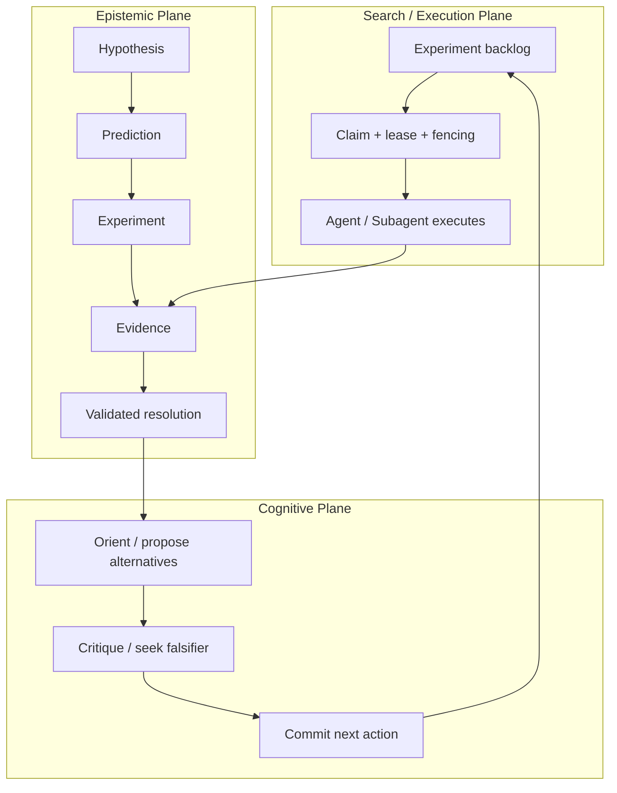
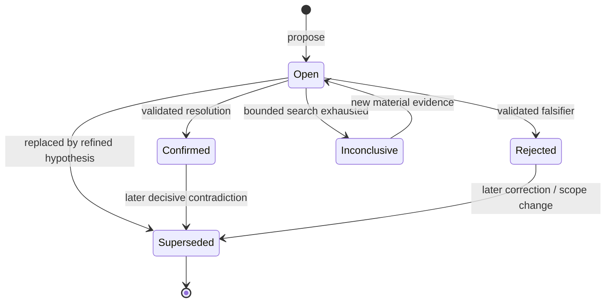
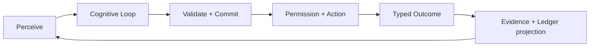

# Hypothesis Ledger v2 与内部 Think Loop 设计

> 状态：Implementation Complete（Phase 0–6；生产高可用运行认证待完成）
>
> 版本：1.1
>
> 日期：2026-08-15
>
> 适用范围：`holmes-core`、`holmes-runtime`、`holmes-session`、`holmes-tools`、`holmes-cli`、`holmes-harness`
>
> 实施对象：其他 AI 或工程团队
>
> 设计基线：当前未提交工作区；Cairn [`8f702c5`](https://github.com/oritera/Cairn/commit/8f702c5f3f9d3163948bd4089edc73980c9c9484)

## 0. 执行摘要

本文定义一套轻量但可审计的演绎系统，由三个相互独立、通过明确协议连接的平面组成：

1. **Cognitive Plane（内部 Think Loop）**：比较候选解释、寻找反证、选择信息增益最高的下一步；只产生结构化提交，不持久化原始思维链。
2. **Epistemic Plane（Hypothesis Ledger v2）**：保存假设、预测、实验、证据关系和裁决；负责“什么可以被相信”。
3. **Search / Execution Plane（Cairn-inspired）**：把待验证实验分派给单 Agent 或子 Agent，通过 lease、heartbeat、fencing 和幂等键避免重复执行；负责“去哪里探索、由谁执行”。

核心结论：

- Holmes 不应恢复旧版 `deduction.rs`，也不应把演绎重新做成一段 Prompt 或三个无状态工具。
- 模型可以**提出**推断，但不能自行决定事实成立。所有状态转换由 Runtime 验证并写入事件账本。
- Evidence 必须来自真实、类型化、成功语义明确且绑定当前 case/contract/experiment 的执行结果。
- Think Loop 只在需要时增加模型调用；简单任务保留零额外调用的 fast path。
- 共享的是结构化认知产物，不是原始 chain-of-thought。
- Cairn 可借鉴的是显式图、stigmergy、任务租约和去中心化探索，不是把 Cairn 的 Fact/Intent 直接当作 Holmes 的证据/假设。

本设计不允许直接从 Phase 1 开始。第 4 节列出的 Phase 0 证据可信度问题必须先修复，否则 Ledger 会把“命令失败但工具返回 `Ok`”之类的错误结果永久化为伪证据。

---

## 1. 背景与当前实现判定

### 1.1 当前系统不是一个完整的演绎系统

当前 Runtime 已经具备任务契约、证据记录、监督、完成验证和 durable subagent task 等重要基础，但“演绎”本身没有形成生产主链路：

- `crates/holmes-runtime/src/deduction.rs` 及 reducer/projection/validator 已删除。
- `AgentRuntime` 的主循环包含 perception、deliberation、action、evidence、reflection、supervisor、completion，但没有独立 deduction stage。
- `ReflectionEngine` 主要处理迭代预算和错误映射，不是对候选解释进行反证的认知循环。
- `TaskControlState::hypotheses` 只保存 `id + statement`，无法表达预测、反证、证据关系、状态转换原因或版本。
- `add_hypothesis`、`confirm_hypothesis`、`reject_hypothesis` 是普通工具；它们返回 JSON，但没有权威持久化和状态转换语义。
- `holmes-core::Event` 中保留的旧 Deduction Ledger 事件主要承担兼容/重放遗留数据的作用，生产主链路并未可靠地产生完整事件序列。
- `SkepticGate` 和 `CompletionVerifier` 提供了局部门禁，但仍不是一个可重放、可解释、可并发协调的认识论账本。

因此，当前正确的工程方向不是“补回一个 DeductionEngine 类”，而是建立一个 case-scoped 的结构化认知协议，并把它接到现有 Runtime、Evidence、Completion 和 durable task 基础上。

### 1.2 设计目标

本设计必须同时满足：

- **可验证**：强结论必须能追溯到成功执行产生的证据。
- **可反驳**：每个重要假设必须声明可观测预测或明确无法验证的原因。
- **可重放**：相同 case event stream 必须投影出相同 Ledger 状态。
- **可并发**：多个子 Agent 可以共享认知状态而不重复认领同一实验。
- **可恢复**：进程崩溃后能够继续；陈旧 writer 不能覆盖新结果。
- **有界**：Think Loop 的轮数、时间、token、候选数和并发度都有上限。
- **安全**：未受信任工具输出不会变成指令；权限门禁仍位于所有副作用之前。
- **轻量**：不引入图数据库、分布式共识或完整 theorem prover。
- **兼容**：旧 session 可以读取，旧事件不会被自动升级为已确认事实。

### 1.3 非目标

本版本不实现：

- 形式逻辑证明器、SAT/SMT 求解或一阶逻辑完备性。
- 持久化模型的逐 token 推理过程或原始 chain-of-thought。
- 自动给所有信念分配貌似精确的 0–1 概率。
- 跨独立用户/租户共享 Ledger。
- 无限制自主运行或绕过现有 permission/approval/scope 约束。
- 用 Ledger 取代 Memory、TaskContract、transcript 或普通审计事件。

---

## 2. 与 Cairn 的关系

### 2.1 Cairn 的核心抽象

以本文基线 commit 为准，Cairn 是一个基于 Blackboard 的并行 state-space search 系统：

- `Fact`：已经确认的客观发现。
- `Intent`：准备探索的方向，从一个 Fact 指向潜在的新 Fact。
- `Hint`：外部提供的指导。
- Bootstrap / Reason / Explore worker 通过共享图和 stigmergy 协调。
- Dispatcher/Server 负责图一致性、认领、lease、heartbeat 和消息协议；它不替 worker 判断内容在认识论上是否为真。

参考：

- [Cairn README](https://github.com/oritera/Cairn/blob/main/README.md)
- [Server protocol](https://github.com/oritera/Cairn/blob/main/docs/specs/server-protocol.md)
- [Dispatcher design](https://github.com/oritera/Cairn/blob/main/docs/specs/dispatcher-design.md)
- [Reason worker prompt](https://github.com/oritera/Cairn/blob/main/cairn/src/cairn/dispatcher/prompts/default/reason.md)

### 2.2 Holmes 与 Cairn 的关键差异

| 维度 | Cairn | Holmes Hypothesis Ledger v2 |
|---|---|---|
| 首要问题 | 搜索空间如何并行展开 | 一个结论为什么值得相信 |
| 核心节点 | Fact、Intent、Hint | Hypothesis、Prediction、Experiment、EvidenceLink、Resolution |
| Intent / Hypothesis | Intent 是探索方向 | Hypothesis 是可被证实或驳回的命题 |
| Fact / Evidence | Fact 是 worker 声明的文本结果 | Evidence 是工具/观察产生且带来源、哈希、执行语义和上下文绑定的记录 |
| 服务端验证 | 验证图与协议一致性 | 还要验证证据资格、状态转换、矛盾和裁决条件 |
| 完成语义 | 搜索已足够回答任务 | 关键结论已满足裁决和任务契约条件 |
| 多 Agent 协作 | 通过图与 intent lease | 通过实验 lease + 共享 Ledger；原始思维不共享 |
| 失败语义 | 探索可能无新 Fact | 失败/阴性结果本身可成为反证或 inconclusive evidence |

### 2.3 可借鉴与不可照搬

应借鉴：

- 显式状态图，而不是把所有进度埋在聊天上下文中。
- stigmergic 协作：Agent 读取环境中已有的结构化产物决定下一步。
- 单一认领、lease、heartbeat、release、fencing token。
- Bootstrap 快速尝试 + Reason 扩展 + Explore 执行的分层节奏。
- Dispatcher 不参与具体业务推理，保持协议层简单。

不可照搬：

- 不把 worker 产出的任意文本直接升级为 Fact。
- 不把 Intent 当作 Hypothesis；探索方向不必可证伪，假设必须有裁决语义。
- 不只校验 JSON shape 和节点引用；Holmes 还要校验证据是否成功、是否属于当前 case/contract、是否覆盖预测。
- 不让并行 worker 直接写最终裁决；worker 只能提交候选事实、证据和 resolution request。

### 2.4 三层心智模型



简化表达：

- Cairn-style search plane：**去哪里探索、谁来做**。
- Hypothesis Ledger：**相信什么、为什么**。
- Internal Think Loop：**本轮如何比较并决定下一步**。

---

## 3. 架构原则与不可破坏的不变量

实现必须维护以下不变量。任何优化都不能削弱它们。

### 3.1 权威边界

1. LLM 只能提出 `propose / plan / link / request_resolution`。
2. Runtime 是状态转换的唯一权威执行者。
3. Ledger event stream 是认知状态的 source of truth；snapshot 只是可重建缓存。
4. ToolRegistry 中的普通工具不能直接修改 Ledger。
5. 子 Agent 不能绕过 lease/fencing 或越过 case scope 写入父任务的最终结论。

### 3.2 证据边界

1. 每个 Evidence 都必须有全 case 单调且永不复用的 ID。
2. 工具“调用完成”不等于成功；必须由 typed outcome 判断。
3. Evidence 必须绑定 `case_id`，适用时还要绑定 `contract_id`、`requirement_id`、`experiment_id` 和 `prediction_ids`。
4. 旧 case、旧 contract 或无关实验的 Evidence 不能满足当前 requirement。
5. 工具输出摘要是 UNTRUSTED DATA，不能作为系统指令重新注入模型。
6. 阴性结果、失败结果和不可判定结果都可以记录，但只有满足 validator 规则的结果才能形成 supports/contradicts 关系。

### 3.3 推理边界

1. `Supported` 和 `Contradicted` 是 EvidenceLink 关系，不是 Hypothesis 的最终状态。
2. 缺少证据不能自动推出 `Rejected`；应为 `Open` 或 `Inconclusive`。
3. `Confirmed` 必须至少有一个符合当前裁决策略的正向证据路径。
4. 存在未解决的 decisive contradiction 时不能 `Confirmed`。
5. 模型声明的 confidence 不能直接触发状态转换。
6. 完成任务不意味着所有假设都确认；但最终强结论必须引用已确认 resolution，重要未决项必须显式披露。

### 3.4 Think Loop 边界

1. 只有 Commit pass 可以产生可执行 tool calls。
2. Propose/Critique pass 不获得工具定义，不能产生副作用。
3. 原始内部 reasoning 不进入 transcript、Memory、Ledger 或日志。
4. 只持久化结构化 `DeliberationCommit`：候选摘要、选择理由类别、风险、引用和下一步。
5. Ledger snapshot 在思考期间发生相关变化时，提交必须 rebase 或重新思考，不能盲写。

### 3.5 并发与恢复边界

1. 同一 Experiment 同一时刻最多一个有效 lease owner。
2. 每次 claim 产生单调 fencing token；陈旧 worker 的完成写入必须被拒绝。
3. 所有事件写入必须携带 `expected_ledger_version` 或 aggregate revision。
4. 重试使用稳定 idempotency key；重复提交不会生成重复实体或重复关系。
5. crash 后先恢复 Ledger，再恢复 task lease；不能从 transcript 猜测状态。

---

## 4. Phase 0：实现 Ledger 前必须修复的问题（已完成，2026-08-14）

这些不是“后续增强”，而是 Ledger 的可信基础。

### 4.1 Typed Tool Outcome

#### 当前风险

`execute_command` / `execute_python` 等路径可能把非零退出、超时、取消或业务失败包装在 `Ok(JSON)` 中。上层如果只看 Rust `Result::Ok`，会把失败记录为 `Deterministic` 成功证据。

#### 必须引入

```rust
pub enum ToolOutcomeStatus {
    Succeeded,
    Failed,
    TimedOut,
    Cancelled,
    Denied,
}

pub struct ToolOutcome {
    pub status: ToolOutcomeStatus,
    pub content: String,
    pub exit_code: Option<i32>,
    pub error_code: Option<String>,
    pub started_at: DateTime<Utc>,
    pub completed_at: DateTime<Utc>,
    pub side_effect_committed: Option<bool>,
}
```

规则：

- `Succeeded` 才能默认生成正向 action evidence。
- `Failed/TimedOut/Cancelled/Denied` 仍生成 audit outcome；只有领域 validator 明确判断其为有效阴性观测时，才可建立 `Contradicts` 或 `Inconclusive` EvidenceLink。
- 不能通过解析自由文本中的 `success: true` 判断状态。
- Process、HTTP、Browser、MCP 和 file tools 都必须映射到统一 outcome。

### 4.2 Evidence ID 永不复用

当前 evidence deque 有容量上限，如果 ID 由当前长度生成，淘汰后会复用 `ev-N`。

必须增加持久化的 `next_evidence_seq: u64`，ID 格式为 `ev-{case_seq}`，append 后单调递增；删除或 snapshot compact 不得回退。

### 4.3 Evidence Contract Binding

EvidenceRecord 必须新增或明确持久化：

```rust
pub struct EvidenceBinding {
    pub case_id: CaseId,
    pub contract_id: Option<String>,
    pub requirement_ids: Vec<String>,
    pub experiment_id: Option<ExperimentId>,
    pub prediction_ids: Vec<PredictionId>,
    pub tool_call_id: Option<String>,
}
```

Requirement binding 必须由 Runtime/validator 依据工具、参数和结果计算，不能由模型自报。

### 4.4 Completion Verifier 输入隔离

- 进入 semantic verifier 的工具输出必须位于结构化、显式标注的 untrusted 字段。
- verifier 使用 strict JSON schema；解析失败视为 verification failure。
- verifier 看不到控制工具定义，不能发起工具调用。
- deterministic checks 在 semantic verifier 之前运行；前者失败时不得让模型覆盖。
- verifier 输出只是一项裁决输入，不直接写 `Confirmed`。

### 4.5 Subagent Tool Allowlist 真正执行

当前结构中即使任务声明 `tools_allowlist`，实际子 Agent registry 也必须按 allowlist 构造或在执行边界 fail closed。

规则：

- allowlist 为空表示“无工具”，不能解释为“所有工具”。
- 子 Agent 的 tool set 是父作用域、任务 allowlist、全局 policy 三者交集。
- 每次 tool call 在 ActionEngine 再校验一次，避免只依赖 prompt。

### 4.6 Phase 0 验收

- 非零 exit、timeout、cancel、deny 均不会产生 `Succeeded` Evidence。
- Evidence ring buffer 淘汰后 ID 继续单调增长。
- 旧 contract 的证据不能满足新 contract。
- verifier prompt injection 场景不能改变 schema 或绕过 deterministic failure。
- 被移除的子 Agent 工具在 registry 和执行边界均不可调用。

---

## 5. 领域模型

### 5.1 标识与 case scope

Ledger 的共享边界是 `case_id`，不是单一 `session_id`。

- 新 root session 创建时生成 `case_id`。
- fork、foreground subagent、background subagent 继承父 `case_id`。
- 独立聊天或独立任务默认新建 case。
- v2 初始迁移可将既有 root `session_id` 作为其 `case_id`，但后续代码不得假设二者永久相等。

建议强类型：

```rust
pub struct CaseId(pub String);
pub struct HypothesisId(pub String);
pub struct PredictionId(pub String);
pub struct ExperimentId(pub String);
pub struct EvidenceLinkId(pub String);
pub struct ResolutionId(pub String);
```

所有 ID 由 Runtime 生成。模型只使用本次提交内的 `client_ref` 连接尚未分配 ID 的对象。

### 5.2 Hypothesis

```rust
pub struct Hypothesis {
    pub id: HypothesisId,
    pub case_id: CaseId,
    pub claim: String,
    pub premise_refs: Vec<LedgerRef>,
    pub alternative_group: Option<String>,
    pub priority: Priority,
    pub status: HypothesisStatus,
    pub revision: u64,
    pub created_by: ActorId,
    pub created_at: DateTime<Utc>,
    pub updated_at: DateTime<Utc>,
}

pub enum Priority { Low, Medium, High, Critical }

pub enum HypothesisStatus {
    Open,
    Confirmed,
    Rejected,
    Inconclusive,
    Superseded,
}
```

约束：

- `claim` 必须是单一、可判定命题，最多 1,000 字符。
- `premise_refs` 只能引用同一 case 中已存在的 Evidence、Resolution 或用户提供的 assertion。
- `alternative_group` 表示相互竞争的解释，但组内不自动互斥；除非 validator 能证明互斥。
- `revision` 用于 aggregate-level optimistic concurrency。

### 5.3 Prediction

```rust
pub struct Prediction {
    pub id: PredictionId,
    pub case_id: CaseId,
    pub hypothesis_id: HypothesisId,
    pub observable: String,
    pub expected_when_true: String,
    pub falsifier: String,
    pub validator: ValidatorKind,
    pub required: bool,
    pub created_at: DateTime<Utc>,
}
```

Prediction 是 Hypothesis 与实验结果之间的可检验桥梁。

要求：

- High/Critical hypothesis 在申请 Confirmed 前至少有一个 `required=true` prediction。
- `falsifier` 不能为空；若确实不可证伪，必须显式写明限制，并且该假设最高只能到 `Inconclusive`，不能 Confirmed。
- Prediction 创建后不可原地改写；变更应 supersede 原 Hypothesis 或新增 Prediction 并产生审计事件。

### 5.4 Experiment

```rust
pub struct Experiment {
    pub id: ExperimentId,
    pub case_id: CaseId,
    pub hypothesis_ids: Vec<HypothesisId>,
    pub prediction_ids: Vec<PredictionId>,
    pub action: String,
    pub expected_observations: Vec<String>,
    pub tool_allowlist: Vec<String>,
    pub risk: RiskLevel,
    pub status: ExperimentStatus,
    pub task_id: Option<String>,
    pub attempt: u32,
    pub idempotency_key: String,
    pub created_by: ActorId,
    pub created_at: DateTime<Utc>,
    pub updated_at: DateTime<Utc>,
}

pub enum ExperimentStatus {
    Planned,
    Queued,
    Running,
    Observed,
    Blocked,
    Failed,
    Cancelled,
    Expired,
}
```

规则：

- Experiment 可以同时区分多个竞争假设，以提高 information gain。
- `tool_allowlist` 是执行约束，不是提示。
- 产生外部副作用的 Experiment 必须经过现有 permission/approval/checkpoint 链路。
- `Observed` 只表示获得观测，不表示支持任何假设。
- `Blocked` 表示 scope、permission、approval 或 capability 阻止执行，不构成对 Hypothesis 的反证。
- 与 background task 对应时，`task_id` 指向现有 durable tasks 表；lease/fencing 以 task store 为权威。

### 5.5 Evidence 与 EvidenceLink

不复制原始工具结果。现有 `EvidenceRecord` 演进为 case-scoped 证据锚点，v2 在其上建立关系。完整原始输出仍只保存在现有 session event/blob 路径；case Ledger 保存 bounded metadata、hash、binding 和来源，并通过 `EvidenceRecordedV2` 重放。

```rust
pub struct EvidenceRecord {
    pub id: String,
    pub binding: EvidenceBinding,
    pub source_session_id: String,
    pub tool: String,
    pub tool_call_id: Option<String>,
    pub outcome_status: ToolOutcomeStatus,
    pub exit_code: Option<i32>,
    pub kind: EvidenceKind,
    pub input_summary: String,
    pub output_hash: String,
    pub output_snippet: String,
    pub predicate: String,
    pub verified_by: VerificationMethod,
    pub recorded_at: DateTime<Utc>,
}
```

Outcome 到 Evidence 的固定规则：

- `Succeeded`：创建 EvidenceRecord；是否 Supports/Contradicts 仍由 prediction validator 决定。
- `Failed` / `TimedOut`：绑定了 Experiment 时创建 audit EvidenceRecord，默认只能 Inconclusive；只有专用 validator 能证明“执行已完成且该失败码本身就是声明的 observable”时，才能建立 Supports/Contradicts。
- `Cancelled`：默认只写 session outcome 和 ExperimentCancelled，不创建可链接 Evidence。
- `Denied`：只写 ToolBlocked/ExperimentBlocked，不创建 Evidence；没有执行就没有观测。
- HTTP 4xx/5xx 是否属于 ToolOutcome `Succeeded` 取决于工具契约：若网络交换完整完成，应视为成功采集到 HTTP status，再由 validator 解释业务含义，不能把 HTTP 404 与传输失败混为一谈。

```rust
pub struct EvidenceLink {
    pub id: EvidenceLinkId,
    pub case_id: CaseId,
    pub evidence_id: String,
    pub hypothesis_id: HypothesisId,
    pub prediction_id: Option<PredictionId>,
    pub relation: EvidenceRelation,
    pub strength: EvidenceStrength,
    pub rationale: String,
    pub validator: ValidatorKind,
    pub actor: ActorId,
    pub created_at: DateTime<Utc>,
}

pub enum EvidenceRelation {
    Supports,
    Contradicts,
    Inconclusive,
}

pub enum EvidenceStrength {
    Weak,
    Moderate,
    Strong,
    Decisive,
}
```

`strength` 是离散、可解释分类，不是模型随意给出的浮点 confidence。Runtime 根据 validator、来源、重复性、直接性和 contract binding 对模型建议进行降级或拒绝。

EvidenceLink 校验：

- 引用对象必须存在且属于同一 case。
- Evidence 必须先持久化，不能引用未来结果。
- Evidence 的 experiment/prediction binding 与 link 必须一致。
- 同一个 evidence 对同一个 hypothesis/prediction/relation 的重复 link 应幂等。
- 同一 evidence 被同时链接为 Supports 与 Contradicts 时，必须标为 conflict 并阻止自动 resolution。
- `rationale` 仅保存简明公共理由，最多 800 字符；禁止保存原始思维链。

### 5.6 Resolution

```rust
pub struct Resolution {
    pub id: ResolutionId,
    pub case_id: CaseId,
    pub hypothesis_id: HypothesisId,
    pub status: ResolvedStatus,
    pub evidence_link_ids: Vec<EvidenceLinkId>,
    pub unresolved_contradiction_ids: Vec<EvidenceLinkId>,
    pub validator_summary: String,
    pub requested_by: ActorId,
    pub verified_by: ActorId,
    pub created_at: DateTime<Utc>,
}

pub enum ResolvedStatus {
    Confirmed,
    Rejected,
    Inconclusive,
    Superseded,
}
```

Resolution 不可修改。纠错通过新的 Resolution + `HypothesisSupersededV2` 或 reopen 事件完成，并保留历史。

### 5.7 DeliberationCommit

```rust
pub struct DeliberationCommit {
    pub case_id: CaseId,
    pub session_id: String,
    pub ledger_version: u64,
    pub mode: ThinkMode,
    pub considered_hypothesis_ids: Vec<HypothesisId>,
    pub selected_operation: CommitOperation,
    pub public_rationale: String,
    pub expected_information_gain: Ordinal,
    pub risk: RiskLevel,
    pub executable_call_bindings: Vec<CallBinding>,
    pub created_at: DateTime<Utc>,
}
```

这是 Think Loop 唯一需要持久化的产物。`public_rationale` 应描述可审计的决定依据，例如“该请求可以同时区分 H-1/H-2”，而不是模型内部逐步推理。

---

## 6. 状态机与裁决规则

### 6.1 Hypothesis 状态机



不允许：

- `Open -> Confirmed` 仅因为模型声称“高置信度”。
- `Open -> Rejected` 仅因为实验没有返回预期文本。
- 对已 `Superseded` 假设原地修改状态。

### 6.2 Confirmed 条件

基础 validator 必须全部通过：

1. Hypothesis 属于当前 case 且 revision 未过期。
2. 至少一个有效 Supports link；High/Critical 默认要求至少一个 Strong 或 Decisive link。
3. 所有 required predictions 已有合格观测，或者 domain policy 明确允许部分覆盖。
4. Evidence outcome 为成功，或领域 validator 明确认可该阴性观测的真实性。
5. Evidence 绑定当前 contract/requirement/experiment。
6. 没有未解决的 Strong/Decisive contradiction。
7. 对应 domain validator 通过。
8. 若启用 semantic verifier，其 strict structured verdict 为 pass。

### 6.3 Rejected 条件

满足以下之一且无同等级冲突：

- Prediction 声明的 falsifier 被直接观测到。
- 受控实验得到可重复的反证。
- 竞争假设被确认，且领域 validator 证明二者互斥。
- 用户/外部权威撤销了作为必要前提的 assertion，并且来源身份已验证。

“找不到支持证据”“工具超时”“权限被拒绝”通常只能得到 Inconclusive。

### 6.4 Inconclusive 条件

- 达到认知/时间/成本预算，但证据不足。
- 实验失败且无法区分“假设错误”和“执行条件不成立”。
- 正反证据冲突且没有足够判别实验。
- 假设本身不可操作化或不可证伪。

### 6.5 Superseded 语义

用于：

- 收窄或修正 claim。
- contract/scope 改变导致旧结论不再适用。
- 新的 decisive evidence 推翻此前已确认或驳回状态。

Superseded 不删除历史 Resolution。新 Hypothesis 的 `premise_refs` 应引用旧 Resolution 并说明变更原因。

### 6.6 冲突处理

当同一 Hypothesis 同时存在 Strong/Decisive Supports 与 Contradicts：

1. 产生 `ContradictionDetectedV2`。
2. Hypothesis 保持 Open，或从 Confirmed 进入待 supersede 状态。
3. Think policy 强制进入 deep mode。
4. 优先选择能区分来源可靠性、环境条件或作用域差异的实验。
5. Completion gate 禁止把该 Hypothesis 表述为确定结论。

---

## 7. 内部 Think Loop

### 7.1 外层 Runtime 流程



Runtime 的 `DeliberationEngine` 演进为 `CognitiveEngine`，但不要求一次性重写现有主循环。可以先在 Deliberation 前后增加 adapter。

### 7.2 三种模式

```rust
pub enum ThinkMode {
    Fast,
    Adaptive,
    Deep,
}
```

#### Fast

- 使用当前一次 deliberation 调用。
- 不增加额外 LLM call。
- 仍必须输出/派生 `DeliberationCommit`。
- 适合直接回答、单一低风险工具操作、已有确定计划的后续步骤。

#### Adaptive

- 默认模式。
- Policy 判断是否升级为 deep。
- 简单步骤走 fast，关键节点走 propose + critique + commit。

#### Deep

- 至多 `max_rounds` 个内部 pass。
- Propose 和 Critique 不获得 tools。
- 最终 Commit 才能看到允许的 tool definitions。
- 适合多解释竞争、完成前审查、finding confirmation、冲突、高风险操作和连续失败。

### 7.3 Deep mode pass

`cognition.max_rounds` 的定义是**本次 Cognitive Loop 的 LLM 调用总数，包含最终 Commit**，不是 Propose/Critique 循环次数。v2 允许 1–3：

- `1`：Commit only，即 fast。
- `2`：Propose -> Commit。
- `3`：Propose -> Critique -> Commit，即完整 deep。

v2 不实现无界的 proposer/critic 往返。若完整 deep 所需预算不足，而当前触发器是 Finish、finding、decisive contradiction 或高风险副作用，则 fail closed；普通低风险任务可以降为两次或一次调用。

#### Pass A：Orient / Propose

输入：

- 当前 task contract 和用户目标。
- Ledger 的 bounded projection。
- 最新 typed outcomes/evidence 摘要。
- 剩余预算、权限和可用能力摘要。

输出为临时 `ProposalSet`：

```rust
pub struct ProposalSet {
    pub schema_version: u32,
    pub candidate_hypotheses: Vec<HypothesisProposal>,
    pub candidate_experiments: Vec<ExperimentProposal>,
    pub completion_candidate: Option<CompletionCandidate>,
    pub open_uncertainties: Vec<String>,
}
```

该 pass 使用 strict JSON-only response，候选通过 `candidate_ref` 在临时 workspace 内关联。解析失败不保存原文，按第 7.9 节降级。

#### Pass B：Critique / Falsify

独立 critic 检查：

- 是否存在替代解释。
- Evidence 是否真正绑定当前 contract。
- 是否把 absence of evidence 当成反证。
- 是否有 prompt injection、来源污染或自我引用。
- 哪个实验最能区分候选假设。
- 是否准备过早 Finish/report_finding。

输出为临时 `Critique`，不得写 Ledger。

```rust
pub struct Critique {
    pub schema_version: u32,
    pub issues: Vec<CritiqueIssue>,
    pub missing_alternatives: Vec<String>,
    pub unsupported_claim_refs: Vec<String>,
    pub recommended_candidate_ref: Option<String>,
    pub completion_safe: bool,
}

pub struct CritiqueIssue {
    pub code: CritiqueCode,
    pub target_ref: Option<String>,
    pub public_summary: String,
    pub blocking: bool,
}
```

`CritiqueCode` 是固定枚举，例如 `MissingEvidence`、`WrongContract`、`NoFalsifier`、`AlternativeIgnored`、`ConflictingEvidence`、`PromptInjectionRisk`、`ExcessiveRisk` 和 `PrematureCompletion`。自由文本只能放在 bounded `public_summary` 中。

#### Pass C：Commit

最终模型只提交以下一种主操作：

- Answer / AskWatson / Finish。
- 执行一个或多个工具。
- 仅提交 Ledger meta actions 并继续。
- Ledger meta actions + 可执行工具。

Runtime 对 commit 做 schema、引用、版本、权限和预算验证，成功后才持久化和执行。

`DeliberationCommit` 不要求模型再调用一个额外 control tool。`CommitAssembler` 从以下输入确定性构造：

- 最终 `ParsedDecision` 和已验证 MetaActions。
- 本次 Ledger snapshot version。
- `plan_experiment.bind_calls` 与 executable calls。
- ProposalSet/Critique 中被选候选的公共 ID 和 issue codes。
- 最终响应中 bounded 的公开 rationale；缺失时使用 Runtime 模板，例如“执行已绑定实验 x-7 的两个只读调用”。

禁止把 ProposalSet/Critique 的原始 response body复制进 commit。LLM client 的 debug tracing 同样不得记录这两个内部 response body。

### 7.4 强制 Deep 的触发器

以下任一条件触发 deep，除非已无足够预算；预算不足时 fail closed 或 AskWatson：

- 请求 Finish。
- 请求 `report_finding` 或 Confirmed resolution。
- Hypothesis 存在 Strong/Decisive contradiction。
- 将执行高风险、不可逆或外部可见操作。
- Supervisor 检测到重复失败、stagnation 或策略切换。
- 两个子 Agent 给出冲突结论。
- 用户明确要求深入推理/终审/严格验证。
- 新工具输出与当前主要假设不一致。
- 当前决策依赖未验证的模型推断，而不是确定性状态。

### 7.5 Fast path 保留条件

只有以下条件全部满足才保持 fast：

- 无高优先级开放冲突。
- 不请求 Finish、Confirmed 或 finding。
- 操作为只读或已批准的低风险、可恢复操作。
- 动作与已有 Experiment 或 TaskContract 明确绑定。
- 最近无重复失败/stagnation。
- 当前 Ledger version 未发生相关变化。

### 7.6 行动选择策略

候选实验采用序数评分，避免虚假精度：

```text
utility = goal_relevance
        × expected_information_gain
        × discrimination_power
        × estimated_success
        ÷ (cost + risk + duplication)
```

每个维度为 Low / Medium / High，由 policy + 模型建议共同决定。选择规则按优先级：

1. 能同时区分多个竞争假设的实验。
2. 能直接触发 falsifier 的实验。
3. 能覆盖 task contract 必需 requirement 的实验。
4. 成本和副作用更低的实验。
5. 已有相同 idempotency key 的实验不重复创建。

### 7.7 Snapshot 并发控制

Think Loop 开始时读取 `LedgerSnapshot(version=V)`。

提交时：

- 若当前 version 仍为 V，正常提交。
- 若仅发生与本 commit 引用集合不相交的变更，可由 Runtime 做 deterministic rebase。
- 若引用 Hypothesis、Prediction、Experiment 或 Evidence 发生变化，拒绝 commit，产生 `CognitiveCommitInvalidated` 并重新 Perceive。
- 最大重思考次数可配置；耗尽后 AskWatson 或返回 partial，不得忽略冲突。

### 7.8 原始思维的处理

`ThoughtWorkspace` 仅存在内存中：

```rust
pub struct ThoughtWorkspace {
    proposal: ProposalSet,
    critique: Option<Critique>,
    started_at: Instant,
    token_usage: Usage,
}
```

禁止：

- 写入 session events。
- 写入 transcript。
- 写入 Memory。
- 写入 tracing/log。
- 传给子 Agent。

允许持久化的是经过压缩的公共决策理由和引用 ID，不包含逐步隐藏推理。

### 7.9 降级策略

- Propose/Critique provider 临时失败：在剩余时间足够时走一次安全 Commit；Finish、finding、高风险操作仍 fail closed。
- Commit schema 无效：允许一次纠错提示；再次失败返回 protocol violation。
- Think budget 用尽：保存 partial state，列出 open hypotheses，不伪造确定答案。
- 取消或 deadline：不执行尚未 Commit 的副作用。

---

## 8. 模型控制协议

### 8.1 原则

Ledger 操作应像现有 `set_goal` 一样作为 Runtime 拦截的 native control tools，而不是注册到普通 ToolRegistry。

新增 reserved control names：

```rust
pub const LEDGER_CONTROL_TOOL_NAMES: &[&str] = &[
    "propose_hypothesis",
    "plan_experiment",
    "link_evidence",
    "request_resolution",
];
```

它们是非终止 MetaAction，可与 executable calls 同一响应出现；Runtime 必须先验证并提交 meta actions，再执行主操作。

### 8.2 propose_hypothesis

```json
{
  "client_ref": "h-auth-cache",
  "claim": "认证差异来自缓存键缺少用户名维度",
  "premise_refs": ["ev-41"],
  "alternative_group": "auth-differential-cause",
  "priority": "high",
  "predictions": [
    {
      "client_ref": "p-cache-repeat",
      "observable": "相同缓存键下不同用户名得到相同响应",
      "expected_when_true": "跨用户名重复请求响应体与缓存标识一致",
      "falsifier": "响应随用户名稳定变化且无共享缓存命中",
      "validator": "network_differential",
      "required": true
    }
  ]
}
```

Runtime：

- 校验长度、枚举、引用和 case scope。
- 将 `client_ref` 映射为 Runtime ID。
- 在一次 commit 内允许后续 MetaAction 引用该 client_ref。
- client_ref 只在一次响应中有效，不持久化为主键。

### 8.3 plan_experiment

```json
{
  "client_ref": "x-compare-users",
  "hypothesis_refs": ["h-auth-cache"],
  "prediction_refs": ["p-cache-repeat"],
  "action": "对两个用户名发送参数受控的重复认证请求并比较响应",
  "expected_observations": [
    "响应状态和规范化响应体差异",
    "缓存相关响应头"
  ],
  "tool_allowlist": ["http_request"],
  "risk": "low",
  "bind_calls": [0, 1]
}
```

`bind_calls` 是本响应中 executable tool calls 的零基索引，不包含 control calls。

约束：

- 一个 executable call 最多绑定一个 Experiment。
- 多个 call 可绑定同一 Experiment。
- 索引越界、重叠绑定或 tool 不在 allowlist 时，整个 commit 失败且不执行工具。
- 未绑定 Experiment 的工具仍可执行，但其 Evidence 不能自动用于 Hypothesis resolution。
- 同响应中的 `client_ref` 在 commit 时先解析为真实 ID。

### 8.4 link_evidence

```json
{
  "evidence_id": "ev-43",
  "hypothesis_id": "hyp-7",
  "prediction_id": "pred-9",
  "relation": "contradicts",
  "strength": "strong",
  "rationale": "受控重复请求的响应随用户名稳定变化，命中了声明的 falsifier",
  "validator": "network_differential"
}
```

Runtime 不接受模型自报最终 strength。字段表示建议值；validator 可以接受、降级或拒绝。

### 8.5 request_resolution

```json
{
  "hypothesis_id": "hyp-7",
  "expected_revision": 3,
  "requested_status": "rejected",
  "evidence_link_ids": ["el-12"],
  "reason": "required prediction 的 falsifier 已被受控实验直接观测"
}
```

Runtime 流程：

1. 创建 `ResolutionRequestedV2`。
2. 运行 deterministic base validator。
3. 运行对应 domain validator。
4. 高风险/语义型结论按 policy 运行 independent semantic verifier。
5. 通过后创建 immutable Resolution 并更新 Hypothesis status/revision。
6. 失败则创建 `ResolutionRejectedV2`，把缺口写回 PerceptionFrame。

### 8.6 终止控制与 MetaAction 的组合

保持当前协议：terminal control (`finish`, `ask_watson`) 不能与 executable calls 混合。

v2 的确定规则：

- `request_resolution` 可以与 executable calls 同响应出现，但 resolution 只能引用**此前已存在**的 Evidence，不能引用本轮尚未执行的结果。
- `finish` 必须在独立响应中出现，不能与 executable calls 或 Ledger MetaAction 混合。
- `finish.conclusion_refs` 只能引用此前已落账的 Resolution/Finding；不允许同一响应“先裁决自己、再完成”。
- 对混合响应整体返回 protocol violation，不应用 MetaAction，也不执行工具。

### 8.7 旧 hypothesis tools

`add_hypothesis`、`confirm_hypothesis`、`reject_hypothesis`：

1. 一个兼容版本内从 ToolRegistry 移除并返回明确迁移提示。
2. 不再把它们计入 `BOOKKEEPING_TOOLS` 之外的任何证据。
3. 之后删除实现与注册。
4. 不能继续保留“返回 success JSON 但没有写状态”的行为。

---

## 9. Evidence 采集、自动绑定与领域验证

### 9.1 执行前绑定

`plan_experiment.bind_calls` 在 Commit 阶段转换为内部 `ActionBinding`：

```rust
pub struct ActionBinding {
    pub tool_call_id: String,
    pub case_id: CaseId,
    pub contract_id: Option<String>,
    pub requirement_ids: Vec<String>,
    pub experiment_id: Option<ExperimentId>,
    pub prediction_ids: Vec<PredictionId>,
}
```

ActionEngine 必须把 binding 传到 ToolOutcome -> EvidenceRecord 的生成路径。禁止工具执行后由模型任意挑选旧 Evidence 冒充本实验结果。

### 9.2 采集顺序

1. ActionEngine 在权限检查后记录 ToolCall + ActionBinding。
2. Tool 返回 typed ToolOutcome。
3. EvidenceEngine 生成不可变 EvidenceRecord，保存 outcome hash 和 bounded snippet，并落 `EvidenceRecordedV2`。
4. Experiment 收到 `ExperimentObservedV2`、`ExperimentBlockedV2` 或失败类事件。
5. 下一个 PerceptionFrame 展示新 Evidence 和尚未评估的 Prediction。
6. 模型提交 `link_evidence`；validator 决定关系与 strength。
7. resolution request 单独发生。

可以为完全确定性的 validator 提供自动 link，但自动 link 必须产生相同事件并可审计。

### 9.3 Validator 接口

```rust
pub trait EvidenceValidator: Send + Sync {
    fn validate_link(
        &self,
        evidence: &EvidenceRecord,
        prediction: Option<&Prediction>,
        proposed: &EvidenceLinkProposal,
    ) -> ValidationVerdict;
}

pub trait HypothesisValidator: Send + Sync {
    fn validate_resolution(
        &self,
        snapshot: &LedgerSnapshot,
        hypothesis: &Hypothesis,
        request: &ResolutionRequest,
    ) -> ResolutionVerdict;
}
```

### 9.4 v2 首批 ValidatorKind

- `command_exit`：退出码、stdout/stderr、预期断言。
- `file_postcondition`：文件存在、内容 hash、diff 或测试结果。
- `network_differential`：受控请求之间的状态、header、normalized body 差异。
- `code_test`：测试命令成功且对应目标/文件范围匹配。
- `security_reproduction`：可重复、受控的安全现象与负对照。
- `human_attestation`：经身份边界确认的用户声明；来源独立标注，不能伪装成工具证据。
- `semantic`：仅在 deterministic checks 后使用的独立模型判断。

未知 validator 必须 fail closed，不能回退为 `semantic` 自动通过。

### 9.5 负面证据

示例：

- 命令非零退出通常表示实验执行失败，不自动反驳 Hypothesis。
- HTTP 请求成功返回 404，若 Experiment 本来就在检测资源不存在，可成为有效观测。
- Browser timeout 只能说明未完成观测，通常为 Inconclusive。
- 负对照与正样本表现一致，可能直接反驳“仅特定输入触发”的假设。

Validator 必须区分“行动失败”和“行动成功地观测到阴性结果”。

---

## 10. 持久化与事件模型

### 10.1 为什么不能只用 session event stream

当前 events 以 session 为作用域。子 Agent 拥有自己的 session；如果把共享 Ledger 继续塞进父 session：

- 子 Agent 无法安全并发 append。
- case 状态与对话历史耦合。
- fork/recovery 时容易重复投影或丢失结果。

因此新增 case-scoped event stream。

### 10.2 Schema

建议 migration 新增：

```sql
ALTER TABLE sessions ADD COLUMN case_id TEXT;

CREATE TABLE cases (
    case_id TEXT PRIMARY KEY NOT NULL,
    root_session_id TEXT NOT NULL,
    status TEXT NOT NULL,
    ledger_version INTEGER NOT NULL DEFAULT 0,
    next_evidence_seq INTEGER NOT NULL DEFAULT 1,
    created_at TEXT NOT NULL,
    updated_at TEXT NOT NULL
);

CREATE TABLE case_ledger_events (
    case_id TEXT NOT NULL,
    seq INTEGER NOT NULL,
    event_id TEXT NOT NULL,
    aggregate_kind TEXT NOT NULL,
    aggregate_id TEXT NOT NULL,
    aggregate_revision INTEGER NOT NULL,
    actor_session_id TEXT NOT NULL,
    event_type TEXT NOT NULL,
    event_data TEXT NOT NULL,
    created_at TEXT NOT NULL,
    PRIMARY KEY (case_id, seq),
    UNIQUE (event_id),
    FOREIGN KEY (case_id) REFERENCES cases(case_id)
);

CREATE INDEX idx_case_ledger_events_aggregate
ON case_ledger_events(case_id, aggregate_kind, aggregate_id, seq);

CREATE TABLE case_ledger_snapshots (
    case_id TEXT PRIMARY KEY NOT NULL,
    projected_seq INTEGER NOT NULL,
    state_json TEXT NOT NULL,
    checksum TEXT NOT NULL,
    updated_at TEXT NOT NULL,
    FOREIGN KEY (case_id) REFERENCES cases(case_id)
);
```

备注：

- SQLite 中 migration 必须兼容旧库；实际 `ALTER` 写法按现有 schema version 机制实现。
- snapshot 可延后到 Phase 2；没有 snapshot 时从 case events 重建。
- raw tool output 继续沿用现有 blob/event 机制，Ledger 只保存 hash、snippet 和引用。
- `EvidenceRecordedV2` 是 case 内证据索引的权威事件；它不复制 raw output。

### 10.3 Event envelope

```rust
pub struct CaseLedgerEvent {
    pub case_id: CaseId,
    pub seq: u64,
    pub event_id: String,
    pub aggregate_kind: AggregateKind,
    pub aggregate_id: String,
    pub aggregate_revision: u64,
    pub actor_session_id: String,
    pub event: LedgerEvent,
    pub created_at: DateTime<Utc>,
}
```

### 10.4 v2 事件

- `HypothesisProposedV2`
- `PredictionDeclaredV2`
- `ExperimentPlannedV2`
- `ExperimentQueuedV2`
- `ExperimentStartedV2`
- `ExperimentObservedV2`
- `ExperimentBlockedV2`
- `ExperimentFailedV2`
- `ExperimentCancelledV2`
- `ExperimentExpiredV2`
- `EvidenceRecordedV2`
- `EvidenceLinkedV2`
- `EvidenceLinkRejectedV2`
- `ContradictionDetectedV2`
- `ResolutionRequestedV2`
- `HypothesisResolvedV2`
- `ResolutionRejectedV2`
- `HypothesisReopenedV2`
- `HypothesisSupersededV2`
- `DeliberationCommittedV2`

事件 payload 必须 versioned，未知版本应报可诊断错误，不能静默丢字段。

### 10.5 Store API

```rust
#[async_trait]
pub trait CaseLedgerStore: Send + Sync {
    async fn load(&self, case_id: &CaseId) -> Result<LedgerSnapshot, StoreError>;

    async fn append(
        &self,
        case_id: &CaseId,
        expected_version: u64,
        command_id: &str,
        events: Vec<UnstoredLedgerEvent>,
    ) -> Result<AppendResult, StoreError>;

    async fn record_evidence(
        &self,
        case_id: &CaseId,
        actor_session_id: &str,
        receipt: ToolOutcomeReceipt,
        binding: ActionBinding,
    ) -> Result<EvidenceRecord, StoreError>;
}
```

`append` 必须在一个 SQLite transaction 内：

1. 校验当前 `ledger_version == expected_version`。
2. 校验 `command_id/event_id` 幂等。
3. 分配连续 seq。
4. 写全部事件。
5. 更新 cases.ledger_version / updated_at。
6. 必要时同步创建或更新 durable task row。

如果 Experiment enqueue 与 Ledger event 无法在同一事务完成，必须使用 outbox；不能先向模型确认 planned/queued 再丢任务。

`record_evidence` 是特殊的 receipt 路径：

- 它不使用 Think Loop 开始时的旧 `expected_version`。工具一旦执行，结果必须被记录，不能因为另一 Agent 更新了 Ledger 就丢失 receipt。
- 它以 `tool_call_id + attempt` 为幂等键，在事务内读取当前 ledger version、分配 `next_evidence_seq`、写 `EvidenceRecordedV2` 并推进 version。
- Session ToolResult/ToolOutcome event 与 case Evidence event 必须由 `TransactionalStateCoordinator` 在同一 SQLite transaction 中写入。
- 若部署形态使二者不在同一数据库，则必须在 session outcome transaction 中写 durable outbox；下轮 Perceive 前先 drain outbox，再允许 EvidenceLink/Resolution。
- receipt append 只记录已经发生的现实，不因为 Ledger version conflict 而失败；后续认知 commit 会看到新 version 并 rebase/re-think。

### 10.6 Reducer 规则

- Reducer 是 pure function：`(state, event) -> state/error`。
- 不访问网络、时间、LLM 或 ToolRegistry。
- 重复 event ID 不重复应用。
- seq 缺口、revision 回退、跨 case 引用立即失败。
- Snapshot checksum 不匹配时丢弃 snapshot，从 events 全量重建。
- 所有 map 的序列化顺序固定，确保确定性测试。

### 10.7 Legacy 事件

旧 `EvidenceObserved`、`HypothesisProposed`、`HypothesisSupported` 等：

- 保留反序列化支持，标注 `legacy_unverified`。
- 默认不导入 v2 case Ledger。
- 如需显式迁移，只能映射为 `Open` Hypothesis 和 Unverified EvidenceLink。
- 旧 Confirmed 不能自动成为 v2 Confirmed。
- 旧事件移除至少经过一个兼容周期和 migration telemetry 评估。

---

## 11. Runtime 集成

### 11.1 新组件

建议新增：

```text
crates/holmes-runtime/src/cognition.rs
crates/holmes-runtime/src/ledger/mod.rs
crates/holmes-runtime/src/ledger/model.rs
crates/holmes-runtime/src/ledger/reducer.rs
crates/holmes-runtime/src/ledger/validator.rs
crates/holmes-runtime/src/ledger/perception.rs
crates/holmes-session/src/case_store.rs
crates/holmes-session/src/ledger_store.rs
```

Core 中只放跨 crate 的稳定协议和事件类型；Runtime 中放 policy/reducer/validator；Session 中放 SQLite 实现。

### 11.2 Runtime 主循环顺序

建议顺序：

1. `Supervisor::before_iteration`
2. 加载/刷新 `LedgerSnapshot`
3. `PerceptionEngine` 构造 bounded frame
4. `CognitiveEngine::deliberate`
5. `CommitValidator` 校验响应、client refs、call bindings、ledger version
6. 原子 append Ledger meta events + session `DeliberationCommitted`
7. 对 executable calls 执行 scope/effect/permission/approval/checkpoint
8. `ActionEngine` 执行并返回 typed outcomes
9. `TransactionalStateCoordinator` 原子写 session outcome、EvidenceRecord 和 experiment observation events
10. `Supervisor::after_iteration`
11. 若 Finish：运行 Resolution gate + CompletionVerifier
12. 继续下一轮或返回用户

### 11.3 MetaAction 扩展

`MetaAction` 增加：

```rust
ProposeHypothesis(HypothesisProposal),
PlanExperiment(ExperimentProposal),
LinkEvidence(EvidenceLinkProposal),
RequestResolution(ResolutionRequest),
```

不要为每个操作增加新的 `HolmesDecision` 主分支。它们都是可以与一次行动组合的认知提交。

### 11.4 PerceptionFrame

每轮注入模型的 Ledger 视图必须有界，推荐：

```rust
pub struct LedgerPerception {
    pub version: u64,
    pub active_hypotheses: Vec<HypothesisView>,       // max 8
    pub pending_predictions: Vec<PredictionView>,     // max 8
    pub recent_evidence: Vec<EvidenceView>,            // max 12
    pub contradictions: Vec<ContradictionView>,        // max 5
    pub candidate_experiments: Vec<ExperimentView>,    // max 8
    pub rejected_operations: Vec<ValidationGap>,       // max 5
}
```

排序：Critical/High、与当前 contract 相关、存在 contradiction、最近更新优先。

不要把整个 Ledger JSON 每轮塞入 Prompt。超出部分通过只读查询工具或内部 retrieval 取回；查询结果仍受 case scope 限制。

### 11.5 Evidence 与 TaskControlState

迁移期间：

- `TaskControlState.evidence` 继续作为当前 turn/supervisor 的 bounded working set。
- 权威 Evidence identity/sequence 移到 case state。
- `TaskControlState.hypotheses: Vec<ActiveHypothesis>` 改为从 LedgerPerception 投影，避免双写。
- CompletionVerifier 从 LedgerSnapshot + TaskControlState 联合读取，之后可逐步删除简化 hypothesis list。

### 11.6 ReflectionEngine

不要继续把所有 Think Loop 塞进 `ReflectionEngine`。

- Reflection 保留 Runtime 故障/预算/重复行为后的 policy 反馈。
- Cognition 负责候选假设、反证和 commit。
- Supervisor 决定何时强制 deep/replan。

---

## 12. Finding 与 Completion 集成

### 12.1 report_finding

扩展 schema：

```json
{
  "title": "...",
  "description": "...",
  "severity": "...",
  "hypothesis_id": "hyp-7",
  "resolution_id": "res-4",
  "evidence_refs": ["ev-43"]
}
```

门禁：

- `resolution_id` 必须属于 `hypothesis_id` 且状态为 Confirmed。
- finding evidence_refs 必须是 Resolution evidence_link 引用的子集。
- Open/Inconclusive 只能记录为 `candidate finding`，不能进入 confirmed finding channel。
- Rejected hypothesis 不能 report。
- SkepticGate 不能使用模型自报 confidence 覆盖 Ledger 状态。

### 12.2 Finish schema

建议扩展：

```json
{
  "summary": "...",
  "conclusion_refs": ["res-4", "finding-2"],
  "remaining_hypothesis_refs": ["hyp-9"],
  "limitations": ["无法访问生产环境日志"]
}
```

### 12.3 Completion gate 新规则

在现有 TaskContract/Evidence checks 基础上增加：

- 所有强事实性 conclusion 必须引用 Confirmed Resolution、deterministic Fact 或已验证 finding。
- Critical/High 的 Open Hypothesis 必须解决，或在 remaining_work/limitations 中披露且不影响 contract completion。
- 存在 unresolved decisive contradiction 时禁止 Finish 为“已验证完成”。
- Inconclusive 不得在 summary 中改写为确定结论。
- 若用户只要求方案/解释而无需外部验证，可以由 contract 分类为 `advisory`，不强制创建 Hypothesis；但模型不能虚构已执行验证。

### 12.4 Independent verifier

Verifier 输入只包含：

- contract requirements。
- conclusion refs。
- Resolution 的结构化摘要。
- Evidence type、binding、validator verdict 和 bounded untrusted snippet。
- unresolved questions/contradictions。

Verifier 看不到原始 ThoughtWorkspace。输出 schema：

```rust
pub struct CompletionVerdict {
    pub pass: bool,
    pub satisfied_requirement_ids: Vec<String>,
    pub blocking_gaps: Vec<String>,
    pub unsupported_conclusion_refs: Vec<String>,
}
```

---

## 13. 多 Agent 与 Cairn 式搜索平面

### 13.1 共享内容

子 Agent 可读取：

- 分配给自己的 Experiment。
- 关联 Hypothesis/Prediction 的 bounded slice。
- 相关 Evidence/Resolution 摘要。
- TaskContract 子集、权限、预算和工具 allowlist。

子 Agent不可读取或写入：

- 其他 Agent 的原始 Think workspace。
- 不相关 case 数据。
- 未授权工具或 secret。
- 最终 Resolution（只能 request）。

### 13.2 Experiment 到 Durable Task 的映射

```text
Experiment.Planned
  -> durable task Queued
  -> claim lease + fencing token
  -> Experiment.Running
  -> execute
  -> typed AgentTaskResult + Evidence
  -> Experiment.Observed/Failed
  -> release/complete lease
```

复用现有 tasks 表的：

- `lease_owner`
- `lease_expires_at`
- `attempt`（当前实现同时作为 fencing token）
- `idempotency_key`
- `safe_to_retry`
- recovery states

如果现有字段命名略有差异，语义必须保持。

### 13.3 Claim 协议

1. Dispatcher/parent 从 Ledger 查找 Planned/Queued Experiments。
2. 通过 TaskStore 原子 claim，获得 fencing token。
3. 写 `ExperimentStartedV2(task_id, owner, fencing_token)`。
4. Worker 定期 heartbeat。
5. 完成写入时同时校验 task owner、lease 和 fencing token。
6. lease 丢失后 worker 停止启动新工具；晚到结果可进入 quarantine audit，但不能更新权威 Experiment。

### 13.4 Stigmergic 协作

Worker 不需要直接互相聊天。新 Evidence、Rejected resolution、Contradiction 和新 Experiment 会改变共享 Ledger，其他 worker 在下一次读取时自然调整。

这保留了 Cairn 的 stigmergy 优点，同时避免让自由文本消息成为隐式状态。

### 13.5 去重

Experiment idempotency key 由规范化字段生成：

```text
sha256(case_id
     + sorted hypothesis_ids
     + sorted prediction_ids
     + canonical action
     + canonical tool constraints
     + relevant environment fingerprint)
```

相同 key 且状态为 Planned/Queued/Running/Observed 时，不创建重复 Experiment；可返回已有 ID。

### 13.6 子 Agent 结果接入

`AgentTaskResult` 中：

- `evidence` 必须引用真实 case Evidence IDs。
- `findings` 默认是 candidate，除非父 Runtime 已验证 Resolution。
- `remaining_work` 映射为 open questions 或新 Experiment proposal。
- `completed` 只表示被分配 Experiment 执行完成，不表示 Hypothesis Confirmed。

---

## 14. 配置

在 `config.default.yaml` 增加：

```yaml
cognition:
  enabled: true
  mode: adaptive               # fast | adaptive | deep
  max_rounds: 3              # 总 LLM calls，包含 Commit；v2 允许 1..3
  max_candidates: 4
  max_think_tokens: 6000
  max_think_time_ms: 45000
  max_rebases: 2
  deep_on_finish: true
  deep_on_finding: true
  deep_on_contradiction: true
  deep_on_high_risk_action: true
  deep_on_stagnation: true
  persist_commit_summary: true
  persist_raw_reasoning: false  # MUST remain false in v2

ledger:
  enabled: true
  max_active_hypotheses_in_context: 8
  max_predictions_in_context: 8
  max_recent_evidence_in_context: 12
  max_contradictions_in_context: 5
  snapshot_every_events: 100
  semantic_verifier: true
  require_prediction_for_high_priority: true

experiments:
  max_concurrent_per_case: 4
  default_lease_ms: 60000
  heartbeat_ms: 20000
  max_attempts: 3
```

Config validation：

- `heartbeat_ms < default_lease_ms / 2`。
- `1 <= max_rounds <= 3`。
- `persist_raw_reasoning=true` 在 v2 直接启动失败，不只是 warning。
- 子 Agent 并发仍受现有全局 semaphore 上限约束，取更小值。
- think deadline 不得超过剩余 turn deadline。

---

## 15. 安全、隐私与信任边界

### 15.1 Prompt injection

- Tool output、网页、文件和子 Agent 文本均标为 untrusted content。
- PerceptionFrame 注入 evidence snippet 时使用结构化字段和固定 delimiter。
- 任意输出中出现 `finish`、`confirm_hypothesis` 或系统指令文本都只是数据。
- Control calls 只接受模型 API 的 native structured tool call，不从工具输出或普通文本中二次解析。

### 15.2 数据最小化

- Ledger 只存 bounded claim/rationale/snippet/hash/reference。
- Secret、token、cookie、PII 在事件写入前走现有 sensitive screening/redaction。
- 原始大型输出进入现有 blob store，按权限读取。
- ThoughtWorkspace 永不持久化。

### 15.3 权限与副作用

Ledger commit 不授予新权限。

顺序固定为：

```text
Commit validation
  -> scope
  -> effect classification
  -> permission
  -> approval
  -> checkpoint
  -> execute
```

Experiment 标记 low risk 不能覆盖工具实际 effect classification。

### 15.4 来源身份

Actor 类型至少包括：

- `runtime`
- `model:<provider/model>`
- `session:<id>`
- `subagent:<task_id>`
- `human:<authenticated-surface>`
- `validator:<kind/version>`

Resolution 的 `verified_by` 必须是 runtime/domain validator/independent verifier，而不能只有 model actor。

### 15.5 资源滥用

- Hypothesis、Prediction、Experiment 数量按 case 限制。
- 所有字符串和引用数组有长度上限。
- 相同 hypothesis/experiment 的重复 proposal 幂等合并或拒绝。
- Think Loop、validator、subagent 都继承 `ExecutionContext` deadline/cancel/budget。

---

## 16. 可观测性

### 16.1 结构化事件

除持久化 Ledger events 外，tracing 至少包含：

- `CognitiveLoopStarted`
- `CognitivePassCompleted`
- `CognitiveCommitValidated`
- `CognitiveCommitInvalidated`
- `CognitiveBudgetExceeded`
- `LedgerAppendConflict`
- `HypothesisProposed`
- `EvidenceLinked`
- `EvidenceLinkRejected`
- `ContradictionDetected`
- `ResolutionValidated`
- `ResolutionRejected`
- `ExperimentClaimed`
- `ExperimentLeaseLost`
- `ExperimentCompleted`

禁止把 Proposal/Critique 原文放入 tracing fields。

### 16.2 指标

```text
cognition.loop.total{mode,outcome}
cognition.rounds
cognition.duration_ms
cognition.tokens
cognition.deep_trigger.total{reason}
cognition.rebase.total{outcome}

ledger.append.total{event_type,outcome}
ledger.version_conflict.total
ledger.hypotheses{status,priority}
ledger.evidence_link.total{relation,strength,outcome}
ledger.contradictions.open
ledger.resolution.total{status,outcome,validator}

experiment.total{status}
experiment.claim.total{outcome}
experiment.lease_lost.total
experiment.duplicate_suppressed.total
experiment.duration_ms
```

### 16.3 诊断视图

CLI 可增加只读命令：

```text
/ledger
/ledger hypothesis <id>
/ledger experiments
/ledger contradictions
```

输出展示公共结构化理由和证据引用，不展示 hidden reasoning。

---

## 17. 失败与恢复语义

| 故障点 | 权威状态 | 恢复行为 |
|---|---|---|
| Think pass 中崩溃 | 无 commit | 丢弃 ThoughtWorkspace，重新 Perceive |
| Ledger meta commit 前崩溃 | 无事件 | 使用相同 command id 可安全重试 |
| Ledger append 后、工具执行前崩溃 | Experiment Planned/Queued | 恢复器按 durable task 重排；副作用任务按 safe_to_retry 策略 |
| 工具执行中 lease 丢失 | task owner 失效 | 停止新动作；晚到结果隔离，不接受陈旧 fencing token |
| 工具成功后、Evidence append 前崩溃 | 取决于 tool idempotency/checkpoint | 使用 tool_call_id/idempotency key 恢复或进入 manual recovery；不得假装未执行 |
| Evidence 已写、link 前崩溃 | Evidence 存在、Hypothesis Open | 下一轮重新评估并 link |
| Resolution request 后 validator 崩溃 | request event 存在 | 幂等恢复 validator；尚未 Confirmed |
| Snapshot 损坏 | events 权威 | checksum 失败后全量 replay |
| semantic verifier 不可用 | deterministic state 保留 | 高风险 conclusion fail closed；普通 case 返回 Inconclusive/partial |

关键要求：任何恢复路径都不能通过重新执行不可幂等副作用来“猜测”结果。

---

## 18. 测试策略

### 18.1 Unit tests

#### Model / reducer

- 每个合法状态转换。
- 每个非法状态转换。
- 相同 events replay 得到相同 snapshot/checksum。
- 重复 event_id 幂等。
- seq 缺口、跨 case 引用、revision 回退被拒绝。
- legacy event 不会自动 Confirmed。

#### Control protocol

- 同响应 client_ref 正确解析。
- `bind_calls` 只计算 executable calls。
- 索引越界、重叠绑定、allowlist 不匹配整体失败。
- terminal + executable 继续视为 protocol violation。
- 无效 JSON、超长 claim、未知 enum fail closed。

#### Validators

- command exit、file postcondition、network differential、code test。
- absence of evidence 不会导致 Rejected。
- failed action 与成功观测到阴性结果可区分。
- decisive contradiction 阻止 Confirmed。
- required predictions 未覆盖时阻止 Confirmed。

#### Think policy

- 简单读操作保持 fast。
- finish/finding/contradiction/stagnation/high risk 强制 deep。
- budget/deadline 上限。
- snapshot relevant change 导致 invalidation。
- 不相关变更允许 deterministic rebase。

### 18.2 Property tests

- 任意合法 event 序列中，Confirmed Hypothesis 必然存在有效 Resolution。
- 任意有效 Resolution 引用的 EvidenceLink 和 Evidence 都属于同一 case。
- Evidence ID 在 compact/replay/淘汰后单调不复用。
- Reducer 纯确定性。
- Superseded entity 不再原地改变。
- Fencing token 单调，旧 token 永不覆盖新 owner。

### 18.3 Integration tests

1. `propose -> predict -> plan -> execute -> evidence -> link -> confirm`。
2. 直接观测 falsifier -> reject。
3. timeout -> inconclusive，不是 contradiction。
4. 非零 exit 不产生成功证据。
5. 旧 contract evidence 被拒绝。
6. 正反证据冲突 -> deep think + completion blocked。
7. finish 引用 Open Hypothesis -> rejected。
8. finding 无 resolution -> candidate 或 rejected。
9. snapshot 在 Think 期间变化 -> re-think。
10. crash after plan before action -> task recovery。
11. crash after evidence before link -> 可继续。
12. semantic verifier prompt injection -> strict failure。
13. raw reasoning 不出现在 DB、transcript、logs、Memory。

### 18.4 Concurrency tests

- 两个 worker 同时 claim 一个 Experiment，只有一个成功。
- lease 过期后新 worker token 大于旧 token。
- 旧 worker 晚到 completion 被拒绝。
- 两个子 Agent append 不同 aggregates 可成功，snapshot version 正确。
- 两个 Agent 修改同 Hypothesis revision，一个收到 conflict 并 rebase。
- duplicate idempotency key 只创建一个 Experiment。

### 18.5 Harness scenarios

新增：

```text
scenarios/ledger-confirmed-path.yaml
scenarios/ledger-falsifier-rejects.yaml
scenarios/ledger-negative-inconclusive.yaml
scenarios/ledger-conflict-blocks-finish.yaml
scenarios/ledger-old-evidence-rejected.yaml
scenarios/ledger-think-fast-path.yaml
scenarios/ledger-think-deep-on-finding.yaml
scenarios/ledger-subagent-lease-race.yaml
scenarios/ledger-no-raw-reasoning.yaml
```

### 18.6 Reliability

- nightly reliability soak 纳入 Ledger 场景循环。
- kill -9 crash matrix 覆盖第 17 节所有事务边界。
- 24h 多 subagent case 中无重复 Experiment、无 evidence ID 复用、无悬空 link。

---

## 19. 实施计划

### Phase 0：证据可信基础（阻塞后续）

实施：

- 统一 ToolOutcome。
- 修复 Evidence ID sequence。
- 强化 case/contract/requirement binding。
- verifier strict input isolation。
- 执行 subagent tools_allowlist。

门禁：第 4.6 节全部通过。

### Phase 1：Case 与 Ledger Core（已完成，2026-08-14）

实施：

- 新增 CaseId、领域模型和 v2 events。
- 新增 cases/case_ledger_events migration。
- 实现 CaseLedgerStore、pure reducer、optimistic append、replay。
- root/fork/subagent case inheritance。
- old events 兼容读取。

门禁：unit/property/migration tests 全绿。

### Phase 2：MetaAction 与单 Agent Ledger

实施：

- 新 control tools schemas。
- client_ref 与 bind_calls parser。
- Ledger MetaAction commit transaction。
- Evidence action binding。
- LedgerPerception bounded projection。
- 删除/禁用无状态 hypothesis tools。

门禁：单 Agent 端到端 confirm/reject/inconclusive 全绿。

### Phase 3：Internal Think Loop

实施：

- CognitiveEngine 与 fast/adaptive/deep policy。
- Propose/Critique/Commit 三 pass。
- ThoughtWorkspace ephemeral 保证。
- snapshot rebase/invalidation。
- budget/cancel/deadline 和 telemetry。

门禁：fast path 零额外 call；强制 deep 场景正确；无 raw reasoning persistence。

### Phase 4：Resolution、Finding 与 Completion

实施：

- Evidence/Hypothesis validator registry。
- Resolution request/validation/state transition。
- report_finding refs。
- Finish conclusion_refs/remaining refs。
- Completion gate 与 independent verifier 集成。

门禁：任何 confirmed finding 和强 conclusion 都有有效证据路径。

### Phase 5：Cairn 式多 Agent 搜索平面

实施：

- Experiment -> durable task adapter。
- claim/lease/heartbeat/fencing/recovery。
- 子 Agent bounded Ledger slice 和真实 tool allowlist。
- AgentTaskResult Evidence refs 验证。
- idempotency dedup 和 stigmergic refresh。

门禁：并发、lease loss、crash recovery tests 全绿。

### Phase 6：迁移、运维与清理

实施：

- snapshot/compaction。
- CLI `/ledger` 诊断。
- metrics/runbook/alerts。
- README、CLAUDE、设计文档同步。
- 删除 legacy hypothesis tools 和过期 README 声明。
- nightly soak 与 migration telemetry。

门禁：全 workspace CI、migration、soak、文档一致性通过。

---

## 20. 文件级改动建议

| 文件/模块 | 主要改动 |
|---|---|
| `crates/holmes-core/src/event.rs` | v2 case ledger event payload；保留 legacy deserialization |
| `crates/holmes-core/src/types.rs` | Case/actor/stable ID 类型（若跨 crate 使用） |
| `crates/holmes-core/src/tool_types.rs` | Typed ToolOutcome |
| `crates/holmes-core/src/subagent.rs` | AgentTaskResult case/evidence/experiment refs |
| `crates/holmes-runtime/src/decision.rs` | Ledger control names、MetaAction、client_ref、bind_calls 校验 |
| `crates/holmes-runtime/src/deliberation.rs` | 接入 CognitiveEngine；工具仅对 Commit pass 可见 |
| `crates/holmes-runtime/src/cognition.rs` | fast/adaptive/deep、ThoughtWorkspace、rebase policy |
| `crates/holmes-runtime/src/ledger/*` | model、reducer、validator、projection、commands |
| `crates/holmes-runtime/src/perception.rs` | LedgerPerception bounded 注入 |
| `crates/holmes-runtime/src/action.rs` | ActionBinding 传播、typed outcome、fencing/allowlist 复核 |
| `crates/holmes-runtime/src/evidence.rs` | case sequence、binding、outcome -> evidence |
| `crates/holmes-runtime/src/task_control.rs` | evidence working set 与 Ledger 投影，移除双写假设 |
| `crates/holmes-runtime/src/completion.rs` | resolution/conclusion refs 与 strict verifier |
| `crates/holmes-runtime/src/runtime.rs` | 新主循环顺序和事务边界 |
| `crates/holmes-runtime/src/supervisor.rs` | deep triggers、contradiction/stagnation policy |
| `crates/holmes-session/src/schema.rs` | cases、case events、snapshots migration |
| `crates/holmes-session/src/case_store.rs` | case 生命周期与继承 |
| `crates/holmes-session/src/ledger_store.rs` | append/replay/snapshot/optimistic concurrency |
| `crates/holmes-session/src/task_store.rs` | Experiment task adapter、fencing completion |
| `crates/holmes-tools/src/builtin/hypothesis.rs` | deprecate 后删除 |
| `crates/holmes-tools/src/builtin/report_finding.rs` | hypothesis/resolution/evidence refs |
| `crates/holmes-tools/src/builtin/subagent.rs` | Experiment assignment 和 enforce allowlist |
| `crates/holmes-harness/*` | Ledger/Cognition actions、assertions 和 crash points |
| `config.default.yaml` | cognition/ledger/experiments 配置 |
| `docs/observability.md` | 新事件、指标、查询示例 |
| `docs/runbooks/agent-recovery.md` | Ledger/task 恢复和 manual recovery |
| `README.md` / `CLAUDE.md` | 更新真实决策流，移除已删除 deduction 声明 |

---

## 21. 验收标准

只有以下条件全部满足，Hypothesis Ledger v2 才可称为完成：

### 21.1 正确性

- 任一 Confirmed Hypothesis 可沿 `Resolution -> EvidenceLink -> Evidence -> ToolOutcome` 追溯。
- 任一强 Finding/Finish conclusion 引用 Confirmed Resolution 或确定性已验证事实。
- Failed/TimedOut/Cancelled/Denied tool outcome 不被当作成功证据。
- Evidence 不跨 case/contract/requirement 错配。
- 冲突不会被最后写入者静默覆盖。
- replay 结果确定且 snapshot 可丢弃重建。

### 21.2 认知质量

- 重要 Hypothesis 有 prediction/falsifier。
- 没有证据时使用 Open/Inconclusive，不滥用 Rejected。
- competing hypotheses 场景能优先选择判别性实验。
- Finish/finding/contradiction 触发独立 critique。
- 简单任务不会因 v2 固定增加多个 LLM round-trip。

### 21.3 安全与隐私

- 无 raw chain-of-thought 持久化。
- 工具输出 prompt injection 不能调用 control protocol。
- Ledger 不绕过 scope/permission/approval/checkpoint。
- 子 Agent allowlist 和 case scope 在工具边界检查；其中 scope 是启发式 advisory guard（redirect、动态命令、未声明目标的工具可绕过），不是硬边界，模型仍须自行遵守 Watson 授权范围。
- 敏感数据在 Ledger event 前完成筛查/脱敏。

### 21.4 高可用与并发

- 相同 Experiment 不被两个有效 owner 同时执行。
- lease/fencing 可拒绝陈旧 worker。
- crash matrix 中不存在静默丢失或重复不可逆副作用。
- 24h soak 无 evidence ID 重复、悬空引用或 reducer divergence。

### 21.5 工程门禁

- `cargo fmt --check`
- `cargo clippy --workspace --all-targets -- -D warnings`
- `cargo test --workspace --all-targets`
- `git diff --check`
- migration tests、harness scenarios、nightly reliability 全部通过。

---

## 22. 给实现型 AI 的执行约束

实现 AI 必须遵循：

1. 按 Phase 顺序实施；Phase 0 未通过不得实现自动 Confirmed。
2. 每个 Phase 先补失败测试，再实现，再跑 workspace 级回归。
3. 不恢复已删除旧 DeductionEngine，也不复制旧 reducer 作为 v2 起点。
4. 不把 Ledger 操作做成“返回 JSON 即成功”的普通工具。
5. 不持久化隐藏 reasoning，即使为了调试也不允许默认开启。
6. 不让 semantic verifier 覆盖 deterministic failure。
7. 不修改或删除无法理解的现有用户变更；当前工作区为未提交状态。
8. 新 schema 必须有旧数据库 migration test 和 rollback/失败行为说明。
9. 每个状态转换必须有事件、reducer test 和拒绝路径。
10. 每个并发写必须说明 expected_version、idempotency 和 fencing 语义。
11. 如实现中发现本文与当前代码不一致，先记录差异和最小变更提案，不得静默改变核心不变量。
12. 每完成一个 Phase，更新本文状态和实际文件清单，不得先更新 README 宣称功能完成。

建议提交粒度：

```text
1. fix: introduce trustworthy typed tool outcomes
2. feat: add case-scoped ledger event store
3. feat: add ledger model reducer and validators
4. feat: add ledger native meta actions and evidence binding
5. feat: add adaptive cognitive think loop
6. feat: gate findings and completion on resolutions
7. feat: add experiment leases for subagents
8. docs/test: migration observability soak and cleanup
```

---

## 23. 最终设计决策记录

### ADR-HL2-001：事件溯源而非可变 JSON 单体

选择 case-scoped append-only events + rebuildable snapshot。理由是需要审计、replay、并发控制和历史纠错。单体 JSON 每次覆盖无法可靠表达裁决历史和陈旧 writer。

### ADR-HL2-002：EvidenceLink 关系与 Hypothesis 状态分离

选择 Supports/Contradicts/Inconclusive 作为 link relation，Hypothesis 只保留 Open/Confirmed/Rejected/Inconclusive/Superseded。这样不会因一条新证据把整个实体反复切换成“Supported/Contradicted”。

### ADR-HL2-003：不持久化原始 Think Loop

只持久化 DeliberationCommit。理由是隐私、安全、上下文污染和模型内部推理不应成为系统事实。可审计性由结构化引用和 validator verdict 提供。

### ADR-HL2-004：Cairn 用于搜索平面，不作为认识论账本

借鉴 Fact/Intent 图的显式协作、lease 和 stigmergy，但以 Experiment 作为可认领单元，以 Evidence/Resolution 管理真实性。

### ADR-HL2-005：自适应 Think Loop

简单任务 fast path 不增加调用；完成、finding、冲突和高风险节点才强制 deep。这样在质量、延迟和成本之间取得可控平衡。

### ADR-HL2-006：Runtime 生成 ID，模型使用短生命周期 client_ref

避免模型伪造/碰撞持久化 ID，同时允许在同一 commit 中原子创建 Hypothesis、Prediction 和 Experiment。

### ADR-HL2-007：裁决请求与裁决执行分离

模型提交 request，Runtime/validator 决定是否落 Resolution。这是防止“自证”的最小必要边界。

---

## 24. 完成定义

本设计的最终产品不是一个“更会写推理文字”的 Agent，而是一个能做到以下闭环的 Agent：

```text
提出可反驳的解释
  -> 选择能区分解释的实验
  -> 在受控权限和预算内执行
  -> 形成绑定上下文的真实证据
  -> 记录支持、反证与冲突
  -> 由独立规则裁决
  -> 只把已裁决内容用于 finding 与完成声明
  -> 在多 Agent 和崩溃恢复下仍保持同一语义
```

做到这一点后，Holmes 与 Cairn 的关系将非常清晰：Cairn 风格机制扩大探索覆盖率，Holmes Ledger 保证探索结果不会未经验证就变成事实，而 Think Loop 负责在每个关键节点选择最值得执行的下一步。

---

## 25. 实施记录

### 2026-08-14：Phase 0 证据可信基础

状态：**Complete**。

实际完成：

- `holmes-core::ToolResult` 增加权威 `ToolOutcomeStatus`：`Succeeded / Failed / TimedOut / Cancelled / Denied`；`is_error` 仅保留为 wire/UI 兼容投影。
- `execute_command` 和 `execute_python` 对非零退出返回 typed failure，内部 timeout/cancel/process failure 不再包装为成功 JSON；Python 输出补齐 `exit_code`。
- `Event::ToolResult` 增加可选 typed `outcome`，schema 升级至 v7 comment-only migration；旧事件按 `success` 兼容，新事件发生布尔/typed 状态冲突时 fail closed。
- Runtime、Dialogue、Action 和 TaskControl 的成功判断改用 typed status；只有 `Succeeded` 进入 deterministic evidence。
- `TaskControlState` 增加单调 `next_evidence_seq` 和 genuine operator `current_turn_id`；Evidence 增加 `turn_id`、`contract_id`、`requirement_ids`、`outcome`。
- TaskContract 只接受同一当前 contract、成功 outcome、目标相关且明确绑定 requirement 的 Evidence；旧 contract Evidence 不再满足新 contract。
- Completion semantic verifier 输入改为 JSON 编码的全字段 untrusted data，输出改为 `deny_unknown_fields` 的 strict JSON；未知 evidence ID、额外字段、错误 schema、缺失字段、前后缀垃圾和 tool call 全部 fail closed。
- 子 Agent registry 在 builtin/MCP 注册完成后执行 `tools_allowlist` 过滤；空列表等于零 executable tools，未知名字拒绝 spawn，执行时 ToolRegistry absence 形成第二道 fail-closed 边界。
- Harness 的 semantic verifier scripted responses 已迁移到 strict JSON 协议。

实现涉及：

- `crates/holmes-core/src/tool_types.rs`
- `crates/holmes-core/src/event.rs`
- `crates/holmes-tools/src/registry.rs`
- `crates/holmes-tools/src/builtin/execute_command.rs`
- `crates/holmes-tools/src/builtin/execute_python.rs`
- `crates/holmes-runtime/src/action.rs`
- `crates/holmes-runtime/src/dialogue.rs`
- `crates/holmes-runtime/src/runtime.rs`
- `crates/holmes-runtime/src/task_control.rs`
- `crates/holmes-runtime/src/task_contract.rs`
- `crates/holmes-runtime/src/completion.rs`
- `crates/holmes-cli/src/subagent.rs`
- `crates/holmes-session/src/schema.rs`
- completion 相关 scenarios

验证结果：

- `cargo fmt --all -- --check`：PASS。
- `cargo clippy --workspace --all-targets -- -D warnings`：PASS。
- `cargo test --workspace --all-targets`：PASS，825 passed / 0 failed / 11 ignored。
- `cargo test -p holmes-harness`：PASS，3 unit + 22 scenarios。
- migration、legacy event、typed process outcome、Evidence binding/monotonic ID、strict verifier、subagent allowlist 定向测试：PASS。

已知边界：

- 当前 Evidence ID 和 binding 仍由 session-scoped `TaskControlState` 持有；Phase 1 将其提升为 case-scoped Ledger event stream。
- v7 只固定 typed ToolResult payload，不是 Ledger schema；case/case events 使用后续独立 migration。
- 旧事件没有 typed outcome 时只能兼容映射为 Succeeded/Failed，不能恢复历史 timeout/cancel 细分。

### 2026-08-14：Phase 1 Case 与 Ledger Core

状态：**Complete**。

实际完成：

- 新增 `holmes_core::ledger`，定义强类型 `CaseId / HypothesisId / PredictionId / ExperimentId / EvidenceLinkId / ResolutionId / ActorId`，以及 Hypothesis、Prediction、Experiment、case-scoped Evidence、EvidenceLink、Resolution、Contradiction 和 DeliberationCommit 领域对象。
- 固化全部 20 个 v2 事件 payload；每个 payload 携带 `schema_version=2`，未知版本在 reducer/replay 时返回可诊断错误，不做宽松降级。
- 新增 deterministic pure reducer。它不依赖 I/O、clock、LLM 或 ToolRegistry；强制连续 seq、同 case 引用、aggregate kind/ID/revision、合法 Experiment/Hypothesis 状态转换、已存在引用、绑定一致性以及幂等 event ID。
- Reducer 与模型放在 `holmes-core`，`holmes-runtime::ledger` 作为 runtime facade 复用同一实现。这样 SQLite 写入前校验和 crash replay 不会出现两套语义。
- session schema 升至 v8，新增 `sessions.case_id`、`cases`、`case_ledger_commands`、`case_ledger_events` 和 `case_ledger_snapshots`。`case_ledger_commands` 是在原设计 schema 上增加的 command receipt，用 payload hash 固定多事件命令的幂等语义。
- 新 root session 生成独立 `case-<uuid>`；普通 child、fork、foreground subagent 和 background subagent 都通过父 session 继承 case。`Session` 对外暴露 `case_id`，但代码不假定 `case_id == session_id`。
- v8 migration 用 recursive CTE 把既有 root/child session tree 回填到同一 case；无法归属 root 的孤立 legacy row 保守地获得自己的 case。旧 session events 保持原样，不自动提升为 v2 结论。
- 新增 `CaseLedgerStore`，并将其作为现有 `SessionStore` 的 supertrait，使当前 `Arc<dyn SessionStore>` 可直接进入后续 Runtime Ledger 集成，不需要 SQLite downcast。
- `append(case_id, expected_version, command_id, events)` 在单一 SQLite transaction 内完成 version 检查、command idempotency、全批 reducer 校验、连续 seq 分配、event append 和 case version 更新；无效批次零写入，stale writer 返回显式 version conflict。
- `load` 从权威 case event stream 全量重放，并核对 `cases.ledger_version`；event gap、非法 revision、跨 case 引用或 durable version 不一致均 fail closed。

实现涉及：

- `crates/holmes-core/src/ledger.rs`
- `crates/holmes-core/src/types.rs`
- `crates/holmes-core/src/lib.rs`
- `crates/holmes-runtime/src/ledger/mod.rs`
- `crates/holmes-runtime/src/lib.rs`
- `crates/holmes-session/src/ledger_store.rs`
- `crates/holmes-session/src/schema.rs`
- `crates/holmes-session/src/db.rs`
- `crates/holmes-session/src/store.rs`
- `crates/holmes-session/src/lib.rs`
- `crates/holmes-session/tests/ledger_store_tests.rs`

验证结果：

- `cargo fmt --all -- --check`：PASS。
- `git diff --check`：PASS。
- `cargo clippy --workspace --all-targets -- -D warnings`：PASS。
- `cargo test --workspace --all-targets`：PASS，833 passed / 0 failed / 11 ignored。
- `cargo test -p holmes-harness`：PASS，3 unit + 22 scenarios。
- Phase 1 定向覆盖：pure reducer deterministic/idempotent、seq gap、cross-case、revision/schema rejection、root/child/fork inheritance、legacy tree migration、atomic invalid batch、command retry/different-payload conflict、stale version 和 concurrent single-winner append，全部 PASS。

已知边界与后续工作：

- `case_ledger_snapshots` 已建表但 Phase 1 的 `load` 故意从 events 全量重放；snapshot checksum、compact 和 fallback 属于 Phase 6。
- `cases.next_evidence_seq` 已持久化但尚未接管当前 session-scoped `TaskControlState` Evidence；ToolOutcome receipt、同事务 session outcome + case evidence 协调和 ActionBinding 属于 Phase 2。
- 本阶段只提供 `holmes-runtime::ledger` facade，没有启用 native Ledger control tools、MetaAction、LedgerPerception 或自动 Resolution；因此不会改变现有模型行为，也不能宣称完整 Ledger 已上线。
- 旧 hypothesis/deduction events 继续按现有 session replay 兼容读取，但不会自动导入 v2、不会把 legacy Confirmed 升级为 v2 Confirmed。

### 2026-08-14：Phase 2 MetaAction 与单 Agent Ledger

状态：**Complete**。

实际完成：

- native control protocol 新增 `propose_hypothesis / plan_experiment / link_evidence / request_resolution`；所有参数使用 strict serde，保留 `client_ref` 供同一 commit 内解析 Runtime IDs，`bind_calls` 只接受本响应 executable call 的零基索引。
- terminal control 强制独占响应。`finish/ask_watson` 与 executable call 或任何 meta action 混合时整批拒绝，不产生部分状态更新。
- `CommitAssembler` 在一个 optimistic Ledger append 中解析 client refs、生成 Hypothesis/Prediction/Experiment、校验 premise/case/revision、校验 call index 唯一性和 experiment tool allowlist，并生成 `ActionBinding`。
- session schema 升至 v9；`record_evidence` 在单一 SQLite transaction 中同时写权威 session `ToolResult`、command receipt、单调 `ev-N` case Evidence 和 case version/sequence。相同 call/attempt/payload 重试不重复投影；不同 payload 明确冲突。
- 成功 ToolOutcome 形成 deterministic Evidence；Failed/TimedOut 只有在 experiment-bound 且类型为 `AuditOutcome` 时才可记录，Cancelled/Denied 不形成可链接 Evidence。
- bound Experiment 在工具执行前进入 Running，执行后按 typed outcomes 转为 Observed/Blocked/Failed/Cancelled；中间 middleware 改写后的最终工具名仍再次接受 allowlist 校验。
- PerceptionFrame 注入配置有界的 Ledger projection：活动 Hypothesis、Prediction、未链接 Evidence 和 contradiction 摘要；工具输出继续作为 untrusted data。
- 旧 `add_hypothesis / confirm_hypothesis / reject_hypothesis` builtin 不再注册，避免无状态普通工具绕过 Ledger reducer 和 validator。

主要实现文件：

- `crates/holmes-core/src/ledger.rs`
- `crates/holmes-session/src/ledger_store.rs`
- `crates/holmes-session/src/schema.rs`
- `crates/holmes-runtime/src/decision.rs`
- `crates/holmes-runtime/src/ledger/commit.rs`
- `crates/holmes-runtime/src/action.rs`
- `crates/holmes-runtime/src/runtime.rs`
- `crates/holmes-runtime/src/perception.rs`
- `crates/holmes-tools/src/builtin/mod.rs`

定向验证覆盖：native Ledger controls、malformed reserved control fail-closed、client_ref/bind_calls、atomic receipt、Evidence ID 单调性、receipt retry idempotency、unbound failure rejection、experiment-bound audit outcome、tool allowlist 和 reducer validation。

### 2026-08-14：Phase 3 Internal Think Loop

状态：**Complete（单 Agent cognitive plane）**。

实际完成：

- 新增 `CognitiveEngine` 和显式 `fast / adaptive / deep` policy。Fast 保持一次 LLM call；Deep 支持 `Propose -> Commit` 或 `Propose -> Critique -> Commit`，总调用数严格限制在 1..=3。
- Propose/Critique 没有任何 tool definitions，输出必须是无前后缀、无 tool call、`deny_unknown_fields` 的 strict JSON；候选数、issue 数和公共字符串长度都有硬上限。
- Adaptive 先缓冲一次 provisional Commit。普通低风险结果立即成为一调用 fast path；Finish、Confirmed resolution、finding 或 mutating/high-risk candidate 不写 transcript、不落 Ledger、不执行，而是转为有界 ProposalSet，经过无工具 Critique 后要求全新 Commit。
- `ThoughtWorkspace` 只存在内存中且不实现 Debug；原始 Proposal/Critique body 不进入 session events、transcript、Memory、Ledger commit 或 Runtime tracing。`persist_raw_reasoning=true` 在配置反序列化边界直接失败。
- 最终响应只持久化 `DeliberationCommittedV2`：mode、最终 operation、bounded public rationale、considered Hypothesis IDs、risk、information gain 和 executable call bindings。私有 pass 的 token usage 会合并进入 session accounting。
- Think 开始读取 Ledger version；Commit 前重新从 store 读取。如果 version 变化，候选 Commit 在写入/执行前丢弃，刷新 Perception 后重思考，受 `max_rebases` 限制。
- cognition deadline、turn cancel/deadline 和 token budget 均有界；新增 `CognitiveLoopStarted / CognitivePassCompleted / CognitiveCommitValidated / CognitiveCommitInvalidated / CognitiveBudgetExceeded` 无原文 telemetry。
- `config.default.yaml` 新增实际被 Runtime 消费的 `cognition` 与 `ledger` 配置；startup diagnostics 覆盖未知字段、round/candidate/time 非法值。

主要实现文件：

- `crates/holmes-runtime/src/cognition.rs`
- `crates/holmes-runtime/src/deliberation.rs`
- `crates/holmes-runtime/src/runtime.rs`
- `crates/holmes-core/src/config.rs`
- `config.default.yaml`

定向验证覆盖：adaptive fast path 恰好一次调用、Deep 前两 pass 看不到 tools、只有 Commit 可见 tools、strict JSON/unknown field/tool-call rejection、raw workspace marker 不进入 session/Ledger、aggregate token accounting 和 snapshot invalidation fail-closed。

### 2026-08-14：Phase 4 Resolution、Finding 与 Completion

状态：**Complete（单 Agent resolution plane）**。

实际完成：

- `validate_link` 对 Evidence/Hypothesis/Prediction/experiment binding、typed outcome 和 immutable validator 做确定性校验；Failed/TimedOut 只能 Inconclusive，strength 由 Runtime cap，模型不能自报 Decisive。
- `validate_resolution` 实施 Open/revision、EvidenceLink ownership、required Prediction、Strong support/falsifier、competing evidence 和 contradiction 门禁；请求与状态转换分别记录 `ResolutionRequestedV2` 和 resolved/rejected event。
- High/Critical Hypothesis 或 Semantic EvidenceLink 在确定性校验通过后仍必须获得 strict、无工具、request-bound 的 independent semantic verdict。verdict 的 hypothesis/revision/status/evidence IDs 任一不一致、额外字段、前后缀垃圾、provider 错误或 tool call 都生成 `ResolutionRejectedV2`，不能覆盖 deterministic failure。
- immutable Resolution 的 `verified_by` 明确区分 `runtime:deterministic-validator` 和 `independent:goal-evaluator`；没有独立授权时，高优先级 Resolution 只会被拒绝。
- `report_finding` 增加 `resolution_ids`。Confirmed 必须引用 Confirmed Resolution；not-vulnerable/negative 必须引用 Rejected Resolution；未知、状态不符或 contradiction-backed Resolution 在执行前拒绝。
- Runtime 在验证通过后覆盖写入 `_ledger_validation` attestation；`SkepticGate` 不再把模型 confidence 当权威。该字段不暴露在模型可见 schema 中，工具执行层只接受其强类型内部结构并继续拒绝其他未知字段。直接或伪造的强 claim 没有 Runtime attestation 时只能进入 Candidate。
- `finish` 强制携带 `conclusion_refs` 和 `remaining_hypothesis_ids`。强结论只接受既存 Confirmed/Rejected Resolution，High/Critical Open/Inconclusive 和 contradiction 必须完整披露；同一响应不能先裁决自己再 Finish。
- material Ledger 已存在时，plain Answer 不得绕过 refs gate；必须使用结构化 Finish 或继续调查。通过 Ledger gate 后仍运行原 TaskContract/CompletionVerifier，二者是叠加门禁而不是互相替代。

主要实现文件：

- `crates/holmes-runtime/src/ledger/validator.rs`
- `crates/holmes-runtime/src/ledger/resolution_verifier.rs`
- `crates/holmes-runtime/src/ledger/commit.rs`
- `crates/holmes-runtime/src/runtime.rs`
- `crates/holmes-tools/src/builtin/report_finding.rs`
- `crates/holmes-guards/src/post/skeptic_gate.rs`

定向验证覆盖：high-priority resolution 缺少独立 verdict 时拒绝、bound independent verdict 才能产生 Resolution、strict semantic verdict、unattested finding downgrade、typed private finding attestation 与未知字段拒绝、Finish/terminal protocol、completion adversarial scenarios 和全部既有 Runtime/harness 回归。

共同边界：Phase 2–4 完成的是单 Agent 认识论与认知闭环；Cairn 式多 Agent Experiment lease/fencing/search plane 属于 Phase 5，snapshot compaction/24h soak/发布制品化属于 Phase 6。因此本记录不把当前状态表述为“高可用生产 Agent”。独立 verifier 使用独立 logical role；若部署要求物理模型隔离，仍需在 `llm.roles.goal_evaluator` 绑定不同 provider/model。

Phase 2–4 最终门禁：

- `cargo fmt --all -- --check`：PASS。
- `git diff --check`：PASS。
- `cargo clippy --workspace --all-targets -- -D warnings`：PASS。
- `cargo test --workspace --all-targets`：PASS，849 passed / 0 failed / 11 ignored。
- `cargo test -p holmes-harness`：PASS，3 unit + 22 scenarios。

### 2026-08-15：Phase 5 多 Agent Experiment 执行平面

状态：**Complete（代码与故障注入门禁）**。

实际完成：

- `plan_experiment` 使用规范化 action、排序后的 Hypothesis/Prediction/allowlist 和固定 runtime environment 生成稳定 idempotency key。语义重复 Experiment 复用既有计划；同一 executable binding 的重复执行拒绝，避免“去重计划但重复副作用”。
- delegated Experiment 必须精确绑定一个 `spawn_subagent`；父 Runtime 以私有 `_ledger_assignment` 注入 case/experiment/revision/concurrency/lease/retry safety，覆盖并清除模型自报字段。子 agent 的 `tools_allowlist` 必须与 Experiment allowlist 完全相等。
- 只有 Low risk 且 allowlist 内全部工具静态判定 read-only 时 `safe_to_retry=true`；否则崩溃恢复进入人工核对，绝不自动重放副作用。
- schema v10 将 `case_id / experiment_id / lease_duration_ms / max_concurrent_per_case` 固化到 durable task，并用 partial unique index 保证一个 Experiment 只映射一个 task。
- enqueue 与 `ExperimentQueuedV2`、lease claim 与 `ExperimentStartedV2`、terminal task 与 `ExperimentObserved|Failed|CancelledV2` 分别在单一 `BEGIN IMMEDIATE` transaction 提交。case running cap 在领取租约时再次检查，避免并发超发。
- task `attempt` 同时作为 Experiment fencing token。heartbeat、child-session、terminal 写入都必须匹配 owner+attempt；safe orphan 重领时执行 Running→Running 且 attempt 严格增加，旧 worker 写回被拒。
- unsafe orphan 原子进入 `manual_recovery_required + ExperimentExpired`；operator cancel 原子进入 `task Cancelled + ExperimentCancelled`。
- 子 agent 只接收当前 Experiment、相关 Hypothesis/Prediction/Evidence/Resolution 的有界 Ledger slice，并在 RuntimeState 中携带 assignment；其普通 executable calls 自动绑定当前 Experiment，不能自选另一个 case。
- `spawn_subagent` 的启动确认不再被当作观察 Evidence，也不会把 Experiment 提前置为 Observed。只有 child session 实际工具结果形成的 case Evidence 才可进入结果协议。
- Experiment completion 解析 strict `VerifiedAgentTaskResult`。Completed/Partial 必须引用至少一个 `kind=ledger_evidence`；每个 ID 必须存在、绑定当前 Experiment 且来源为当前 child session，否则 task 与 Experiment 原子 Failed。

关键实现文件：

- `crates/holmes-core/src/background.rs`
- `crates/holmes-core/src/config.rs`
- `crates/holmes-core/src/ledger.rs`
- `crates/holmes-core/src/types.rs`
- `crates/holmes-runtime/src/ledger/commit.rs`
- `crates/holmes-runtime/src/runtime.rs`
- `crates/holmes-runtime/src/action.rs`
- `crates/holmes-session/src/schema.rs`
- `crates/holmes-session/src/task_store.rs`
- `crates/holmes-tools/src/builtin/subagent.rs`
- `crates/holmes-cli/src/subagent.rs`
- `crates/holmes-session/tests/experiment_task_tests.rs`

定向验证覆盖：唯一 Experiment→task 映射、queue/start/terminal 原子状态、Verified child Evidence、重复 claim、retry takeover attempt=2、late attempt fencing、operator cancel、safe recovery requeue、unsafe expiry/manual recovery。

### 2026-08-15：Phase 6 Snapshot、运维、迁移与清理

状态：**Complete（代码与自动化门禁）；外部运行认证未执行**。

实际完成：

- `CaseLedgerStore::load` 优先读取 checksum snapshot，校验 checksum、case identity、`projected_seq == version`、不超过 durable version，再从 `projected_seq+1` 重放 tail。任何快照结构/checksum/tail 不一致都会计 `ledger.snapshot_fallback` 并从全部权威 events 重放。
- `compact_snapshot` 从已验证 projection 序列化并计算 checksum，在 transaction 中复核 durable version；并发 append 时不写 stale snapshot，达到 `ledger.snapshot_every_events` 后由 Runtime refresh 自动 compact。快照失败只降级性能，不改变 event stream 权威性。
- CLI/TUI 新增 `/ledger`、`/ledger json`、`/ledger compact`，展示 case version、Hypothesis、Experiment attempt/task 和 Evidence/Resolution 计数。
- 新增 Experiment 与 snapshot 指标、恢复 runbook、snapshot 修复步骤；nightly reliability ×10 明确包含 Experiment fencing/recovery 与 snapshot corruption/fallback 定向套件。
- `config.default.yaml` 与 startup diagnostics 增加 `ledger.snapshot_every_events` 和 `experiments.{max_concurrent_per_case,default_lease_ms,heartbeat_ms,max_attempts}`，并校验 heartbeat 小于半个 lease。
- 旧无状态 `add_hypothesis / confirm_hypothesis / reject_hypothesis` builtin 源码已删除；legacy session events 仍只为历史 replay 保留，不自动升级为 v2 事实。
- README、CLAUDE、observability 与 recovery runbook 已改为当前 Think Loop + Ledger 语义，删除“模型 confidence 是强结论权威”等过时描述。

关键实现文件：

- `crates/holmes-session/src/ledger_store.rs`
- `crates/holmes-runtime/src/runtime.rs`
- `crates/holmes-cli/src/commands.rs`
- `crates/holmes-cli/src/chat.rs`
- `crates/holmes-cli/src/tui.rs`
- `docs/observability.md`
- `docs/runbooks/agent-recovery.md`
- `.github/workflows/nightly-reliability.yml`

Phase 6 真实边界：仓库已提供 nightly 与 24h long-soak 程序/门槛，但本次实施没有等待真实 24 小时、没有运行 GitHub nightly、ignored browser real-network tests 或真实 provider/MCP fault campaign。因此“Phase 0–6 代码完成”不等于“已经获得生产高可用运行证书”。发布仍需固定可复现 revision，并完成 long-soak runbook 的 SLO 证据。

Phase 5–6 最终门禁：

- `cargo fmt --all -- --check`：PASS。
- `git diff --check`：PASS。
- `cargo clippy --workspace --all-targets -- -D warnings`：PASS。
- `cargo test --workspace --all-targets`：PASS，856 passed / 0 failed / 11 ignored。
- Harness：PASS，3 unit + 22 scenarios（已包含在 workspace 全量门禁）。
- Phase 5–6 定向：7 个 Experiment durable-task tests、6 个 Ledger store tests（含 snapshot corruption/fallback）与 CLI slash registry tests 全部 PASS。
