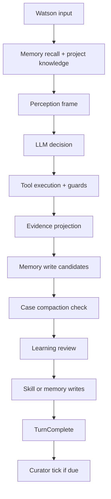
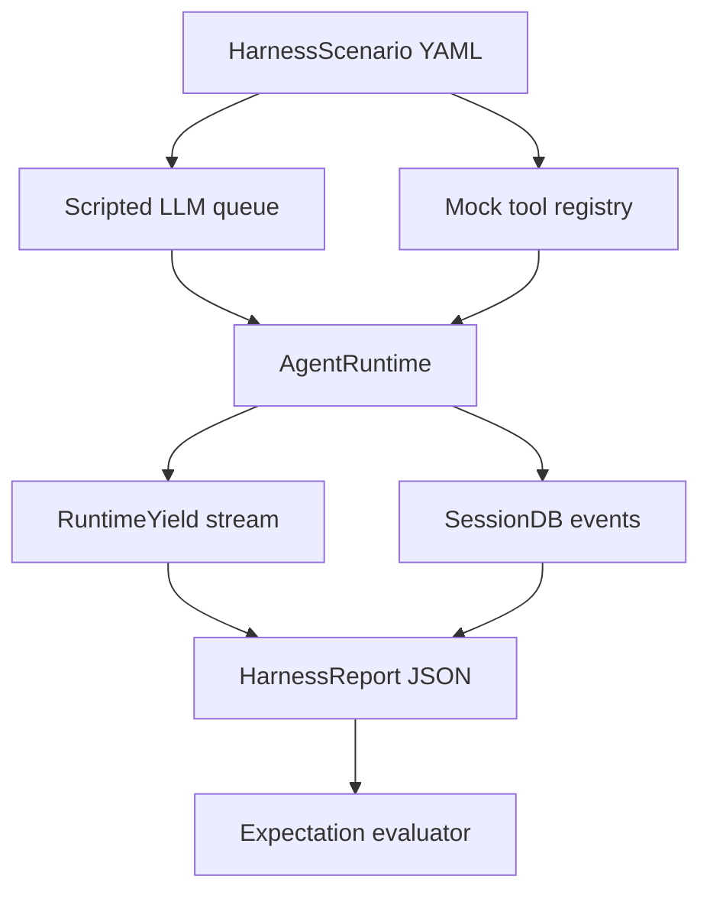

# Holmes Learning and Compression Spec

Date: 2026-06-21
Status: Proposed; Phase 0 deterministic harness implemented
Scope: Make Holmes' compression, memory, skill learning, curation, and regression harness native capabilities

## Purpose

Holmes should not merely remember that an investigation happened. It should become better at investigations because of what happened.

The current runtime has the right foundation: event sourcing, `MindPalace`, `MemoryStore`, `RuntimeYield`, `AgentRuntime`, guards, MCP tools, project knowledge injection, and case reports. The missing layer is the experience loop that turns raw turns and tool results into reusable capability.

This spec defines how to upgrade Holmes from:

```text
conversation -> tools -> events -> memory records
```

to:

```text
conversation -> tools -> evidence -> case compression -> memory/rules/skills -> curation -> better future turns
```

The design is inspired by Hermes Agent's kernel-level features, especially automatic context compression, persistent memory, skills, background self-improvement, and curator lifecycle management. Holmes should adapt those ideas to security research instead of copying them directly.

## References

- Hermes overview: https://hermes-agent.nousresearch.com/docs/
- Hermes context compression: https://hermes-agent.nousresearch.com/docs/developer-guide/context-compression-and-caching
- Hermes persistent memory: https://hermes-agent.nousresearch.com/docs/user-guide/features/memory
- Hermes skills: https://hermes-agent.nousresearch.com/docs/user-guide/features/skills
- Hermes curator: https://hermes-agent.nousresearch.com/docs/user-guide/features/curator

Relevant Holmes code today:

- `crates/holmes-harness/src/runner.rs`
- `crates/holmes-harness/src/scenario.rs`
- `crates/holmes-harness/src/llm.rs`
- `crates/holmes-harness/src/tool.rs`
- `crates/holmes-runtime/src/runtime.rs`
- `crates/holmes-runtime/src/memory.rs`
- `crates/holmes-runtime/src/perception.rs`
- `crates/holmes-cli/src/project_knowledge.rs`
- `crates/holmes-cli/src/main.rs`
- `crates/holmes-mind-palace/src/context_layer.rs`
- `crates/holmes-session/src/memory_store.rs`
- `crates/holmes-core/src/event.rs`
- `crates/holmes-core/src/config.rs`
- `docs/harness.md`
- `scenarios/basic-answer.yaml`
- `scenarios/basic-tool.yaml`

## Problem Statement

Some Holmes capabilities currently exist as schema, config, or manual commands, but not as default agent behavior.

Examples:

- `CompressionApplied` exists, but compression is not automatically triggered by context pressure.
- `compressor.context_limit` and `compressor.threshold` exist, but the runtime does not use them to compact messages.
- `/compress` exists, but `ContextLayer::compress()` only prunes state summaries; it is not a real conversation/case compactor.
- `MemoryStore::consolidate()` exists, but no runtime component decides when to consolidate memories.
- `SkillInjected` and `KnowledgeInjected` exist, but there is no skill creation, patching, usage telemetry, or curator.
- `skills.auto_inject` now loads project knowledge and a skill index, but Holmes cannot turn solved workflows into new skills.
- `skill_evolver` is present in role config, but no `SkillEvolver` engine calls it.
- `holmes-harness` now exists as a deterministic Phase 0 test harness, but it does not yet support replaying real sessions, LLM judge scoring, interactive `ask_watson` fixtures, or learning/compression regression suites.

The main defect is architectural: Holmes treats learning as an output side effect. It should treat learning as part of its cognitive loop.

## Design Principles

1. Native, not optional.
   Compression, memory recall, experience review, and skill discovery should run automatically when enabled in config. Slash commands may inspect or override them, but should not be required for normal operation.

2. Evidence-preserving compression.
   Holmes is a security investigation agent. Compression must never discard authorization scope, confirmed evidence, active hypotheses, artifacts, credentials metadata, report-worthy findings, or unresolved blockers.

3. Progressive disclosure.
   Skills should be indexed at startup but loaded in full only when relevant. Project rules should be always visible only when concise and security-critical.

4. Consent-aware learning.
   Holmes should proactively learn, but memory and skill writes must support approval gates. This matters because wrong memory makes future turns worse.

5. Security-scoped memory.
   Holmes may remember techniques, workflows, tool quirks, target facts for a case, and user preferences. It must not persist raw secrets, private tokens, exploit payloads tied to unauthorized targets, or prompt-injection content as trusted instructions.

6. Event-first implementation.
   Every compression, memory write, skill write, curation action, and rejection should be represented as an event so the case can be replayed and audited.

7. Incremental migration.
   Implement in phases. The current CLI should remain usable after each phase, and existing tests should stay green.

8. Harness-driven cognition.
   Every new cognitive capability should ship with at least one deterministic harness scenario. Holmes should be tested like an agent, not only like a library.

## Target Architecture

Add four native runtime engines, one supporting store, and one verification plane:

```text
AgentRuntime
  PerceptionEngine
  DeliberationEngine
  ActionEngine
  EvidenceEngine
  MemoryEngine
  ReflectionEngine
  CaseCompactor        new
  LearningEngine       new
  SkillEngine          new
  CuratorEngine        new

SessionDB / MemoryStore / SkillStore

Verification plane
  CaseHarness           implemented Phase 0
  Scenario fixtures
  Replay fixtures       planned
  Judge scoring         planned
```

Runtime flow after the change:



The harness should wrap this runtime flow instead of mocking it away:



## Component 1: CaseCompactor

### Goal

Replace manual state pruning with automatic, evidence-preserving context compression.

### Current State

`MindPalace::compress()` calls `ContextLayer::compress()`, which currently:

- keeps only the last five reflections
- removes false-positive vulnerability summaries

This is useful state hygiene, but it does not reduce conversation context, does not call an LLM summarizer, does not preserve tool-call boundaries, and does not record `CompressionApplied`.

### Proposed API

Create a new runtime module:

```text
crates/holmes-runtime/src/compaction.rs
```

Core types:

```rust
pub struct CaseCompactor {
    previous_summary: Option<String>,
}

pub struct CompressionPlan {
    pub should_compress: bool,
    pub before_count: usize,
    pub threshold_tokens: u64,
    pub estimated_tokens: u64,
    pub protected_head: usize,
    pub protected_tail_start: usize,
}

pub struct CompressionResult {
    pub messages: Vec<Message>,
    pub summary: String,
    pub before_count: usize,
    pub after_count: usize,
    pub preserved_keys: Vec<String>,
    pub method: CompressionMethod,
}
```

Runtime methods:

```rust
impl CaseCompactor {
    pub fn should_compress(&self, context: &RuntimeContext) -> CompressionPlan;

    pub async fn compress(
        &mut self,
        context: &RuntimeContext,
        plan: CompressionPlan,
    ) -> Result<CompressionResult, RuntimeError>;
}
```

### Trigger Logic

Use this order:

1. Prefer actual token usage from the latest `LlmResponse.usage`.
2. Fall back to session token counters.
3. Fall back to rough message character estimate.

Compression triggers when:

```text
estimated_tokens >= compressor.context_limit * compressor.threshold
```

Current config can stay compatible:

```yaml
compressor:
  context_limit: 128000
  threshold: 0.75
  protected_head: 3
  protected_tail_tokens: 4000
```

Add optional fields later:

```yaml
compressor:
  enabled: true
  target_ratio: 0.25
  protect_last_n: 20
  max_summary_tokens: 12000
  preserve_tool_groups: true
```

### Compression Algorithm

Phase 1: Cheap pruning.

- Replace old verbose tool results outside the protected tail with compact stubs.
- Preserve artifact paths and result status.
- Never prune tool results attached to unresolved findings.

Example stub:

```text
[Old tool output cleared. Tool: http_request. Status: ok. Artifacts: output/http_12.json]
```

Phase 2: Boundary selection.

Preserve:

- system prompt
- first user objective and first assistant plan
- active goal
- authorization/scope statements
- latest user turns
- tool call/result groups in the tail

Summarize:

- middle conversation turns
- repeated failed attempts
- old verbose tool output

Boundary rule:

```text
[head] system + initial objective
[middle] summarize
[tail] protected_tail_tokens or protect_last_n, whichever keeps more critical context
```

Phase 3: Structured case summary.

Use the compressor role/provider. Summary template:

```markdown
## Objective And Scope
- What Watson asked Holmes to do
- Explicit authorization boundaries

## Current Case State
- Active goal
- Current phase
- Target/context stack

## Evidence
- Confirmed facts
- Important tool results
- Artifacts and file paths

## Findings
- Confirmed vulnerabilities
- Suspicious leads
- False positives already rejected

## Hypotheses
- Active
- Rejected
- Confirmed

## Decisions
- Strategy choices
- User steering
- Guard blocks and why they matter

## Next Steps
- Concrete actions Holmes should consider next

## Critical Details
- Exact commands, URLs, parameters, error snippets, credentials metadata, or constraints that must not be lost
```

Phase 4: Message assembly.

Resulting message list:

```text
system prompt
initial objective / first exchange
assistant case-compaction summary
protected tail
```

The compactor must sanitize orphaned tool calls:

- remove tool results whose call no longer exists
- add stub tool results for tool calls whose full result was removed
- avoid consecutive roles that break provider format

Phase 5: Event recording.

Append:

```rust
Event::CompressionApplied {
    before_count,
    after_count,
    summary,
    preserved_keys,
    method,
}
```

### Acceptance Criteria

- Long sessions compress automatically without a slash command.
- A synthetic 100-message session is reduced while preserving system prompt, initial objective, active goal, latest turns, and evidence.
- Tool call/result pairs remain provider-valid after compression.
- `CompressionApplied` is recorded in `SessionDB`.
- If LLM compression fails, static fallback still preserves evidence and active goal.

## Component 2: LearningEngine

### Goal

Turn runtime experience into memory, rules, and skills.

### Current State

`MemoryEngine` does two useful things:

- recalls top-K memories for every turn
- stores evidence observations as `DiscoveredPattern`

This is not yet self-learning. It stores observations, but does not decide whether an experience should become:

- a durable memory
- a user preference
- a project rule
- a reusable security testing procedure
- a skill patch

### Proposed API

Create:

```text
crates/holmes-runtime/src/learning.rs
```

Core types:

```rust
pub struct LearningEngine;

pub struct LearningReview {
    pub candidates: Vec<LearningCandidate>,
    pub rationale: String,
}

pub enum LearningCandidate {
    Memory(MemoryCandidate),
    Skill(SkillCandidate),
    Rule(RuleCandidate),
}

pub struct MemoryCandidate {
    pub category: MemoryCategory,
    pub content: String,
    pub tags: Vec<String>,
    pub relevance_score: f64,
}

pub struct SkillCandidate {
    pub name: String,
    pub operation: SkillOperation,
    pub summary: String,
    pub content: String,
}

pub enum SkillOperation {
    Create,
    Patch,
}

pub struct RuleCandidate {
    pub path: String,
    pub content: String,
    pub reason: String,
}
```

Runtime hook:

```rust
impl LearningEngine {
    pub async fn review_turn(
        &self,
        context: &RuntimeContext,
        turn_events: &[StoredEvent],
    ) -> Result<LearningReview, RuntimeError>;

    pub async fn apply_review(
        &self,
        context: &mut RuntimeContext,
        review: LearningReview,
    ) -> Result<(), RuntimeError>;
}
```

### Trigger Logic

Run a lightweight deterministic detector every turn. Call the LLM reviewer only when the detector finds learnable signals.

Signals:

- Watson correction: "not this", "remember", "next time", "we prefer", "do not".
- Repeated failure followed by a successful pivot.
- Guard block with useful policy lesson.
- Tool-specific workaround discovered.
- Multi-step procedure succeeded.
- Report confirmed a vulnerability pattern.
- Manual `/steer` note was applied.
- The same type of target or tech stack appears repeatedly across sessions.

Config:

```yaml
learning:
  enabled: true
  review_interval_turns: 1
  background: true
  memory_write_approval: false
  skill_write_approval: true
  rule_write_approval: true
  max_candidates_per_turn: 5
```

### Candidate Classification

Use this policy:

- Memory: short durable fact, preference, environment detail, tool quirk, target-specific case knowledge.
- Skill: reusable multi-step procedure that would save future reasoning/tool calls.
- Rule: always-on instruction that should influence every turn in this project.

Examples:

```text
Memory:
"For this project, API 403 responses include a request-id header that maps to server logs."

Skill:
"JWT refresh-token rotation test workflow: collect baseline, replay stale refresh token, compare session invalidation, verify audit log."

Rule:
"Never run destructive exploit commands unless Watson explicitly confirms scope for the target."
```

### Safety Gate

Before writing any candidate:

- reject raw API keys, passwords, private tokens, SSH keys
- reject prompt injection text as trusted instruction
- reject target credentials unless stored as redacted metadata
- reject unauthorized exploit instructions
- dedupe against existing memory/skills/rules
- check approval config

Events to add or reuse:

```rust
Event::MemoryStored { .. }
Event::SkillInjected { .. }       // reuse for load/injection
Event::KnowledgeInjected { .. }   // reuse for rule/project knowledge
```

Add new events if necessary:

```rust
LearningReviewStarted { trigger: String, event_range: (u64, u64) }
LearningReviewCompleted { candidates: usize, applied: usize, staged: usize }
LearningCandidateRejected { kind: String, reason: String }
MemoryWriteStaged { content: String, reason: String }
SkillWriteStaged { skill_name: String, operation: String, path: String }
RuleWriteStaged { path: String, reason: String }
```

### Acceptance Criteria

- Watson correction can produce a memory candidate.
- Successful repeated workflow can produce a skill candidate.
- Secrets are rejected by tests.
- Approval mode stages writes instead of applying them.
- Applied writes are recorded as events.

## Component 3: SkillEngine And SkillStore

### Goal

Make procedural knowledge first-class.

### Current State

`project_knowledge.rs` now auto-discovers:

- `HOLMES.md`
- `.holmes/HOLMES.md`
- `.holmes/rules/*.md`
- `skills/`
- `.holmes/skills/`

This gives Holmes awareness of skills, but not the ability to create, patch, track, or invoke them as part of learning.

### Skill Layout

Use Agent Skills-compatible folders:

```text
.holmes/skills/
  jwt-refresh-token-testing/
    SKILL.md
    references/
    scripts/
    assets/
```

`SKILL.md` frontmatter:

```markdown
---
name: jwt-refresh-token-testing
description: Validate refresh token rotation, replay behavior, and audit logging.
created_by: holmes
created_from_session: <session-id>
created_at: 2026-06-21T00:00:00Z
last_used_at: null
use_count: 0
success_count: 0
patch_count: 0
---
```

### SkillStore

Create in `holmes-session` or a new crate if it grows:

```text
crates/holmes-session/src/skill_store.rs
```

Responsibilities:

- list skills
- read skill metadata
- create skill
- patch skill
- stage skill write
- approve/reject staged writes
- record usage telemetry
- archive/restore
- backup before curator changes

Sidecar telemetry:

```text
.holmes/skills/.usage.json
```

Schema:

```json
{
  "jwt-refresh-token-testing": {
    "created_by": "holmes",
    "state": "active",
    "pinned": false,
    "use_count": 4,
    "success_count": 3,
    "patch_count": 1,
    "last_used_at": "2026-06-21T12:00:00Z"
  }
}
```

### Tooling

Add a built-in tool:

```text
skill_manage
```

Actions:

```rust
create
patch
stage
approve
reject
archive
restore
record_use
```

The tool should enforce:

- no path traversal
- writes only under configured skill dir
- no deletion of pinned skills
- approval gate when enabled
- backup before destructive changes

### Runtime Loading

Perception should include only the skill index by default.

Full skill content loads when:

- Watson explicitly names a skill
- LLM decision requests it
- `LearningEngine` detects a matching workflow
- memory recall has `RecallTrigger::SkillMatch`

Record:

```rust
Event::SkillInjected {
    skill_name,
    source: InjectionSource::Perception,
    match_reason: Some(...)
}
```

### Acceptance Criteria

- Holmes can create a new skill from a learning review.
- Holmes can patch an existing agent-created skill.
- Skill index is visible in system prompt, but full skill text is loaded only when selected.
- Usage telemetry increments when a skill is injected.
- Skill writes can be staged and approved.

## Component 4: CuratorEngine

### Goal

Prevent self-learning from turning into skill clutter.

### Proposed API

```text
crates/holmes-runtime/src/curator.rs
```

```rust
pub struct CuratorEngine;

pub struct CuratorReport {
    pub stale: Vec<String>,
    pub archived: Vec<String>,
    pub patched: Vec<String>,
    pub consolidated: Vec<String>,
}
```

Trigger points:

- CLI startup
- session end
- every N turns
- future gateway idle tick

Config:

```yaml
curator:
  enabled: true
  interval_hours: 168
  min_idle_hours: 2
  stale_after_days: 30
  archive_after_days: 90
  consolidate: false
  backup:
    enabled: true
    keep: 5
```

Deterministic pass:

- mark unused agent-created skills as stale
- archive stale skills after threshold
- never delete
- never mutate user-authored or hub-installed skills
- skip pinned skills

Optional LLM pass:

- merge near-duplicate agent-created skills
- patch outdated workflows
- propose broader umbrella skills
- stage changes if approval is enabled

Events:

```rust
CuratorRunStarted { reason: String }
CuratorRunCompleted { stale: usize, archived: usize, patched: usize }
SkillArchived { skill_name: String, reason: String, backup_id: String }
SkillRestored { skill_name: String, backup_id: Option<String> }
SkillPinned { skill_name: String }
SkillUnpinned { skill_name: String }
```

### Acceptance Criteria

- Curator never deletes skills.
- Curator archives only agent-created skills unless config explicitly allows more.
- Backup is created before archive/consolidation.
- Pinned skills are untouched.
- Dry-run reports planned actions without mutations.

## Component 5: SessionSearch

### Goal

Let Holmes search prior cases without forcing everything into memory.

Hermes separates durable memory from session search. Holmes should do the same:

- Memory: compact durable facts and reusable lessons.
- Session search: exact historical case lookup.

Proposed tool:

```text
session_search
```

Modes:

```rust
search(query, top_k)
browse(session_id, start_event, limit)
related_to_current_case(top_k)
```

Implementation:

- Use existing `SessionDB.search_events`.
- Return event snippets with session id, event index, category, timestamp.
- Allow scrolling around a hit.
- Never auto-inject large historical sessions; return summaries/snippets only.

Acceptance criteria:

- Holmes can find a prior case by tool name, target, vulnerability title, or user wording.
- Returned snippets include event index and session id.
- Search results do not mutate memory unless LearningEngine later decides to store a distilled lesson.

## Component 6: CaseHarness

### Goal

Make Holmes testable as an agent, not only as a set of Rust crates.

The harness should validate cognitive behavior end to end:

```text
scenario -> scripted LLM/tool world -> AgentRuntime -> yields/events -> expectations -> report
```

This is the backbone for safely adding compression, learning, skill generation, and curator behavior. If Holmes is going to become more AI-native, it needs regression tests that observe decisions, events, tool usage, and user-interaction requests.

### Current State

Phase 0 is implemented:

- `crates/holmes-harness` exists.
- `holmes harness <scenario.yaml>` exists in the CLI.
- Scenarios are YAML files.
- Scripted LLM responses drive `AgentRuntime` deterministically.
- Scenario-defined mock tools can be registered.
- `RuntimeYield` output is captured.
- `SessionDB` events are read back into the report.
- JSON reports include `success`, `turns`, `metrics`, `failed_expectations`, `runtime_errors`, `yields`, and `events`.
- Expectations can check final-answer substrings, event types, tool call names, and maximum errors.
- Example scenarios exist for direct answer and tool use:
  - `scenarios/basic-answer.yaml`
  - `scenarios/basic-tool.yaml`

Run:

```bash
cargo run -p holmes-cli -- harness scenarios/basic-answer.yaml
cargo run -p holmes-cli -- harness scenarios/basic-tool.yaml
```

### Scenario Schema

Current minimal schema:

```yaml
name: basic-tool
description: Minimal deterministic scenario that proves Holmes can call a mock tool and continue.
mode: pentest
turns:
  - input: inspect example.test
tools:
  - name: echo_probe
    description: Returns deterministic probe evidence.
    output: example.test is reachable
    read_only: true
    fail: false
scripted_responses:
  - content: '<holmes_decision>{"type":"use_tools","calls":[...]}</holmes_decision>'
  - content: '<holmes_decision>{"type":"answer","message":"Tool result observed"}</holmes_decision>'
expectations:
  final_contains:
    - Tool result observed
  event_types:
    - user_message
    - tool_call
    - tool_result
    - turn_complete
  tool_calls:
    - echo_probe
  max_errors: 0
```

### Report Schema

Current report fields:

```rust
pub struct HarnessReport {
    pub name: String,
    pub success: bool,
    pub session_id: String,
    pub turns: Vec<HarnessTurnReport>,
    pub metrics: HarnessMetrics,
    pub failed_expectations: Vec<String>,
    pub runtime_errors: Vec<String>,
    pub yields: Vec<RuntimeYield>,
    pub events: Vec<HarnessEventReport>,
}
```

`HarnessEventReport` intentionally nests the original `Event` instead of flattening it, so JSON reports do not produce duplicate timestamp fields.

### Next Capabilities

Add replay mode:

```text
holmes harness replay <session-id>
holmes harness replay --events fixtures/case.json
```

Replay should:

- reconstruct a prior event stream;
- optionally replace real tool outputs with fixture outputs;
- verify compaction/learning decisions on known cases;
- compare new report output against saved expectations.

Add judge mode:

```yaml
judges:
  - type: llm
    rubric: evidence_preserved
    min_score: 0.85
  - type: deterministic
    check: no_secret_persistence
```

Judge mode should be optional and separate from deterministic CI. The deterministic path must remain the default because it is cheap, stable, and model-independent.

Add interactive fixtures:

```yaml
turns:
  - input: test the login flow
    expect_needs_user: true
    reply: yes, authorized for staging only
```

This is required because Holmes should behave more like a real-time conversational agent: it must be able to pause, ask Watson, incorporate the answer, and continue.

Add artifact fixtures:

```yaml
artifacts:
  - path: fixtures/http/login-response.json
    as_tool_output: http_request
```

This supports realistic security testing without network dependencies.

### Required Harness Suites

Compression suite:

- synthetic long case triggers compaction;
- system prompt and first objective survive;
- authorization scope survives;
- latest user turns survive;
- tool call/result groups remain provider-valid;
- `CompressionApplied` event is emitted.

Learning suite:

- Watson correction creates a memory candidate;
- successful workflow creates a skill candidate;
- secret-looking text is rejected;
- prompt-injection text is rejected as trusted instruction;
- approval mode stages writes instead of applying them.

Skill suite:

- skill index is injected;
- full skill loads only when selected;
- `skill_manage` rejects path traversal;
- skill usage telemetry increments;
- staged skill writes can be approved or rejected.

Curator suite:

- stale agent-created skill is archived, not deleted;
- pinned skill is untouched;
- backup exists before mutation;
- dry-run produces no mutation.

Session search suite:

- prior case can be found by phrase;
- browse around an event works;
- snippets include session id and event index;
- search results are not persisted as memory by default.

### Acceptance Criteria

- `holmes harness <scenario.yaml>` exits non-zero on failed expectations.
- Harness scenarios use real `AgentRuntime`, not a parallel fake runtime.
- Reports include yields and persisted events.
- Mock tools support success and failure.
- At least one scenario exists for answer-only and tool-use flows.
- Every future component in this spec adds deterministic harness coverage.
- Replay mode can run against a saved event fixture.
- Judge mode can score open-ended behavior without becoming required for deterministic CI.

## Config Changes

Current config should remain backward compatible. Add new optional sections with defaults.

```yaml
compressor:
  enabled: true
  context_limit: 128000
  threshold: 0.75
  protected_head: 3
  protected_tail_tokens: 4000
  protect_last_n: 20
  target_ratio: 0.25
  max_summary_tokens: 12000
  preserve_tool_groups: true

learning:
  enabled: true
  background: true
  review_interval_turns: 1
  max_candidates_per_turn: 5
  memory_write_approval: false
  skill_write_approval: true
  rule_write_approval: true

skills:
  dir: skills
  auto_inject: true
  write_approval: true
  usage_path: .holmes/skills/.usage.json

curator:
  enabled: true
  interval_hours: 168
  min_idle_hours: 2
  stale_after_days: 30
  archive_after_days: 90
  consolidate: false
  backup:
    enabled: true
    keep: 5

session_search:
  enabled: true
  default_top_k: 8

harness:
  scenarios_dir: scenarios
  report_format: json
  fail_on_expectation_miss: true
  deterministic_default: true
  judge_enabled: false
```

## Event Model Changes

Prefer reusing existing events where possible:

- `CompressionApplied`
- `MemoryStored`
- `MemoryRecalled`
- `MemoryConsolidated`
- `SkillInjected`
- `KnowledgeInjected`
- `HumanFeedback`

Add only events required for auditability:

```rust
LearningReviewStarted
LearningReviewCompleted
LearningCandidateRejected
MemoryWriteStaged
SkillWriteStaged
RuleWriteStaged
SkillCreated
SkillPatched
SkillArchived
SkillRestored
CuratorRunStarted
CuratorRunCompleted
SessionSearchPerformed
```

If adding many variants feels too heavy, use a generic event first:

```rust
ExperienceLifecycle {
    action: String,
    subject_type: String,
    subject_id: Option<String>,
    summary: String,
    metadata: serde_json::Value,
}
```

But explicit variants are easier to query and test.

## Implementation Plan

### Phase 0: Deterministic Case Harness

Status: implemented.

Files:

- `crates/holmes-harness/src/lib.rs`
- `crates/holmes-harness/src/scenario.rs`
- `crates/holmes-harness/src/llm.rs`
- `crates/holmes-harness/src/tool.rs`
- `crates/holmes-harness/src/runner.rs`
- `crates/holmes-cli/src/main.rs`
- `scenarios/basic-answer.yaml`
- `scenarios/basic-tool.yaml`
- `docs/harness.md`

Implemented tasks:

1. Add `holmes-harness` crate.
2. Add deterministic scenario loading from YAML.
3. Add scripted LLM backend.
4. Add scenario-defined mock tools.
5. Run real `AgentRuntime`.
6. Capture runtime yields and persisted events.
7. Evaluate expectations.
8. Add `holmes harness <scenario.yaml>` CLI command.
9. Add answer-only and tool-use fixtures.

Remaining tasks:

1. Add replay fixtures from real sessions.
2. Add judge scoring for open-ended behavior.
3. Add interactive `ask_watson` fixtures.
4. Add artifact fixtures for realistic tool outputs.
5. Add dedicated harness suites for compression, learning, skills, curator, and session search.

### Phase 1: Real Case Compression

Files:

- `crates/holmes-runtime/src/compaction.rs`
- `crates/holmes-runtime/src/runtime.rs`
- `crates/holmes-core/src/config.rs`
- `crates/holmes-core/src/event.rs`
- `crates/holmes-cli/src/chat.rs`

Tasks:

1. Add config defaults for `compressor.enabled`, `protect_last_n`, `target_ratio`, `max_summary_tokens`.
2. Add `CaseCompactor` to `AgentRuntime`.
3. Track actual token usage after each LLM response.
4. Trigger compaction before the next LLM call when threshold is reached.
5. Implement static fallback first.
6. Add LLM summary mode using `compressor` role.
7. Record `CompressionApplied`.
8. Make `/compress` call the same `CaseCompactor`, not only `MindPalace::compress()`.

Tests:

- unit tests for boundary selection
- tool pair sanitation tests
- runtime test that compression triggers
- fallback test when compressor LLM fails
- harness scenario proving a long case compresses while preserving scope, evidence, and latest turns

### Phase 2: LearningEngine Memory Candidates

Files:

- `crates/holmes-runtime/src/learning.rs`
- `crates/holmes-runtime/src/memory.rs`
- `crates/holmes-session/src/memory_store.rs`
- `crates/holmes-guards/src/post/*`

Tasks:

1. Add deterministic learnable-signal detector.
2. Add memory candidate generation.
3. Add duplicate prevention.
4. Add secret/prompt-injection safety scanner.
5. Add approval staging for memory writes.
6. Record learning review events.

Tests:

- Watson correction creates memory candidate.
- Duplicate memory is skipped.
- Secret-looking content is rejected.
- Approval mode stages instead of writes.
- harness scenario proving a correction produces a staged or applied memory candidate according to config.

### Phase 3: SkillStore And `skill_manage`

Files:

- `crates/holmes-session/src/skill_store.rs`
- `crates/holmes-tools/src/builtin/skill_manage.rs`
- `crates/holmes-cli/src/project_knowledge.rs`
- `crates/holmes-runtime/src/perception.rs`

Tasks:

1. Implement skill listing, reading, create, patch, stage, approve, reject.
2. Add usage sidecar.
3. Add `skill_manage` built-in tool.
4. Let `LearningEngine` emit skill candidates.
5. Load full skill content on match and record `SkillInjected`.

Tests:

- create skill under `.holmes/skills`.
- reject path traversal.
- staged skill write requires approval.
- skill injection increments use count.
- harness scenario proving a successful repeated workflow can propose or create a skill.

### Phase 4: Curator

Files:

- `crates/holmes-runtime/src/curator.rs`
- `crates/holmes-session/src/skill_store.rs`
- `crates/holmes-cli/src/commands.rs`
- `crates/holmes-cli/src/chat.rs`

Tasks:

1. Deterministic stale/archive pass.
2. Backup and rollback.
3. `/curator status|run|dry-run|pin|unpin|restore`.
4. Optional LLM consolidation pass.

Tests:

- stale transition.
- archive transition.
- pinned skill is untouched.
- backup exists before mutation.
- harness scenario proving curator dry-run and archive behavior without deleting skill content.

### Phase 5: Session Search Tool

Files:

- `crates/holmes-tools/src/builtin/session_search.rs`
- `crates/holmes-session/src/db.rs`
- `crates/holmes-runtime/src/perception.rs`

Tasks:

1. Wrap `SessionDB.search_events` as a tool.
2. Add browse/scroll around event.
3. Add `SessionSearchPerformed` event.
4. Let Holmes use session search before re-solving known patterns.

Tests:

- event search by phrase.
- browse around event index.
- search results include session id and event index.
- harness scenario proving Holmes uses session search before re-solving a known pattern.

## Acceptance Criteria For The Whole Spec

Holmes is considered improved when all of these are true:

1. Holmes has a deterministic harness that can run agent scenarios through real `AgentRuntime`.
2. Harness reports include yields, persisted events, metrics, failures, and turn outcomes.
3. Long cases compress automatically and preserve evidence.
4. `/compress` and automatic compression use the same code path.
5. Memory writes are not only raw observations; Holmes can store distilled lessons.
6. Holmes can create or patch a skill from a successful workflow.
7. Skills have usage telemetry and lifecycle state.
8. Curator can archive stale agent-created skills with backup.
9. Holmes can search previous sessions as an on-demand tool.
10. Secret and prompt-injection content is rejected before entering durable memory or skills.
11. All learning actions are auditable through events.
12. Every new cognitive component has at least one deterministic harness scenario.
13. Existing runtime, CLI, memory, guard, harness, and workspace tests remain green.

## Non-Goals

This spec does not require:

- a full multi-platform gateway
- cloud hosting
- a Hermes-compatible plugin marketplace
- semantic vector memory in phase 1
- autonomous exploitation beyond explicit authorized scope
- replacing `MemoryStore` with an external provider

## Recommended First PR

Phase 0 is already implemented. The next PR should start with Phase 1 only.

The highest leverage first change is real `CaseCompactor` because every other long-running feature depends on stable context management. Without compression, self-learning and subagents will eventually degrade the active context. With compression, Holmes can run longer cases and produce cleaner learning candidates.

First PR shape:

1. Add a failing harness scenario for a long case that should compress.
2. Add `compaction.rs`.
3. Add config defaults.
4. Add static fallback compression.
5. Wire automatic trigger into `AgentRuntime`.
6. Make `/compress` use the compactor.
7. Record `CompressionApplied`.
8. Add focused unit/runtime tests.
9. Make the harness scenario pass.

After that, Phase 2 can safely add learning review because the runtime will have a stable place to summarize and preserve case state.
