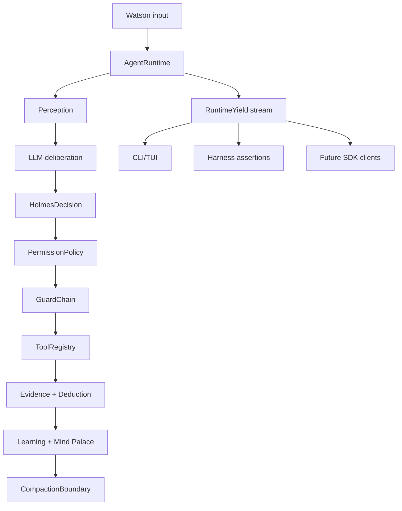

# Holmes Agent SDK Gap Spec

Date: 2026-06-23
Status: active

## Goal

Make Holmes behave less like a fixed automation script and more like an AI-native agent OS for security research: observable, permissioned, resumable, testable, and capable of real-time collaboration with Watson.

This spec is based on public Claude Agent SDK documentation and observable SDK behavior, not proprietary source code. The useful lesson is architectural: a strong agent exposes its loop, tools, permissions, context boundaries, sessions, and user-interaction points as first-class protocol objects.

Reference docs:

- https://code.claude.com/docs/en/agent-sdk/overview
- https://code.claude.com/docs/en/agent-sdk/agent-loop
- https://code.claude.com/docs/en/agent-sdk/user-input
- https://code.claude.com/docs/en/agent-sdk/file-checkpointing
- https://code.claude.com/docs/en/agent-sdk/python

## Current Holmes Shape

Holmes already has the right core pieces:

- `holmes-runtime`: perception, deliberation, action, deduction, learning, memory, reflection, compaction.
- `RuntimeYield`: stream of user-visible runtime events.
- `ToolRegistry`: tool definitions and read-only metadata.
- `GuardChain`: pre/post safety and evidence guards.
- `SessionDB` and `MindPalace`: durable event history and retrieval.
- `holmes-harness`: scenario-driven testbench.
- Anthropic-native LLM protocol and tool-use grouping.

The gap is that several capabilities are still implicit. Permission policy lived inside action/guards, compaction had no explicit stream boundary, and the CLI was the main consumer of agent events.

## Target Architecture

Holmes should expose an internal SDK loop:



## Implemented In This Pass

1. Permission policy as runtime infrastructure

Holmes now has `PermissionConfig` and `PermissionPolicy`.

- `default`: normal agent behavior.
- `plan`: block tools so Holmes must reason, plan, or ask Watson.
- `read_only`: allow only tools marked read-only.
- `dont_ask`: non-interactive policy mode while still honoring allow/deny lists.
- `bypass`: maximum autonomy while still preserving Holmes security guards.

Policy lists support exact names, `prefix*`, `*suffix`, and `*`.

2. Structured permission events

`RuntimeYield::PermissionDecision` reports whether a tool call was allowed and why. CLI hides allowed decisions by default and shows blocked decisions.

3. Explicit compaction boundary

`RuntimeYield::CompactionBoundary` reports message counts, method, summary, and preserved keys when context compression happens. This mirrors the SDK idea that compaction is a protocol boundary, not invisible mutation.

4. Tool-output folding preserved

The CLI keeps tool stdout folded, but full output can still be shown with:

```bash
HOLMES_SHOW_TOOL_OUTPUT=1 ./target/release/holmes
```

## Next Required Work

1. Interactive approvals

Add a runtime-level approval callback:

- `PermissionPolicy` returns `allow | deny | ask`.
- `AgentRuntime` emits `NeedsUserInput` with structured tool metadata.
- CLI can approve once, approve session, deny, or switch permission mode.
- Harness can auto-answer approval requests.

2. Hook system

Add typed hooks around:

- session start/end
- turn start/end
- before/after tool
- before compaction
- after final answer

Hooks should receive structured JSON and return either observation, block, or mutation. Shell hooks must be opt-in and disabled by default.

3. File checkpointing

Holmes cannot safely emulate SDK checkpointing until file mutation tools are explicit. Add native file tools first:

- `read_file`
- `write_file`
- `edit_file`
- `list_files`
- `grep`

Then checkpoint only native file-tool mutations. Shell command side effects should be marked untracked.

4. Agent definitions

Introduce `AgentDefinition` for subagents:

- name
- prompt
- allowed tools
- disallowed tools
- model/provider
- max turns
- memory policy
- background/foreground

This keeps Holmes extensible without turning the main prompt into a pile of conditional logic.

5. SDK-facing stream schema

Stabilize `RuntimeYield` as a versioned schema:

- `run_started`
- `turn_started`
- `message_delta`
- `permission_decision`
- `tool_started`
- `tool_finished`
- `compaction_boundary`
- `result`
- `error`

The CLI, harness, and future SDK clients should all consume the same stream.

## Design Constraints

- Keep Holmes simple: central policy modules beat scattered flags.
- Keep Anthropic tool-use groups valid even when a tool is blocked.
- Keep security guards active even in high-autonomy modes.
- Avoid copying proprietary SDK internals. Use public docs and behavioral compatibility.
- Treat harness as the agent OS testbench: every new runtime capability gets a scenario or unit test.
