# Holmes Cognitive Kernel Spec (Superpowers)

Date: 2026-06-23
Status: proposed

## Goal

Give Holmes the true "superpowers" of an industrial-grade autonomous agent by fundamentally upgrading its cognitive kernel and context loop. This spec focuses on migrating Holmes from a naive "prompt + execute" loop to a highly optimized, stateful, and context-aware cognitive engine, deeply inspired by the advanced mechanisms observed in Anthropic's Claude Agent SDK.

The goal is to enable Holmes to handle infinitely long security research tasks without context window explosions, while dramatically reducing TTFT (Time To First Token) costs through perfect caching, and maintaining a durable cross-session memory base.

## Current Holmes Shape

Currently, Holmes relies on basic contextual mechanisms:
- `holmes-mind-palace` dynamically renders the dashboard (Attack Surface, Findings) and injects it into the System Prompt on every turn. This constant mutation prevents any Prompt Caching on the system level.
- `holmes-runtime` lacks an external state engine; if a read operation falls out of the context window during a long session, the safety guard (`NeedsReadBeforeWrite`) fails.
- Memory exists (`SessionDB`), but it's siloed per session. There's no automatic mechanism to consolidate generic hacking skills cross-session.
- Reflection is purely reactive and done by the main agent, occupying precious main-thread token bandwidth.

## Target Architecture

We introduce four new "Superpowers" to the cognitive kernel:

```mermaid
flowchart TD
    subgraph Context Pipeline
        Static[Static System Prompt] --> PromptCache[LLM Prompt Caching]
        Dynamic[Dynamic State: CWD, MemPath] --> UserMsg1[First User Message]
    end

    subgraph Dual-Track Memory
        MainAgent[Holmes Main Thread] 
        RecallSupervisor[Memory Recall Supervisor]
        
        MainAgent -->|Task Context| RecallSupervisor
        RecallSupervisor -->|SDKMemoryRecallMessage| MainAgent
    end
    
    subgraph Auto-Dream Consolidation
        LocalMem[Local Session Memory] -->|Idle Timer| AutoDream[Auto-Dream Daemon]
        AutoDream -->|Generalize| ProjectMem[Project Memory]
        AutoDream -->|Extract Skills| UserMem[Global User Memory]
    end
    
    subgraph Extrinsic State Machine
        Action[File Read Action] --> StatePool[External Path+MTime Pool]
        StatePool -.->|SeedReadState Request| LLMEngine
        LLMEngine --> Guard[Guard Validation]
    end
```

## Required Work (The 4 Superpowers)

### 1. Static Prompt Caching (动静分离)
**Mechanism**: Remove all highly volatile data (current working directory, current dashboard state, auto-memory paths) from the root System Prompt. 
**Implementation**:
- `holmes-mind-palace` must generate two outputs: a purely static identity prompt, and a dynamic situation snapshot.
- The dynamic snapshot must be prepended to the *first user message* of the sliding context window.
- **Benefit**: Achieves 100% cache hit rate on the massive system prompt, reducing per-turn token cost and massively accelerating response times.

### 2. Auto-Dream & Tiered Memory (三级记忆与后台巩固)
**Mechanism**: Introduce an asynchronous memory consolidation daemon that runs when Holmes goes idle.
**Implementation**:
- Separate memory into three scopes: `local` (current session), `project` (repo-scoped `.claude/agent-memory/`), and `user` (global `~/.claude/agent-memory/`).
- Implement the `auto-dream` background worker. When a pentest session completes, `auto-dream` extracts successful payloads, bypassed logic, and new tool usages from `local` and permanently synthesizes them into `project` or `user` level `CLAUDE.md` files.

### 3. Memory Recall Supervisor (双轨制旁路注入)
**Mechanism**: Don't force the main heavy model to constantly search its memory. 
**Implementation**:
- Attach a lightweight, fast model (e.g., Claude Haiku) listening to the `RuntimeYield` event stream.
- When the main agent encounters a specific target (e.g., "Found WordPress 6.1"), the Supervisor asynchronously queries the FTS5 memory database.
- If relevant past exploits or warnings are found, it injects an `SDKMemoryRecallMessage` directly into the current context boundary.

### 4. Read State Seeding (外部状态注水)
**Mechanism**: Decouple safety state from the LLM's raw context window.
**Implementation**:
- Create a `FileAccessTracker` inside `holmes-guards` that stores `{ path, mtime }` of every file or endpoint the agent has read.
- If the agent's context is compressed (evicting the old read events) and it tries to exploit/edit the file, the Guard usually fails.
- Introduce `SeedReadState`: before validating the edit, inject the tracked `{ path, mtime }` back into the validation logic as long as the real file hasn't changed. This gives the agent the "superpower" of unbounded task duration.

## Design Constraints
- **Performance First**: The Recall Supervisor must not block the main reasoning loop. Its injection should be strictly asynchronous.
- **Security**: The Read State Seeding must strictly verify `mtime`. If the target file changed externally, the seed must be invalidated to prevent blind edits.
- **Transparency**: All Auto-Dream consolidations must be written as readable Markdown so Watson (the user) can audit what Holmes is learning.
